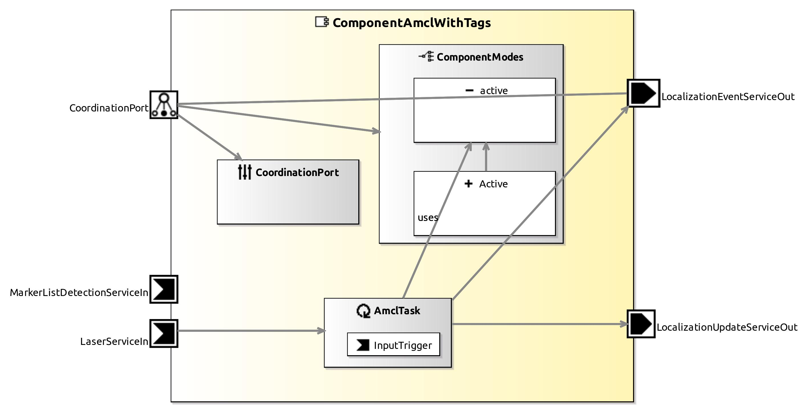

<!--- This file is generated from the ComponentAmclWithTags.componentDocumentation model --->
<!--- do not modify this file manually as it will by automatically overwritten by the code generator, modify the model instead and re-generate this file --->

# ComponentAmclWithTags Component

*Component Short Description:* The ComponentAmclWithTags implements the Adaptive Monte-Carlo Localization (AMCL) algorithm.

## Component Documentation

 ComponentAmclWithTags extends the AMCL to use a virtual laser generated from RGBD camera and visual markers to solve the issues concerning the global localization, reducing the uncertainty in pose estimates during tracking and kidnapped robot problem.

 For More information :

 Nayabrasul Shaik, Matthias Lutz and Christian Schlegel, “2D Localization in Large Areas Using Inexpensive RGBD Camera Augmented With Visual Tags“. In Proc. 25th IEEE International Conference on Emerging Technologies and Factory Automation (ETFA), Vienna, Austria, 2020, pp. 613-619, doi: 10.1109/ETFA46521.2020.9211882.

	GPL-License: includes Code from the Player Project.

	See also: http://playerstage.sourceforge.net/doc/Player-2.0.0/player/group__driver__amcl.html

## Component-Datasheet Properties

<table style="border-collapse:collapse;">
<caption><i>Table:</i> Component-Datasheet Properties</caption>
<tr style="background-color:#ccc;">
<th style="border:1px solid black; padding: 5px;"><i>Property Name</i></th>
<th style="border:1px solid black; padding: 5px;"><i>Property Value</i></th>
<th style="border:1px solid black; padding: 5px;"><i>Property Description</i></th>
</tr>
<tr>
<td style="border:1px solid black; padding: 5px;">SpdxLicense</td>
<td style="border:1px solid black; padding: 5px;">LGPL-2.0-or-later</td>
<td style="border:1px solid black; padding: 5px;">https://spdx.org/licenses/LGPL-2.0-or-later.html</td>
</tr>
<tr>
<td style="border:1px solid black; padding: 5px;">TechnologyReadinessLevel</td>
<td style="border:1px solid black; padding: 5px;">TRL5</td>
<td style="border:1px solid black; padding: 5px;"></td>
</tr>
<tr>
<td style="border:1px solid black; padding: 5px;">Homepage</td>
<td style="border:1px solid black; padding: 5px;">http://servicerobotik-ulm.de/components</td>
<td style="border:1px solid black; padding: 5px;"></td>
</tr>
<tr>
<td style="border:1px solid black; padding: 5px;">Supplier</td>
<td style="border:1px solid black; padding: 5px;">Servicerobotics Ulm</td>
<td style="border:1px solid black; padding: 5px;"></td>
</tr>
<tr>
<td style="border:1px solid black; padding: 5px;">Purpose</td>
<td style="border:1px solid black; padding: 5px;">Localization</td>
<td style="border:1px solid black; padding: 5px;"></td>
</tr>
</table>

## Component Ports

### LaserServiceIn

*Documentation:*

### LocalizationUpdateServiceOut

*Documentation:*

### LocalizationEventServiceOut

*Documentation:*

### MarkerListDetectionServiceIn

*Documentation:*

## Component Parameters: ComponentAmclWithTagsParams

### Internal Parameter: Filter

*Documentation:*

<table style="border-collapse:collapse;">
<caption><i>Table:</i> Internal Parameter <b>Filter</b></caption>
<tr style="background-color:#ccc;">
<th style="border:1px solid black; padding: 5px;"><i>Attribute Name</i></th>
<th style="border:1px solid black; padding: 5px;"><i>Attribute Type</i></th>
<th style="border:1px solid black; padding: 5px;"><i>Attribute Value</i></th>
<th style="border:1px solid black; padding: 5px;"><i>Attribute Description</i></th>
</tr>
<tr>
<td style="border:1px solid black; padding: 5px;"><b>min_particles</b></td>
<td style="border:1px solid black; padding: 5px;">Int32</td>
<td style="border:1px solid black; padding: 5px;">500</td>
<td style="border:1px solid black; padding: 5px;">
Lower bound for amount of particles.

</td>
</tr>
<tr>
<td style="border:1px solid black; padding: 5px;"><b>max_particles</b></td>
<td style="border:1px solid black; padding: 5px;">Int32</td>
<td style="border:1px solid black; padding: 5px;">5000</td>
<td style="border:1px solid black; padding: 5px;">
Upper bound for amount of particles.

</td>
</tr>
<tr>
<td style="border:1px solid black; padding: 5px;"><b>recovery_alpha_slow</b></td>
<td style="border:1px solid black; padding: 5px;">Double</td>
<td style="border:1px solid black; padding: 5px;">0.001</td>
<td style="border:1px solid black; padding: 5px;">
Decay rates for running averages. Used in deciding when to recover by adding random poses.

</td>
</tr>
<tr>
<td style="border:1px solid black; padding: 5px;"><b>recovery_alpha_fast</b></td>
<td style="border:1px solid black; padding: 5px;">Double</td>
<td style="border:1px solid black; padding: 5px;">0.1</td>
<td style="border:1px solid black; padding: 5px;">
Decay rates for running averages. Used in deciding when to recover by adding random poses.

</td>
</tr>
<tr>
<td style="border:1px solid black; padding: 5px;"><b>kld_err</b></td>
<td style="border:1px solid black; padding: 5px;">Double</td>
<td style="border:1px solid black; padding: 5px;">0.05</td>
<td style="border:1px solid black; padding: 5px;">
Population size error.

</td>
</tr>
<tr>
<td style="border:1px solid black; padding: 5px;"><b>kld_z</b></td>
<td style="border:1px solid black; padding: 5px;">Double</td>
<td style="border:1px solid black; padding: 5px;">0.99</td>
<td style="border:1px solid black; padding: 5px;">
Population size.

</td>
</tr>
<tr>
<td style="border:1px solid black; padding: 5px;"><b>update_min_d</b></td>
<td style="border:1px solid black; padding: 5px;">Double</td>
<td style="border:1px solid black; padding: 5px;">0.2</td>
<td style="border:1px solid black; padding: 5px;">
Update filter if x or y pos delta greater than update_min_d or delta of alpha > update_min_alpha.

</td>
</tr>
<tr>
<td style="border:1px solid black; padding: 5px;"><b>update_min_alpha</b></td>
<td style="border:1px solid black; padding: 5px;">Double</td>
<td style="border:1px solid black; padding: 5px;">0.5236</td>
<td style="border:1px solid black; padding: 5px;">
Update filter if x or y pos delta greater than update_min_d or delta of alpha > update_min_alpha.

</td>
</tr>
<tr>
<td style="border:1px solid black; padding: 5px;"><b>resample_interval</b></td>
<td style="border:1px solid black; padding: 5px;">Double</td>
<td style="border:1px solid black; padding: 5px;">1.0</td>
<td style="border:1px solid black; padding: 5px;">
The distributions will be resampled every x'th time.

</td>
</tr>
</table>

### Internal Parameter: Laser

*Documentation:*

<table style="border-collapse:collapse;">
<caption><i>Table:</i> Internal Parameter <b>Laser</b></caption>
<tr style="background-color:#ccc;">
<th style="border:1px solid black; padding: 5px;"><i>Attribute Name</i></th>
<th style="border:1px solid black; padding: 5px;"><i>Attribute Type</i></th>
<th style="border:1px solid black; padding: 5px;"><i>Attribute Value</i></th>
<th style="border:1px solid black; padding: 5px;"><i>Attribute Description</i></th>
</tr>
<tr>
<td style="border:1px solid black; padding: 5px;"><b>max_beams</b></td>
<td style="border:1px solid black; padding: 5px;">UInt32</td>
<td style="border:1px solid black; padding: 5px;">30</td>
<td style="border:1px solid black; padding: 5px;">
Consider at most max_beams beams from laser for localization.

</td>
</tr>
<tr>
<td style="border:1px solid black; padding: 5px;"><b>z_hit</b></td>
<td style="border:1px solid black; padding: 5px;">Double</td>
<td style="border:1px solid black; padding: 5px;">0.95</td>
<td style="border:1px solid black; padding: 5px;"></td>
</tr>
<tr>
<td style="border:1px solid black; padding: 5px;"><b>z_short</b></td>
<td style="border:1px solid black; padding: 5px;">Double</td>
<td style="border:1px solid black; padding: 5px;">0.1</td>
<td style="border:1px solid black; padding: 5px;"></td>
</tr>
<tr>
<td style="border:1px solid black; padding: 5px;"><b>z_max</b></td>
<td style="border:1px solid black; padding: 5px;">Double</td>
<td style="border:1px solid black; padding: 5px;">0.05</td>
<td style="border:1px solid black; padding: 5px;"></td>
</tr>
<tr>
<td style="border:1px solid black; padding: 5px;"><b>z_rand</b></td>
<td style="border:1px solid black; padding: 5px;">Double</td>
<td style="border:1px solid black; padding: 5px;">0.05</td>
<td style="border:1px solid black; padding: 5px;"></td>
</tr>
<tr>
<td style="border:1px solid black; padding: 5px;"><b>sigma_hit</b></td>
<td style="border:1px solid black; padding: 5px;">Double</td>
<td style="border:1px solid black; padding: 5px;">0.2</td>
<td style="border:1px solid black; padding: 5px;"></td>
</tr>
<tr>
<td style="border:1px solid black; padding: 5px;"><b>lambda_short</b></td>
<td style="border:1px solid black; padding: 5px;">Double</td>
<td style="border:1px solid black; padding: 5px;">0.1</td>
<td style="border:1px solid black; padding: 5px;"></td>
</tr>
<tr>
<td style="border:1px solid black; padding: 5px;"><b>laser_likelihood_max_dist</b></td>
<td style="border:1px solid black; padding: 5px;">Double</td>
<td style="border:1px solid black; padding: 5px;">2.0</td>
<td style="border:1px solid black; padding: 5px;"></td>
</tr>
<tr>
<td style="border:1px solid black; padding: 5px;"><b>laser_model_type</b></td>
<td style="border:1px solid black; padding: 5px;">String</td>
<td style="border:1px solid black; padding: 5px;">"likelihood_field"</td>
<td style="border:1px solid black; padding: 5px;">
Values: beam | likelihood_field.

</td>
</tr>
</table>

### Internal Parameter: Odometry

*Documentation:*

<table style="border-collapse:collapse;">
<caption><i>Table:</i> Internal Parameter <b>Odometry</b></caption>
<tr style="background-color:#ccc;">
<th style="border:1px solid black; padding: 5px;"><i>Attribute Name</i></th>
<th style="border:1px solid black; padding: 5px;"><i>Attribute Type</i></th>
<th style="border:1px solid black; padding: 5px;"><i>Attribute Value</i></th>
<th style="border:1px solid black; padding: 5px;"><i>Attribute Description</i></th>
</tr>
<tr>
<td style="border:1px solid black; padding: 5px;"><b>alpha1</b></td>
<td style="border:1px solid black; padding: 5px;">Double</td>
<td style="border:1px solid black; padding: 5px;">0.2</td>
<td style="border:1px solid black; padding: 5px;">
Drift parameter/odometry error.

</td>
</tr>
<tr>
<td style="border:1px solid black; padding: 5px;"><b>alpha2</b></td>
<td style="border:1px solid black; padding: 5px;">Double</td>
<td style="border:1px solid black; padding: 5px;">0.2</td>
<td style="border:1px solid black; padding: 5px;">
Drift parameter/odometry error.

</td>
</tr>
<tr>
<td style="border:1px solid black; padding: 5px;"><b>alpha3</b></td>
<td style="border:1px solid black; padding: 5px;">Double</td>
<td style="border:1px solid black; padding: 5px;">0.8</td>
<td style="border:1px solid black; padding: 5px;">
Drift parameter/odometry error.

</td>
</tr>
<tr>
<td style="border:1px solid black; padding: 5px;"><b>alpha4</b></td>
<td style="border:1px solid black; padding: 5px;">Double</td>
<td style="border:1px solid black; padding: 5px;">0.2</td>
<td style="border:1px solid black; padding: 5px;">
Drift parameter/odometry error.

</td>
</tr>
<tr>
<td style="border:1px solid black; padding: 5px;"><b>alpha5</b></td>
<td style="border:1px solid black; padding: 5px;">Double</td>
<td style="border:1px solid black; padding: 5px;">0.2</td>
<td style="border:1px solid black; padding: 5px;">
Drift parameter/odometry error.

</td>
</tr>
<tr>
<td style="border:1px solid black; padding: 5px;"><b>odom_model_type</b></td>
<td style="border:1px solid black; padding: 5px;">String</td>
<td style="border:1px solid black; padding: 5px;">"omni"</td>
<td style="border:1px solid black; padding: 5px;">
Specifies type of odometry. Values: diff | omni.

</td>
</tr>
</table>

### Internal Parameter: VisualTag

*Documentation:*

<table style="border-collapse:collapse;">
<caption><i>Table:</i> Internal Parameter <b>VisualTag</b></caption>
<tr style="background-color:#ccc;">
<th style="border:1px solid black; padding: 5px;"><i>Attribute Name</i></th>
<th style="border:1px solid black; padding: 5px;"><i>Attribute Type</i></th>
<th style="border:1px solid black; padding: 5px;"><i>Attribute Value</i></th>
<th style="border:1px solid black; padding: 5px;"><i>Attribute Description</i></th>
</tr>
<tr>
<td style="border:1px solid black; padding: 5px;"><b>distance_variance</b></td>
<td style="border:1px solid black; padding: 5px;">Double</td>
<td style="border:1px solid black; padding: 5px;">0.0069</td>
<td style="border:1px solid black; padding: 5px;"></td>
</tr>
<tr>
<td style="border:1px solid black; padding: 5px;"><b>orientation_variance</b></td>
<td style="border:1px solid black; padding: 5px;">Double</td>
<td style="border:1px solid black; padding: 5px;">0.0076</td>
<td style="border:1px solid black; padding: 5px;"></td>
</tr>
</table>

### Internal Parameter: General

*Documentation:*

<table style="border-collapse:collapse;">
<caption><i>Table:</i> Internal Parameter <b>General</b></caption>
<tr style="background-color:#ccc;">
<th style="border:1px solid black; padding: 5px;"><i>Attribute Name</i></th>
<th style="border:1px solid black; padding: 5px;"><i>Attribute Type</i></th>
<th style="border:1px solid black; padding: 5px;"><i>Attribute Value</i></th>
<th style="border:1px solid black; padding: 5px;"><i>Attribute Description</i></th>
</tr>
<tr>
<td style="border:1px solid black; padding: 5px;"><b>initalizationType</b></td>
<td style="border:1px solid black; padding: 5px;">InlineEnumeration</td>
<td style="border:1px solid black; padding: 5px;">INI_POSE</td>
<td style="border:1px solid black; padding: 5px;"></td>
</tr>
<tr>
<td style="border:1px solid black; padding: 5px;"><b>initPoseFileName</b></td>
<td style="border:1px solid black; padding: 5px;">String</td>
<td style="border:1px solid black; padding: 5px;">"/tmp/lastRobotPose.txt"</td>
<td style="border:1px solid black; padding: 5px;"></td>
</tr>
<tr>
<td style="border:1px solid black; padding: 5px;"><b>verbose</b></td>
<td style="border:1px solid black; padding: 5px;">Boolean</td>
<td style="border:1px solid black; padding: 5px;">false</td>
<td style="border:1px solid black; padding: 5px;">
Print debug messages.

</td>
</tr>
<tr>
<td style="border:1px solid black; padding: 5px;"><b>connect_services</b></td>
<td style="border:1px solid black; padding: 5px;">Boolean</td>
<td style="border:1px solid black; padding: 5px;">true</td>
<td style="border:1px solid black; padding: 5px;">
UNUSED.

</td>
</tr>
<tr>
<td style="border:1px solid black; padding: 5px;"><b>yaml_file</b></td>
<td style="border:1px solid black; padding: 5px;">String</td>
<td style="border:1px solid black; padding: 5px;">"data/maps/amcl-c26.yaml"</td>
<td style="border:1px solid black; padding: 5px;">
Load map and parameters from this file.

</td>
</tr>
<tr>
<td style="border:1px solid black; padding: 5px;"><b>initial_x</b></td>
<td style="border:1px solid black; padding: 5px;">Double</td>
<td style="border:1px solid black; padding: 5px;">0.0</td>
<td style="border:1px solid black; padding: 5px;">
x value [m] of initial pose for Amcl. See also parameters.

</td>
</tr>
<tr>
<td style="border:1px solid black; padding: 5px;"><b>initial_y</b></td>
<td style="border:1px solid black; padding: 5px;">Double</td>
<td style="border:1px solid black; padding: 5px;">0.0</td>
<td style="border:1px solid black; padding: 5px;">
y value [m] of initial pose for Amcl. See also parameters.

</td>
</tr>
<tr>
<td style="border:1px solid black; padding: 5px;"><b>initial_a</b></td>
<td style="border:1px solid black; padding: 5px;">Double</td>
<td style="border:1px solid black; padding: 5px;">0.0</td>
<td style="border:1px solid black; padding: 5px;">
alpha/rotation [rad] of initial pose for Amcl. See also parameters.

</td>
</tr>
<tr>
<td style="border:1px solid black; padding: 5px;"><b>initial_cov_xx</b></td>
<td style="border:1px solid black; padding: 5px;">Double</td>
<td style="border:1px solid black; padding: 5px;">0.03</td>
<td style="border:1px solid black; padding: 5px;">
Initial pose covariance x. See also parameters.

</td>
</tr>
<tr>
<td style="border:1px solid black; padding: 5px;"><b>initial_cov_yy</b></td>
<td style="border:1px solid black; padding: 5px;">Double</td>
<td style="border:1px solid black; padding: 5px;">0.03</td>
<td style="border:1px solid black; padding: 5px;">
Initial pose covariance y. See also parameters.

</td>
</tr>
<tr>
<td style="border:1px solid black; padding: 5px;"><b>initial_cov_aa</b></td>
<td style="border:1px solid black; padding: 5px;">Double</td>
<td style="border:1px solid black; padding: 5px;">0.068539</td>
<td style="border:1px solid black; padding: 5px;">
Initial pose covariance alpha. See also parameters.

</td>
</tr>
<tr>
<td style="border:1px solid black; padding: 5px;"><b>enable_visualization</b></td>
<td style="border:1px solid black; padding: 5px;">Boolean</td>
<td style="border:1px solid black; padding: 5px;">false</td>
<td style="border:1px solid black; padding: 5px;">
Show visualization window. Displays particles in map. WARNING: visualization might fail with X windows forwarding

</td>
</tr>
<tr>
<td style="border:1px solid black; padding: 5px;"><b>lostEventMaxHypothese</b></td>
<td style="border:1px solid black; padding: 5px;">UInt32</td>
<td style="border:1px solid black; padding: 5px;">3</td>
<td style="border:1px solid black; padding: 5px;"></td>
</tr>
<tr>
<td style="border:1px solid black; padding: 5px;"><b>lostEventMaxEigValueSum</b></td>
<td style="border:1px solid black; padding: 5px;">Double</td>
<td style="border:1px solid black; padding: 5px;">0.2</td>
<td style="border:1px solid black; padding: 5px;"></td>
</tr>
<tr>
<td style="border:1px solid black; padding: 5px;"><b>tag_file</b></td>
<td style="border:1px solid black; padding: 5px;">String</td>
<td style="border:1px solid black; padding: 5px;">"tags.json"</td>
<td style="border:1px solid black; padding: 5px;">
Json file with tag positions info

</td>
</tr>
<tr>
<td style="border:1px solid black; padding: 5px;"><b>sensors_to_use</b></td>
<td style="border:1px solid black; padding: 5px;">UInt16</td>
<td style="border:1px solid black; padding: 5px;">0</td>
<td style="border:1px solid black; padding: 5px;">
which sensors to be used for localization, 0 : Laser Only, 1 :  Laser + Visual tags, 2: Visual tags

</td>
</tr>
</table>

### ParameterSetInstance: LocalizationParameter

#### Trigger Instance: INITIALPOSE

*Property:* active = **false**

*Documentation:*

Set the initial pose in normal distribution. ?x = x coordinate [m], ?y = y coordinate [m], ?a = rotation in [rad].

#### Trigger Instance: GLOBALLOCALIZATION

*Property:* active = **false**

*Documentation:*

Initializes the Amcl, particles equally distributed.

#### Trigger Instance: LOADMAP

*Property:* active = **false**

*Documentation:*

