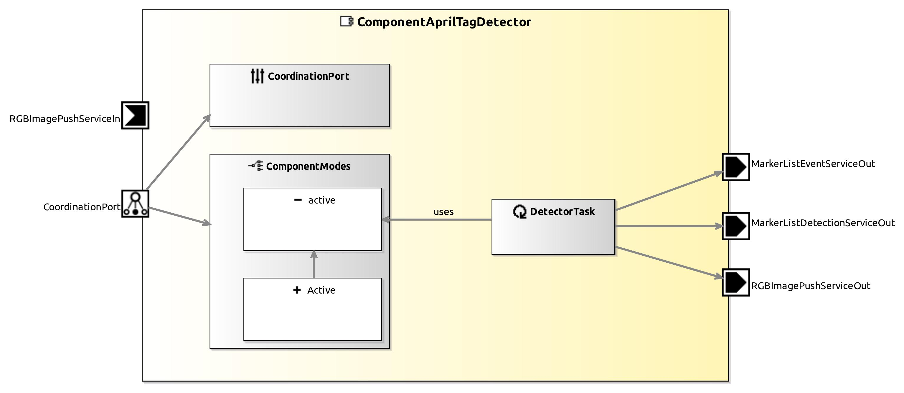

<!--- This file is generated from the ComponentAprilTagDetector.componentDocumentation model --->
<!--- do not modify this file manually as it will by automatically overwritten by the code generator, modify the model instead and re-generate this file --->

# ComponentAprilTagDetector Component

*Component Short Description:* TODO: add short description for ComponentAprilTagDetector datasheet

## Component Documentation

 Component to dected AprilTags in the given images

## Component-Datasheet Properties

<table style="border-collapse:collapse;">
<caption><i>Table:</i> Component-Datasheet Properties</caption>
<tr style="background-color:#ccc;">
<th style="border:1px solid black; padding: 5px;"><i>Property Name</i></th>
<th style="border:1px solid black; padding: 5px;"><i>Property Value</i></th>
<th style="border:1px solid black; padding: 5px;"><i>Property Description</i></th>
</tr>
</table>

## Component Ports

### RGBImagePushServiceIn

*Documentation:*

### RGBImagePushServiceOut

*Documentation:*

 Pushes a RGB image with Detected Markers visualized

### MarkerListDetectionServiceOut

*Documentation:*

 Pushes a List of Markers detcted in the input picture

### MarkerListEventServiceOut

*Documentation:*

## Component Parameters: ComponentAprilTagDetector

### Internal Parameter: options

*Documentation:*

<table style="border-collapse:collapse;">
<caption><i>Table:</i> Internal Parameter <b>options</b></caption>
<tr style="background-color:#ccc;">
<th style="border:1px solid black; padding: 5px;"><i>Attribute Name</i></th>
<th style="border:1px solid black; padding: 5px;"><i>Attribute Type</i></th>
<th style="border:1px solid black; padding: 5px;"><i>Attribute Value</i></th>
<th style="border:1px solid black; padding: 5px;"><i>Attribute Description</i></th>
</tr>
<tr>
<td style="border:1px solid black; padding: 5px;"><b>tag_family</b></td>
<td style="border:1px solid black; padding: 5px;">String</td>
<td style="border:1px solid black; padding: 5px;">"tag16h5"</td>
<td style="border:1px solid black; padding: 5px;"></td>
</tr>
<tr>
<td style="border:1px solid black; padding: 5px;"><b>tag_size</b></td>
<td style="border:1px solid black; padding: 5px;">Double</td>
<td style="border:1px solid black; padding: 5px;">0.16</td>
<td style="border:1px solid black; padding: 5px;"></td>
</tr>
<tr>
<td style="border:1px solid black; padding: 5px;"><b>decision_threshold</b></td>
<td style="border:1px solid black; padding: 5px;">Double</td>
<td style="border:1px solid black; padding: 5px;">50.0</td>
<td style="border:1px solid black; padding: 5px;"></td>
</tr>
<tr>
<td style="border:1px solid black; padding: 5px;"><b>decimate</b></td>
<td style="border:1px solid black; padding: 5px;">Double</td>
<td style="border:1px solid black; padding: 5px;">1.0</td>
<td style="border:1px solid black; padding: 5px;"></td>
</tr>
<tr>
<td style="border:1px solid black; padding: 5px;"><b>sigma</b></td>
<td style="border:1px solid black; padding: 5px;">Double</td>
<td style="border:1px solid black; padding: 5px;">1.0</td>
<td style="border:1px solid black; padding: 5px;"></td>
</tr>
<tr>
<td style="border:1px solid black; padding: 5px;"><b>numThreads</b></td>
<td style="border:1px solid black; padding: 5px;">UInt8</td>
<td style="border:1px solid black; padding: 5px;">1</td>
<td style="border:1px solid black; padding: 5px;"></td>
</tr>
<tr>
<td style="border:1px solid black; padding: 5px;"><b>debug</b></td>
<td style="border:1px solid black; padding: 5px;">Boolean</td>
<td style="border:1px solid black; padding: 5px;">false</td>
<td style="border:1px solid black; padding: 5px;"></td>
</tr>
<tr>
<td style="border:1px solid black; padding: 5px;"><b>refine_edges</b></td>
<td style="border:1px solid black; padding: 5px;">Boolean</td>
<td style="border:1px solid black; padding: 5px;">false</td>
<td style="border:1px solid black; padding: 5px;"></td>
</tr>
</table>

