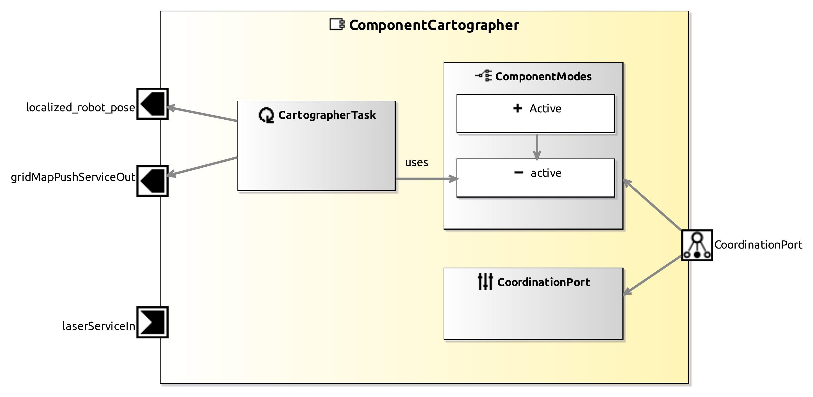

<!--- This file is generated from the ComponentCartographer.componentDocumentation model --->
<!--- do not modify this file manually as it will by automatically overwritten by the code generator, modify the model instead and re-generate this file --->

# ComponentCartographer Component

*Component Short Description:* Datasheet for ComponentCartographer

## Component-Datasheet Properties

<table style="border-collapse:collapse;">
<caption><i>Table:</i> Component-Datasheet Properties</caption>
<tr style="background-color:#ccc;">
<th style="border:1px solid black; padding: 5px;"><i>Property Name</i></th>
<th style="border:1px solid black; padding: 5px;"><i>Property Value</i></th>
<th style="border:1px solid black; padding: 5px;"><i>Property Description</i></th>
</tr>
</table>

## Component Ports

### gridMapPushServiceOut

*Documentation:*

### laserServiceIn

*Documentation:*

### localized_robot_pose

*Documentation:*

## Component Parameters: ComponentCartographer

### Internal Parameter: general

*Documentation:*

<table style="border-collapse:collapse;">
<caption><i>Table:</i> Internal Parameter <b>general</b></caption>
<tr style="background-color:#ccc;">
<th style="border:1px solid black; padding: 5px;"><i>Attribute Name</i></th>
<th style="border:1px solid black; padding: 5px;"><i>Attribute Type</i></th>
<th style="border:1px solid black; padding: 5px;"><i>Attribute Value</i></th>
<th style="border:1px solid black; padding: 5px;"><i>Attribute Description</i></th>
</tr>
<tr>
<td style="border:1px solid black; padding: 5px;"><b>enable_visualization</b></td>
<td style="border:1px solid black; padding: 5px;">Boolean</td>
<td style="border:1px solid black; padding: 5px;">false</td>
<td style="border:1px solid black; padding: 5px;">
Visualize the trajectory path of robot from Cartographer

</td>
</tr>
</table>

### Internal Parameter: sensors

*Documentation:*

<table style="border-collapse:collapse;">
<caption><i>Table:</i> Internal Parameter <b>sensors</b></caption>
<tr style="background-color:#ccc;">
<th style="border:1px solid black; padding: 5px;"><i>Attribute Name</i></th>
<th style="border:1px solid black; padding: 5px;"><i>Attribute Type</i></th>
<th style="border:1px solid black; padding: 5px;"><i>Attribute Value</i></th>
<th style="border:1px solid black; padding: 5px;"><i>Attribute Description</i></th>
</tr>
<tr>
<td style="border:1px solid black; padding: 5px;"><b>use_laser</b></td>
<td style="border:1px solid black; padding: 5px;">Boolean</td>
<td style="border:1px solid black; padding: 5px;">true</td>
<td style="border:1px solid black; padding: 5px;"></td>
</tr>
<tr>
<td style="border:1px solid black; padding: 5px;"><b>use_odometry</b></td>
<td style="border:1px solid black; padding: 5px;">Boolean</td>
<td style="border:1px solid black; padding: 5px;">true</td>
<td style="border:1px solid black; padding: 5px;"></td>
</tr>
<tr>
<td style="border:1px solid black; padding: 5px;"><b>laser_subdivisions</b></td>
<td style="border:1px solid black; padding: 5px;">UInt8</td>
<td style="border:1px solid black; padding: 5px;">1</td>
<td style="border:1px solid black; padding: 5px;"></td>
</tr>
<tr>
<td style="border:1px solid black; padding: 5px;"><b>laser_frequency</b></td>
<td style="border:1px solid black; padding: 5px;">UInt8</td>
<td style="border:1px solid black; padding: 5px;">25</td>
<td style="border:1px solid black; padding: 5px;"></td>
</tr>
</table>

### Internal Parameter: state

*Documentation:*

<table style="border-collapse:collapse;">
<caption><i>Table:</i> Internal Parameter <b>state</b></caption>
<tr style="background-color:#ccc;">
<th style="border:1px solid black; padding: 5px;"><i>Attribute Name</i></th>
<th style="border:1px solid black; padding: 5px;"><i>Attribute Type</i></th>
<th style="border:1px solid black; padding: 5px;"><i>Attribute Value</i></th>
<th style="border:1px solid black; padding: 5px;"><i>Attribute Description</i></th>
</tr>
<tr>
<td style="border:1px solid black; padding: 5px;"><b>load_previous_state</b></td>
<td style="border:1px solid black; padding: 5px;">Boolean</td>
<td style="border:1px solid black; padding: 5px;">false</td>
<td style="border:1px solid black; padding: 5px;">
Continue the mapping from previous session

</td>
</tr>
<tr>
<td style="border:1px solid black; padding: 5px;"><b>pb_stream</b></td>
<td style="border:1px solid black; padding: 5px;">String</td>
<td style="border:1px solid black; padding: 5px;">"test.pbstream"</td>
<td style="border:1px solid black; padding: 5px;">
supply path of pbstream if we want to continue the mapping from previous session

</td>
</tr>
<tr>
<td style="border:1px solid black; padding: 5px;"><b>pure_localization</b></td>
<td style="border:1px solid black; padding: 5px;">Boolean</td>
<td style="border:1px solid black; padding: 5px;">false</td>
<td style="border:1px solid black; padding: 5px;">
Run Cartographer in localization mode, if set true, load_previous_state must be set true and pb_stream must contain path to valid pbstream

</td>
</tr>
</table>

### Internal Parameter: config

*Documentation:*

<table style="border-collapse:collapse;">
<caption><i>Table:</i> Internal Parameter <b>config</b></caption>
<tr style="background-color:#ccc;">
<th style="border:1px solid black; padding: 5px;"><i>Attribute Name</i></th>
<th style="border:1px solid black; padding: 5px;"><i>Attribute Type</i></th>
<th style="border:1px solid black; padding: 5px;"><i>Attribute Value</i></th>
<th style="border:1px solid black; padding: 5px;"><i>Attribute Description</i></th>
</tr>
<tr>
<td style="border:1px solid black; padding: 5px;"><b>config_dir_path</b></td>
<td style="border:1px solid black; padding: 5px;">String</td>
<td style="border:1px solid black; padding: 5px;">"configuration_files"</td>
<td style="border:1px solid black; padding: 5px;"></td>
</tr>
</table>

### ParameterSetInstance: SlamParameter

#### Trigger Instance: INITNEWMAP

*Property:* active = **false**

*Documentation:*

#### Trigger Instance: SAVEMAP

*Property:* active = **false**

*Documentation:*

Stores the current grid map to <?dirname>/<?mapname>.pgm and meta information to data/<?mapname>.yaml.

