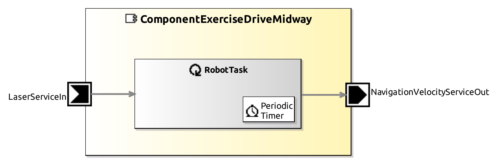

<!--- This file is generated from the ComponentExerciseFollowWall.componentDocumentation model --->
<!--- do not modify this file manually as it will by automatically overwritten by the code generator, modify the model instead and re-generate this file --->

# ComponentExerciseFollowWall Component

The SmartLaserObstacleAvoid component implements a simple reactive obstacle avoidance. 
It periodically receives laser range scans, calculates steering commands and forwards these to the robot 
base (e.g. SmartPioneerBaseServer or SmartPlayerStageSimulator) for execution. It always navigates in a 
free direction and adopts speed and turnrate. This component is a simple example how to send velocity 
commands to the base and how to work with laser scans.

It further illustrates the use of component parameters. The calculated speed is thresholded
according to a variation point (parameter 'v_x') before providing the navigation commands through one of its services.
This parameter 'v_x' can be configured during runtime of the component through its parameter service. See the video tutorials
for more information.

Note: This component is used in Tutorials (e.g. Lesson 1). It is part of the video tutorials and has been shown in:
Christian Schlegel and Dennis Stampfer. The SmartMDSD Toolchain: Supporting dynamic reconfiguration by managing 
variability in robotics software development. Tutorial on Managing Software Variability in Robot Control 
Systems. Robotics: Science and Systems Conference (RSS 2014), Berkeley, CA, July 13th 2014.

| Metaelement | Documentation |
|-------------|---------------|
| License | 	LGPL |
| Hardware Requirements | - |
| Purpose | Example Component: simplistic obstacle avoidance |

## Service Ports

### LaserServiceIn

Used to receive scans from the laser ranger. Typically connected to SmartLaserLMS200Server or SmartPlayerStageSimulator.

### NavigationVelocityServiceOut

Typically connected to the robot base (e.g. SmartPioneerBaseServer, SmartPlayerStageSimulator). This port sends navigation commands v, w.

