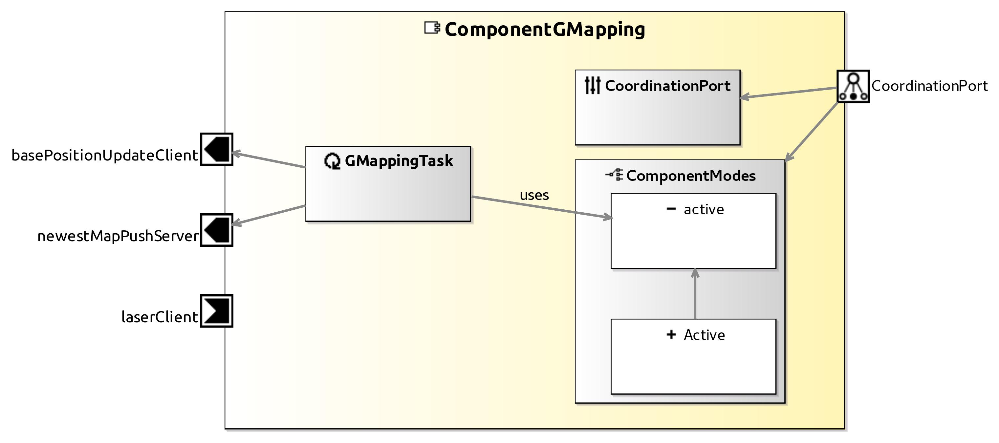

<!--- This file is generated from the ComponentGMapping.componentDocumentation model --->
<!--- do not modify this file manually as it will by automatically overwritten by the code generator, modify the model instead and re-generate this file --->

# ComponentGMapping Component

| Metaelement | Documentation |
|-------------|---------------|
| License |  |
| Hardware Requirements |  |
| Purpose |  |

## Service Ports

## Component Parameters ComponentGMappingParams

### InternalParameter gfs

| Attribute Name | Attribute Type | Description |
|----------------|----------------|-------------|
| particles | Int32 |  |
| angularUpdate | Double |  |
| linearUpdate | Double |  |
| delta | Double |  |
| maxrange | Double |  |
| maxUrange | Double |  |
| sigma | Double |  |
| regscore | Double |  |
| iterations | Int32 |  |
| critscore | Double |  |
| maxMove | Double |  |
| lstep | Double |  |
| astep | Double |  |
| lsigma | Double |  |
| lskip | Int32 |  |
| kernelSize | Int32 |  |
| ogain | Int32 |  |
| resampleThreshold | Double |  |
| srr | Double |  |
| srt | Double |  |
| str | Double |  |
| stt | Double |  |
| xmin | Double |  |
| ymin | Double |  |
| xmax | Double |  |
| ymax | Double |  |
| generateMap | Boolean |  |

### InternalParameter settings

| Attribute Name | Attribute Type | Description |
|----------------|----------------|-------------|
| verbose | Boolean |  |
| initial_pose_x | Double |  |
| initial_pose_y | Double |  |
| initial_pose_azimuth | Double |  |

### ParameterSetInstance SlamParameter

#### TriggerInstance INITNEWMAP

active = false

#### TriggerInstance SAVEMAP

active = false

