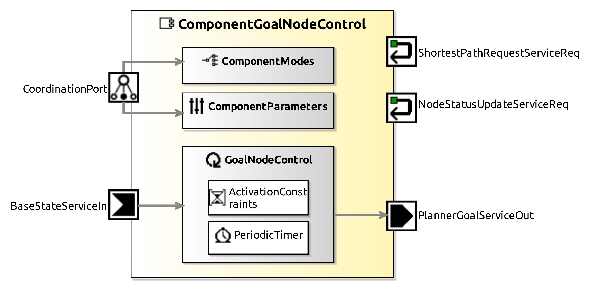

<!--- This file is generated from the ComponentGoalNodeControl.componentDocumentation model --->
<!--- do not modify this file manually as it will by automatically overwritten by the code generator, modify the model instead and re-generate this file --->

# ComponentGoalNodeControl Component

*Component Short Description:* A short description for the ComponentGoalNodeControl datasheet

## Component-Datasheet Properties

<table style="border-collapse:collapse;">
<caption><i>Table:</i> Component-Datasheet Properties</caption>
<tr style="background-color:#ccc;">
<th style="border:1px solid black; padding: 5px;"><i>Property Name</i></th>
<th style="border:1px solid black; padding: 5px;"><i>Property Value</i></th>
<th style="border:1px solid black; padding: 5px;"><i>Property Description</i></th>
</tr>
<tr>
<td style="border:1px solid black; padding: 5px;">Supplier</td>
<td style="border:1px solid black; padding: 5px;">No supplier specified</td>
<td style="border:1px solid black; padding: 5px;"></td>
</tr>
<tr>
<td style="border:1px solid black; padding: 5px;">Homepage</td>
<td style="border:1px solid black; padding: 5px;">http://www.example.com</td>
<td style="border:1px solid black; padding: 5px;"></td>
</tr>
<tr>
<td style="border:1px solid black; padding: 5px;">Purpose</td>
<td style="border:1px solid black; padding: 5px;">Example</td>
<td style="border:1px solid black; padding: 5px;"></td>
</tr>
</table>

## Component Ports

### BaseStateServiceIn

*Documentation:*

### ShortestPathRequestServiceReq

*Documentation:*

### NodeStatusUpdateServiceReq

*Documentation:*

### PlannerGoalServiceOut

*Documentation:*

### CorridorNavigationNextGoalOut

*Documentation:*

## Component Parameters: ComponentGoalNodeControl

### ParameterSetInstance: CorridorNavigationClientParams

#### Trigger Instance: SET_GOAL

*Property:* active = **true**

*Documentation:*

### Internal Parameter: GoalNodeControl

*Documentation:*

<table style="border-collapse:collapse;">
<caption><i>Table:</i> Internal Parameter <b>GoalNodeControl</b></caption>
<tr style="background-color:#ccc;">
<th style="border:1px solid black; padding: 5px;"><i>Attribute Name</i></th>
<th style="border:1px solid black; padding: 5px;"><i>Attribute Type</i></th>
<th style="border:1px solid black; padding: 5px;"><i>Attribute Value</i></th>
<th style="border:1px solid black; padding: 5px;"><i>Attribute Description</i></th>
</tr>
<tr>
<td style="border:1px solid black; padding: 5px;"><b>freeStrategy</b></td>
<td style="border:1px solid black; padding: 5px;">InlineEnumeration</td>
<td style="border:1px solid black; padding: 5px;">CURRENT</td>
<td style="border:1px solid black; padding: 5px;"></td>
</tr>
</table>

