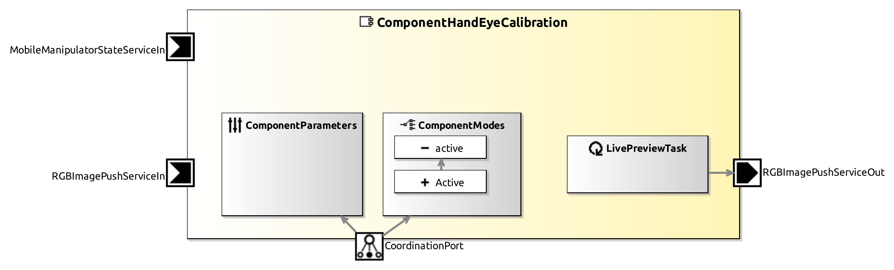

<!--- This file is generated from the ComponentHandEyeCalibration.componentDocumentation model --->
<!--- do not modify this file manually as it will by automatically overwritten by the code generator, modify the model instead and re-generate this file --->

# ComponentHandEyeCalibration Component

*Component Short Description:* 
Component receives images (containing the charuco pattern) and the corresponding manipulator poses and calculates the calibration parameters.
This component uses the OpenCV's [calibrateHandEye](https://docs.opencv.org/4.x/d9/d0c/group__calib3d.html#gaebfc1c9f7434196a374c382abf43439b) function and OpenCV4 is required.

### ChAruco pattern generator
Easy way to generate the ChAruco pattern is using the link [https://calib.io/pages/camera-calibration-pattern-generator](https://calib.io/pages/camera-calibration-pattern-generator).
Update component parameters with the values used for generating the pattern. smartsoft/data folder of the component contains default pattern and the corresponding values are used in component parameters.
### Usage
Step 1: Change the component state to Active.

Step 2: Move the manipulator

Step 3: Received image is visualized with detected pattern and origin, if the detected was correct press y or Y. Otherwise press n or N.

Step 4: A minimum of 10 image is required to get the better results.

Step 5: Finally press c or C and the calibration starts and gives the calibration result.

## Component-Datasheet Properties

<table style="border-collapse:collapse;">
<caption><i>Table:</i> Component-Datasheet Properties</caption>
<tr style="background-color:#ccc;">
<th style="border:1px solid black; padding: 5px;"><i>Property Name</i></th>
<th style="border:1px solid black; padding: 5px;"><i>Property Value</i></th>
<th style="border:1px solid black; padding: 5px;"><i>Property Description</i></th>
</tr>
<tr>
<td style="border:1px solid black; padding: 5px;">Supplier</td>
<td style="border:1px solid black; padding: 5px;">Servicerobotics Ulm</td>
<td style="border:1px solid black; padding: 5px;"></td>
</tr>
<tr>
<td style="border:1px solid black; padding: 5px;">Homepage</td>
<td style="border:1px solid black; padding: 5px;">http://servicerobotik-ulm.de/components</td>
<td style="border:1px solid black; padding: 5px;"></td>
</tr>
<tr>
<td style="border:1px solid black; padding: 5px;">Purpose</td>
<td style="border:1px solid black; padding: 5px;">Hand Eye Calibration</td>
<td style="border:1px solid black; padding: 5px;"></td>
</tr>
</table>

## Component Ports

### MobileManipulatorStateServiceIn

*Documentation:*

Receives Current state of the manipulator

### RGBImagePushServiceIn

*Documentation:*

Receives RGB image

### RGBImagePushServiceOut

*Documentation:*

Provides RGB image with detected pattern drawn on it

## Component Parameters: ComponentHandEyeCalibration

### Internal Parameter: ChArUcoBoard

*Documentation:*

<table style="border-collapse:collapse;">
<caption><i>Table:</i> Internal Parameter <b>ChArUcoBoard</b></caption>
<tr style="background-color:#ccc;">
<th style="border:1px solid black; padding: 5px;"><i>Attribute Name</i></th>
<th style="border:1px solid black; padding: 5px;"><i>Attribute Type</i></th>
<th style="border:1px solid black; padding: 5px;"><i>Attribute Value</i></th>
<th style="border:1px solid black; padding: 5px;"><i>Attribute Description</i></th>
</tr>
<tr>
<td style="border:1px solid black; padding: 5px;"><b>rows</b></td>
<td style="border:1px solid black; padding: 5px;">UInt8</td>
<td style="border:1px solid black; padding: 5px;">8</td>
<td style="border:1px solid black; padding: 5px;">
Number of rows in ChArUcoBoard

</td>
</tr>
<tr>
<td style="border:1px solid black; padding: 5px;"><b>columns</b></td>
<td style="border:1px solid black; padding: 5px;">UInt8</td>
<td style="border:1px solid black; padding: 5px;">11</td>
<td style="border:1px solid black; padding: 5px;">
Number of corner columns in ChArUcoBoard

</td>
</tr>
<tr>
<td style="border:1px solid black; padding: 5px;"><b>squareLength</b></td>
<td style="border:1px solid black; padding: 5px;">Double</td>
<td style="border:1px solid black; padding: 5px;">0.015</td>
<td style="border:1px solid black; padding: 5px;">
Length of checker square side, units : meters

</td>
</tr>
<tr>
<td style="border:1px solid black; padding: 5px;"><b>markerLength</b></td>
<td style="border:1px solid black; padding: 5px;">Double</td>
<td style="border:1px solid black; padding: 5px;">0.012</td>
<td style="border:1px solid black; padding: 5px;">
Length of marker side, units : meters

</td>
</tr>
<tr>
<td style="border:1px solid black; padding: 5px;"><b>dictionaryType</b></td>
<td style="border:1px solid black; padding: 5px;">InlineEnumeration</td>
<td style="border:1px solid black; padding: 5px;">DICT_6X6_50</td>
<td style="border:1px solid black; padding: 5px;">
Dictionany type used in the ChArUcoBoard

</td>
</tr>
</table>

### Internal Parameter: Calibration

*Documentation:*

<table style="border-collapse:collapse;">
<caption><i>Table:</i> Internal Parameter <b>Calibration</b></caption>
<tr style="background-color:#ccc;">
<th style="border:1px solid black; padding: 5px;"><i>Attribute Name</i></th>
<th style="border:1px solid black; padding: 5px;"><i>Attribute Type</i></th>
<th style="border:1px solid black; padding: 5px;"><i>Attribute Value</i></th>
<th style="border:1px solid black; padding: 5px;"><i>Attribute Description</i></th>
</tr>
<tr>
<td style="border:1px solid black; padding: 5px;"><b>type</b></td>
<td style="border:1px solid black; padding: 5px;">InlineEnumeration</td>
<td style="border:1px solid black; padding: 5px;">HAND_TO_EYE</td>
<td style="border:1px solid black; padding: 5px;">
Calibration type either hand-in-eye or hand-to-eye

</td>
</tr>
</table>

