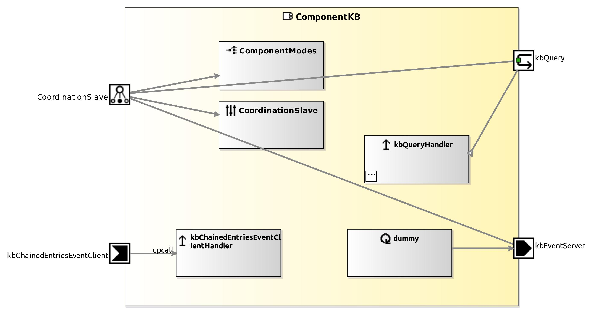

<!--- This file is generated from the ComponentKB.componentDocumentation model --->
<!--- do not modify this file manually as it will by automatically overwritten by the code generator, modify the model instead and re-generate this file --->

# ComponentKB Component

*Component Short Description:* TODO: add short description for ComponentKB datasheet

## Component-Datasheet Properties

<table style="border-collapse:collapse;">
<caption><i>Table:</i> Component-Datasheet Properties</caption>
<tr style="background-color:#ccc;">
<th style="border:1px solid black; padding: 5px;"><i>Property Name</i></th>
<th style="border:1px solid black; padding: 5px;"><i>Property Value</i></th>
<th style="border:1px solid black; padding: 5px;"><i>Property Description</i></th>
</tr>
<tr>
<td style="border:1px solid black; padding: 5px;">MarketName</td>
<td style="border:1px solid black; padding: 5px;">ComponentKB</td>
<td style="border:1px solid black; padding: 5px;"></td>
</tr>
<tr>
<td style="border:1px solid black; padding: 5px;">Supplier</td>
<td style="border:1px solid black; padding: 5px;">Servicerobotics Ulm</td>
<td style="border:1px solid black; padding: 5px;"></td>
</tr>
<tr>
<td style="border:1px solid black; padding: 5px;">Homepage</td>
<td style="border:1px solid black; padding: 5px;">http://servicerobotik-ulm.de/components</td>
<td style="border:1px solid black; padding: 5px;"></td>
</tr>
<tr>
<td style="border:1px solid black; padding: 5px;">Purpose</td>
<td style="border:1px solid black; padding: 5px;">Example</td>
<td style="border:1px solid black; padding: 5px;"></td>
</tr>
</table>

## Component Ports

### kbQuery

*Documentation:*

### kbEventServer

*Documentation:*

### kbChainedEntriesEventClient

*Documentation:*

## Component Parameters: ComponentKBParams

### Internal Parameter: Settings

*Documentation:*

<table style="border-collapse:collapse;">
<caption><i>Table:</i> Internal Parameter <b>Settings</b></caption>
<tr style="background-color:#ccc;">
<th style="border:1px solid black; padding: 5px;"><i>Attribute Name</i></th>
<th style="border:1px solid black; padding: 5px;"><i>Attribute Type</i></th>
<th style="border:1px solid black; padding: 5px;"><i>Attribute Value</i></th>
<th style="border:1px solid black; padding: 5px;"><i>Attribute Description</i></th>
</tr>
<tr>
<td style="border:1px solid black; padding: 5px;"><b>connectChainedEntries</b></td>
<td style="border:1px solid black; padding: 5px;">Boolean</td>
<td style="border:1px solid black; padding: 5px;">false</td>
<td style="border:1px solid black; padding: 5px;"></td>
</tr>
</table>

