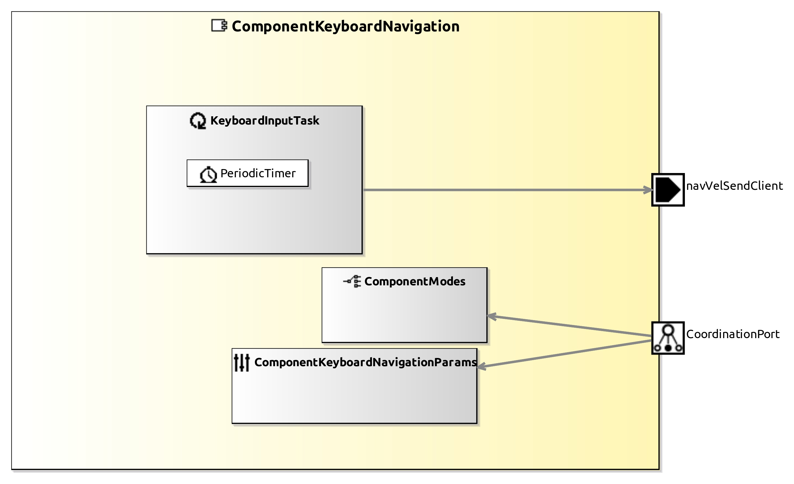

<!--- This file is generated from the ComponentKeyboardNavigation.componentDocumentation model --->
<!--- do not modify this file manually as it will by automatically overwritten by the code generator, modify the model instead and re-generate this file --->

# ComponentKeyboardNavigation Component

| Metaelement | Documentation |
|-------------|---------------|
| License |  |
| Hardware Requirements |  |
| Purpose |  |

## Service Ports

## Component Parameters ComponentKeyboardNavigationParams

### InternalParameter Settings

| Attribute Name | Attribute Type | Description |
|----------------|----------------|-------------|
| speedAcceleration | Double |  |
| angularAcceleration | Double |  |

