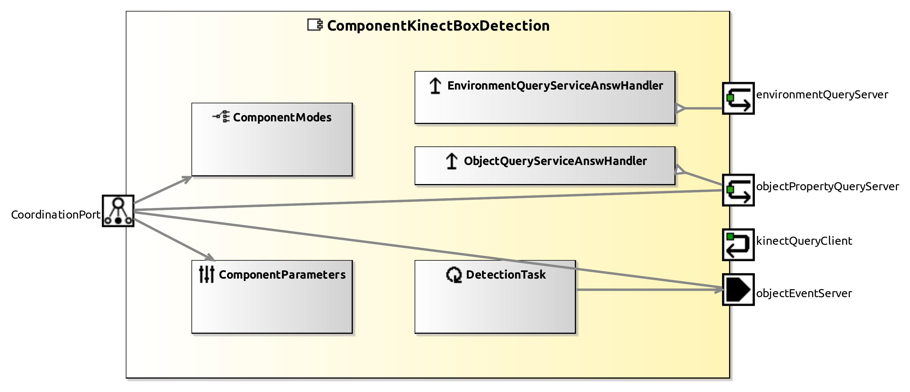

<!--- This file is generated from the ComponentKinectBoxDetection.componentDocumentation model --->
<!--- do not modify this file manually as it will by automatically overwritten by the code generator, modify the model instead and re-generate this file --->

# ComponentKinectBoxDetection Component

*Component Short Description:* TODO: add short description for ComponentKinectBoxDetection datasheet

## Component-Datasheet Properties

<table style="border-collapse:collapse;">
<caption><i>Table:</i> Component-Datasheet Properties</caption>
<tr style="background-color:#ccc;">
<th style="border:1px solid black; padding: 5px;"><i>Property Name</i></th>
<th style="border:1px solid black; padding: 5px;"><i>Property Value</i></th>
<th style="border:1px solid black; padding: 5px;"><i>Property Description</i></th>
</tr>
</table>

## Component Ports

### objectPropertyQueryServer

*Documentation:*

### environmentQueryServer

*Documentation:*

### kinectQueryClient

*Documentation:*

### objectEventServer

*Documentation:*

## Component Parameters: ComponentKinectBoxDetection

### ParameterSetInstance: ObjectRecognitionParameter

#### Parameter Instance: BELIEF_THRESHOLD

*Documentation:*

<table style="border-collapse:collapse;">
<caption><i>Table:</i> Parameter-Instance <b>BELIEF_THRESHOLD</b></caption>
<tr style="background-color:#ccc;">
<th style="border:1px solid black; padding: 5px;"><i>Attribute Name</i></th>
<th style="border:1px solid black; padding: 5px;"><i>Attribute Type</i></th>
<th style="border:1px solid black; padding: 5px;"><i>Attribute Value</i></th>
<th style="border:1px solid black; padding: 5px;"><i>Attribute Description</i></th>
</tr>
<tr>
<td style="border:1px solid black; padding: 5px;"><b>threshold</b></td>
<td style="border:1px solid black; padding: 5px;">Double</td>
<td style="border:1px solid black; padding: 5px;">0.0</td>
<td style="border:1px solid black; padding: 5px;"></td>
</tr>
</table>

#### Parameter Instance: CLOUD

*Documentation:*

<table style="border-collapse:collapse;">
<caption><i>Table:</i> Parameter-Instance <b>CLOUD</b></caption>
<tr style="background-color:#ccc;">
<th style="border:1px solid black; padding: 5px;"><i>Attribute Name</i></th>
<th style="border:1px solid black; padding: 5px;"><i>Attribute Type</i></th>
<th style="border:1px solid black; padding: 5px;"><i>Attribute Value</i></th>
<th style="border:1px solid black; padding: 5px;"><i>Attribute Description</i></th>
</tr>
<tr>
<td style="border:1px solid black; padding: 5px;"><b>id</b></td>
<td style="border:1px solid black; padding: 5px;">UInt32</td>
<td style="border:1px solid black; padding: 5px;">0</td>
<td style="border:1px solid black; padding: 5px;"></td>
</tr>
</table>

#### Parameter Instance: CLUSTERING

*Documentation:*

<table style="border-collapse:collapse;">
<caption><i>Table:</i> Parameter-Instance <b>CLUSTERING</b></caption>
<tr style="background-color:#ccc;">
<th style="border:1px solid black; padding: 5px;"><i>Attribute Name</i></th>
<th style="border:1px solid black; padding: 5px;"><i>Attribute Type</i></th>
<th style="border:1px solid black; padding: 5px;"><i>Attribute Value</i></th>
<th style="border:1px solid black; padding: 5px;"><i>Attribute Description</i></th>
</tr>
<tr>
<td style="border:1px solid black; padding: 5px;"><b>doClustering</b></td>
<td style="border:1px solid black; padding: 5px;">Boolean</td>
<td style="border:1px solid black; padding: 5px;">true</td>
<td style="border:1px solid black; padding: 5px;"></td>
</tr>
</table>

#### Parameter Instance: ESTIMATEFILLING

*Documentation:*

<table style="border-collapse:collapse;">
<caption><i>Table:</i> Parameter-Instance <b>ESTIMATEFILLING</b></caption>
<tr style="background-color:#ccc;">
<th style="border:1px solid black; padding: 5px;"><i>Attribute Name</i></th>
<th style="border:1px solid black; padding: 5px;"><i>Attribute Type</i></th>
<th style="border:1px solid black; padding: 5px;"><i>Attribute Value</i></th>
<th style="border:1px solid black; padding: 5px;"><i>Attribute Description</i></th>
</tr>
<tr>
<td style="border:1px solid black; padding: 5px;"><b>estimateObjectProperties</b></td>
<td style="border:1px solid black; padding: 5px;">Boolean</td>
<td style="border:1px solid black; padding: 5px;">false</td>
<td style="border:1px solid black; padding: 5px;"></td>
</tr>
</table>

#### Parameter Instance: SETOBJECTID

*Documentation:*

<table style="border-collapse:collapse;">
<caption><i>Table:</i> Parameter-Instance <b>SETOBJECTID</b></caption>
<tr style="background-color:#ccc;">
<th style="border:1px solid black; padding: 5px;"><i>Attribute Name</i></th>
<th style="border:1px solid black; padding: 5px;"><i>Attribute Type</i></th>
<th style="border:1px solid black; padding: 5px;"><i>Attribute Value</i></th>
<th style="border:1px solid black; padding: 5px;"><i>Attribute Description</i></th>
</tr>
<tr>
<td style="border:1px solid black; padding: 5px;"><b>id</b></td>
<td style="border:1px solid black; padding: 5px;">UInt32</td>
<td style="border:1px solid black; padding: 5px;">0</td>
<td style="border:1px solid black; padding: 5px;"></td>
</tr>
</table>

#### Trigger Instance: RECOGNIZE

*Property:* active = **true**

*Documentation:*

### Internal Parameter: General

*Documentation:*

<table style="border-collapse:collapse;">
<caption><i>Table:</i> Internal Parameter <b>General</b></caption>
<tr style="background-color:#ccc;">
<th style="border:1px solid black; padding: 5px;"><i>Attribute Name</i></th>
<th style="border:1px solid black; padding: 5px;"><i>Attribute Type</i></th>
<th style="border:1px solid black; padding: 5px;"><i>Attribute Value</i></th>
<th style="border:1px solid black; padding: 5px;"><i>Attribute Description</i></th>
</tr>
<tr>
<td style="border:1px solid black; padding: 5px;"><b>verbose</b></td>
<td style="border:1px solid black; padding: 5px;">Boolean</td>
<td style="border:1px solid black; padding: 5px;">true</td>
<td style="border:1px solid black; padding: 5px;"></td>
</tr>
<tr>
<td style="border:1px solid black; padding: 5px;"><b>use_kinect</b></td>
<td style="border:1px solid black; padding: 5px;">Boolean</td>
<td style="border:1px solid black; padding: 5px;">false</td>
<td style="border:1px solid black; padding: 5px;"></td>
</tr>
<tr>
<td style="border:1px solid black; padding: 5px;"><b>use_kinect_v2</b></td>
<td style="border:1px solid black; padding: 5px;">Boolean</td>
<td style="border:1px solid black; padding: 5px;">true</td>
<td style="border:1px solid black; padding: 5px;"></td>
</tr>
<tr>
<td style="border:1px solid black; padding: 5px;"><b>use_hsv</b></td>
<td style="border:1px solid black; padding: 5px;">Boolean</td>
<td style="border:1px solid black; padding: 5px;">false</td>
<td style="border:1px solid black; padding: 5px;"></td>
</tr>
<tr>
<td style="border:1px solid black; padding: 5px;"><b>do_x_filtering</b></td>
<td style="border:1px solid black; padding: 5px;">Boolean</td>
<td style="border:1px solid black; padding: 5px;">true</td>
<td style="border:1px solid black; padding: 5px;"></td>
</tr>
<tr>
<td style="border:1px solid black; padding: 5px;"><b>do_y_filtering</b></td>
<td style="border:1px solid black; padding: 5px;">Boolean</td>
<td style="border:1px solid black; padding: 5px;">true</td>
<td style="border:1px solid black; padding: 5px;"></td>
</tr>
<tr>
<td style="border:1px solid black; padding: 5px;"><b>do_z_filtering</b></td>
<td style="border:1px solid black; padding: 5px;">Boolean</td>
<td style="border:1px solid black; padding: 5px;">true</td>
<td style="border:1px solid black; padding: 5px;"></td>
</tr>
<tr>
<td style="border:1px solid black; padding: 5px;"><b>x_detection_distance_min</b></td>
<td style="border:1px solid black; padding: 5px;">Double</td>
<td style="border:1px solid black; padding: 5px;">-1000</td>
<td style="border:1px solid black; padding: 5px;"></td>
</tr>
<tr>
<td style="border:1px solid black; padding: 5px;"><b>x_detection_distance_max</b></td>
<td style="border:1px solid black; padding: 5px;">Double</td>
<td style="border:1px solid black; padding: 5px;">1000</td>
<td style="border:1px solid black; padding: 5px;"></td>
</tr>
<tr>
<td style="border:1px solid black; padding: 5px;"><b>y_detection_distance_min</b></td>
<td style="border:1px solid black; padding: 5px;">Double</td>
<td style="border:1px solid black; padding: 5px;">-1000</td>
<td style="border:1px solid black; padding: 5px;"></td>
</tr>
<tr>
<td style="border:1px solid black; padding: 5px;"><b>y_detection_distance_max</b></td>
<td style="border:1px solid black; padding: 5px;">Double</td>
<td style="border:1px solid black; padding: 5px;">1000</td>
<td style="border:1px solid black; padding: 5px;"></td>
</tr>
<tr>
<td style="border:1px solid black; padding: 5px;"><b>z_detection_distance_min</b></td>
<td style="border:1px solid black; padding: 5px;">Double</td>
<td style="border:1px solid black; padding: 5px;">50</td>
<td style="border:1px solid black; padding: 5px;"></td>
</tr>
<tr>
<td style="border:1px solid black; padding: 5px;"><b>z_detection_distance_max</b></td>
<td style="border:1px solid black; padding: 5px;">Double</td>
<td style="border:1px solid black; padding: 5px;">1300</td>
<td style="border:1px solid black; padding: 5px;"></td>
</tr>
<tr>
<td style="border:1px solid black; padding: 5px;"><b>box_aspect_ratio</b></td>
<td style="border:1px solid black; padding: 5px;">Double</td>
<td style="border:1px solid black; padding: 5px;">3.0</td>
<td style="border:1px solid black; padding: 5px;"></td>
</tr>
<tr>
<td style="border:1px solid black; padding: 5px;"><b>send_obstacle_mesh</b></td>
<td style="border:1px solid black; padding: 5px;">Boolean</td>
<td style="border:1px solid black; padding: 5px;">true</td>
<td style="border:1px solid black; padding: 5px;"></td>
</tr>
</table>

### Extended Parameter: SETSEARCHHEIGHT

*Documentation:*

<table style="border-collapse:collapse;">
<caption><i>Table:</i> Extended Parameter <b>SETSEARCHHEIGHT</b></caption>
<tr style="background-color:#ccc;">
<th style="border:1px solid black; padding: 5px;"><i>Attribute Name</i></th>
<th style="border:1px solid black; padding: 5px;"><i>Attribute Type</i></th>
<th style="border:1px solid black; padding: 5px;"><i>Attribute Value</i></th>
<th style="border:1px solid black; padding: 5px;"><i>Attribute Description</i></th>
</tr>
<tr>
<td style="border:1px solid black; padding: 5px;"><b>minM</b></td>
<td style="border:1px solid black; padding: 5px;">Double</td>
<td style="border:1px solid black; padding: 5px;">0.0</td>
<td style="border:1px solid black; padding: 5px;"></td>
</tr>
<tr>
<td style="border:1px solid black; padding: 5px;"><b>maxM</b></td>
<td style="border:1px solid black; padding: 5px;">Double</td>
<td style="border:1px solid black; padding: 5px;">0.0</td>
<td style="border:1px solid black; padding: 5px;"></td>
</tr>
</table>

