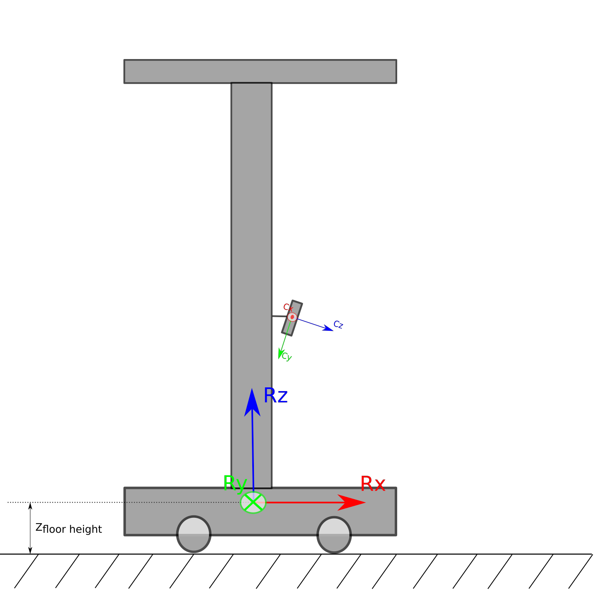

# 2D Laser generation from RGBD camera
* Initialize the laser parameters i.e 
    * angle resolution = 0.5 degrees as default, parameter in .ini file
    * number of laser rays = (horizontal field of view of camera / angle resolution)
    * angle of the first laser ray = -1 * (horizontal field of view of camera / 2.0 )
* Receive **CommRGBDImage** from 3D camera component.
    * Get **CommDepthImage** from **CommRGBDImage**.
* Generate pointcloud in the camera frame using depth image and intrinsic parameters.
* Transform the pointcloud into robot frame using camera sensor pose (from comobj).
* Remove the points correspond to the floor.
    * Filter the pointcloud using pass-through filter on Z coordinate of points (Zfloor_height < ZRi x < Zmaxx).
* Down project the pointcloud and find the minimum distance for laser each ray.
    * find distance of the each laser ray di with angleand index li.
    * Calculate the angle and distance ri of each pointin XY plane of robot. 
        *  &theta;i = atan2(yi, xi)
        *  ri = &radic;(xi2, yi2)
    * Find ray index li fromand set ray distance as ri.
        *  if(ri < di) di = ri
* Set the calculated distances di to **CommMobileLaserScan**.

  
