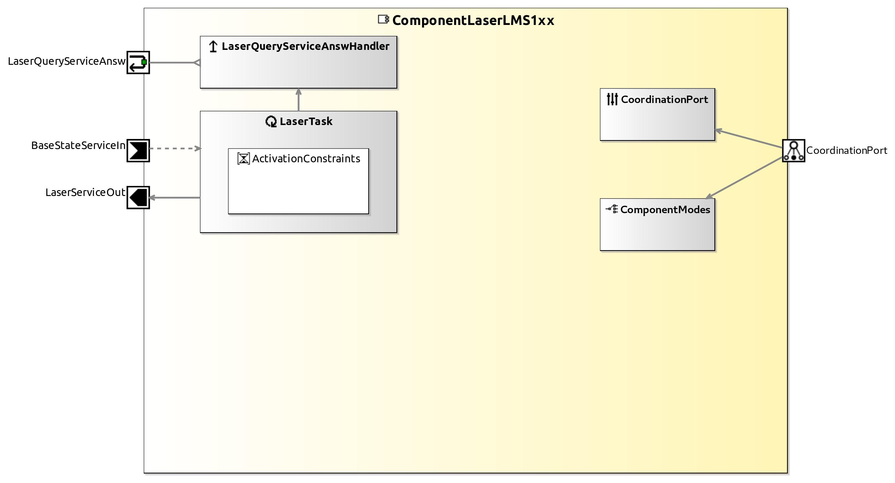

<!--- This file is generated from the ComponentLaserLMS1xx.componentDocumentation model --->
<!--- do not modify this file manually as it will by automatically overwritten by the code generator, modify the model instead and re-generate this file --->

# ComponentLaserLMS1xx Component

The ComponentLaserLMS1xx makes laser scans from SICK LMS 1xx series and PLS langer rangers available. Scans can be requested by push newest or query communication. This component includes Code from the Player Project

| Metaelement | Documentation |
|-------------|---------------|
| License | LGPL v2.1 |
| Hardware Requirements | A Sick Laser LMS1xx series |
| Purpose |  |

## Service Ports

## Component Parameters ComponentLaserLMS1xxParams

### InternalParameter scanner

| Attribute Name | Attribute Type | Description |
|----------------|----------------|-------------|
| verbose | Boolean |  |
| on_turret | Boolean |  |
| x | Int32 |  |
| y | Int32 |  |
| z | Int32 |  |
| azimuth | Double |  |
| elevation | Double |  |
| roll | Double |  |
| ip_address | String |  |
| port | UInt32 |  |
| min_range | UInt32 |  |
| max_range | UInt32 |  |
| opening_angle | UInt32 |  |
| resolution | Double |  |
| length_unit | UInt32 |  |
| frequency | UInt32 |  |

### InternalParameter base_manipulator

| Attribute Name | Attribute Type | Description |
|----------------|----------------|-------------|
| on_base | Boolean |  |
| x | Int32 |  |
| y | Int32 |  |
| z | Int32 |  |
| base_a | Double |  |
| steer_a | Double |  |
| turret_a | Double |  |

### InternalParameter services

| Attribute Name | Attribute Type | Description |
|----------------|----------------|-------------|
| activate_push_newest | Boolean |  |
| active_push_timed | Boolean |  |

