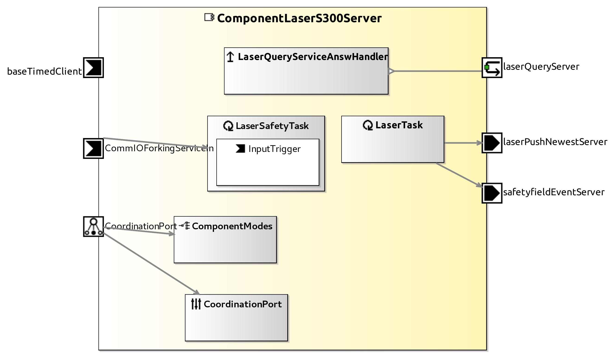

<!--- This file is generated from the ComponentLaserS300Server.componentDocumentation model --->
<!--- do not modify this file manually as it will by automatically overwritten by the code generator, modify the model instead and re-generate this file --->

# ComponentLaserS300Server Component

| Metaelement | Documentation |
|-------------|---------------|
| License |  |
| Hardware Requirements |  |
| Purpose |  |

## Service Ports

## Component Parameters ComponentLaserS300ServerParams

### InternalParameter scanner

| Attribute Name | Attribute Type | Description |
|----------------|----------------|-------------|
| verbose | Boolean |  |
| on_turret | Boolean |  |
| x | Int32 |  |
| y | Int32 |  |
| z | Int32 |  |
| azimuth | Double |  |
| elevation | Double |  |
| roll | Double |  |
| device | String |  |
| baudrate | UInt32 |  |
| min_range | UInt32 |  |
| max_range | UInt32 |  |
| opening_angle | UInt32 |  |
| resolution | Double |  |
| length_unit | UInt32 |  |
| frequency | UInt32 |  |
| telgrm_v103 | Boolean |  |

### InternalParameter base_manipulator

| Attribute Name | Attribute Type | Description |
|----------------|----------------|-------------|
| on_base | Boolean |  |
| x | Int32 |  |
| y | Int32 |  |
| z | Int32 |  |
| base_a | Double |  |
| steer_a | Double |  |
| turret_a | Double |  |

### InternalParameter services

| Attribute Name | Attribute Type | Description |
|----------------|----------------|-------------|
| activate_push_newest | Boolean |  |
| activate_push_timed | Boolean |  |
| activate_safetyEventServer | Boolean |  |

