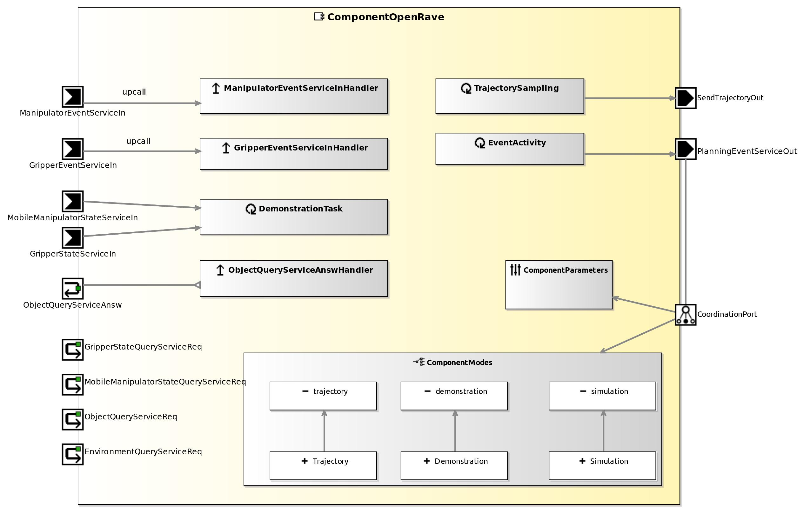

<!--- This file is generated from the ComponentOpenRave.componentDocumentation model --->
<!--- do not modify this file manually as it will by automatically overwritten by the code generator, modify the model instead and re-generate this file --->

# ComponentOpenRave Component

NOTE: THIS COMPONENT PROJECT ONLY CONTAINS A COMPONENT HULL. IMPLEMENTATION OF THIS COMPONENT IS WORK IN PROGRESS. YOU CAN USE THIS COMPONENT HULL TO FILL IN YOUR OWN IMPLEMENTATION.

TODO: ADD description!

| Metaelement | Documentation |
|-------------|---------------|
| License |  |
| Hardware Requirements |  |
| Purpose |  |

## Service Ports

## Component Parameters ComponentOpenRaveParams

### InternalParameter OpenRave

| Attribute Name | Attribute Type | Description |
|----------------|----------------|-------------|
| defaultEnvironmentPath | String |  |
| robotPath | String |  |
| saveTrajectoryToFile | Boolean |  |
| saveObjectsToFile | Boolean |  |
| debugSend | Boolean |  |
| debugOpenRave | Boolean |  |
| debugGrasping | Boolean |  |
| gui_active | Boolean |  |
| robotName | String |  |
| showCompleteTrajectory | Boolean |  |
| storedEnvironmentPath | String |  |
| storedEnvironmentName | String |  |
| python_path | String |  |
| objectDatabasePath | String |  |
| objectDatabaseXMLFilename | String |  |

### InternalParameter PortParameter

| Attribute Name | Attribute Type | Description |
|----------------|----------------|-------------|
| withManipulator | Boolean |  |
| withGripper | Boolean |  |
| gripperComponentName | String |  |
| gripperComponentParameterService | String |  |
| withObjectRecognition | Boolean |  |

### ParameterSetInstance ManipulationPlannerParameter

#### TriggerInstance PLAN_PATH_TARGET_TCP_POSE

active = false

#### TriggerInstance PLAN_PATH_TARGET_JOINT_ANGLES

active = false

#### TriggerInstance PLAN_FURNITURE_MANIPUATION_TASK

active = false

#### TriggerInstance CONSTRAINED_PATH

active = false

#### TriggerInstance ENV_CLEAR

active = false

#### TriggerInstance ENV_LOAD_FILE

active = false

#### TriggerInstance ENV_LOAD_OBJECTRECOGNITION

active = false

#### TriggerInstance ENV_SAVE_FILE

active = false

#### TriggerInstance GRASPING_CENTERED

active = false

#### TriggerInstance GRASPING_NONE

active = false

#### TriggerInstance GRASPING_SIMPLE

active = false

#### TriggerInstance NORMAL_PATH

active = false

#### TriggerInstance OBJ_ADD

active = false

#### TriggerInstance OBJ_COMPUTEGRASPTABLE

active = false

#### TriggerInstance OBJ_DELETE

active = false

#### TriggerInstance OBJ_MOVE

active = false

#### TriggerInstance PLANNING_GRASPOBJ

active = false

#### TriggerInstance PLANNING_RELEASEOBJ

active = false

#### TriggerInstance SIMULATION_PLAN_ALL

active = false

#### TriggerInstance SIMULATION_TEST_IK_ONLY

active = false

