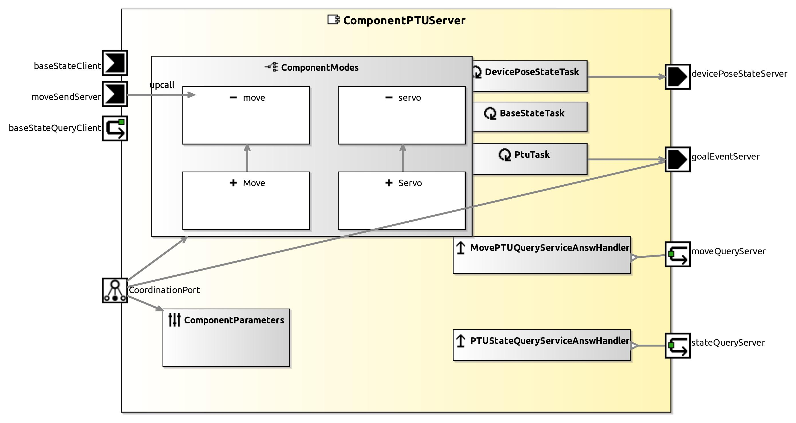

<!--- This file is generated from the ComponentPTUServer.componentDocumentation model --->
<!--- do not modify this file manually as it will by automatically overwritten by the code generator, modify the model instead and re-generate this file --->

# ComponentPTUServer Component

*Component Short Description:* TODO: add short description for ComponentPTUServer datasheet

## Component-Datasheet Properties

<table style="border-collapse:collapse;">
<caption><i>Table:</i> Component-Datasheet Properties</caption>
<tr style="background-color:#ccc;">
<th style="border:1px solid black; padding: 5px;"><i>Property Name</i></th>
<th style="border:1px solid black; padding: 5px;"><i>Property Value</i></th>
<th style="border:1px solid black; padding: 5px;"><i>Property Description</i></th>
</tr>
</table>

## Component Ports

### baseStateQueryClient

*Documentation:*

### baseStateClient

*Documentation:*

### devicePoseStateServer

*Documentation:*

### goalEventServer

*Documentation:*

### moveSendServer

*Documentation:*

### moveQueryServer

*Documentation:*

### stateQueryServer

*Documentation:*

## Component Parameters: ComponentPTUServerParams

### ParameterSetInstance: PTUParameter

#### Parameter Instance: ACCELERATION_PAN

*Documentation:*

<table style="border-collapse:collapse;">
<caption><i>Table:</i> Parameter-Instance <b>ACCELERATION_PAN</b></caption>
<tr style="background-color:#ccc;">
<th style="border:1px solid black; padding: 5px;"><i>Attribute Name</i></th>
<th style="border:1px solid black; padding: 5px;"><i>Attribute Type</i></th>
<th style="border:1px solid black; padding: 5px;"><i>Attribute Value</i></th>
<th style="border:1px solid black; padding: 5px;"><i>Attribute Description</i></th>
</tr>
<tr>
<td style="border:1px solid black; padding: 5px;"><b>acc</b></td>
<td style="border:1px solid black; padding: 5px;">Double</td>
<td style="border:1px solid black; padding: 5px;">1.795</td>
<td style="border:1px solid black; padding: 5px;"></td>
</tr>
</table>

#### Parameter Instance: ACCELERATION_TILT

*Documentation:*

<table style="border-collapse:collapse;">
<caption><i>Table:</i> Parameter-Instance <b>ACCELERATION_TILT</b></caption>
<tr style="background-color:#ccc;">
<th style="border:1px solid black; padding: 5px;"><i>Attribute Name</i></th>
<th style="border:1px solid black; padding: 5px;"><i>Attribute Type</i></th>
<th style="border:1px solid black; padding: 5px;"><i>Attribute Value</i></th>
<th style="border:1px solid black; padding: 5px;"><i>Attribute Description</i></th>
</tr>
<tr>
<td style="border:1px solid black; padding: 5px;"><b>acc</b></td>
<td style="border:1px solid black; padding: 5px;">Double</td>
<td style="border:1px solid black; padding: 5px;">1.795</td>
<td style="border:1px solid black; padding: 5px;"></td>
</tr>
</table>

#### Parameter Instance: RESET

*Documentation:*

<table style="border-collapse:collapse;">
<caption><i>Table:</i> Parameter-Instance <b>RESET</b></caption>
<tr style="background-color:#ccc;">
<th style="border:1px solid black; padding: 5px;"><i>Attribute Name</i></th>
<th style="border:1px solid black; padding: 5px;"><i>Attribute Type</i></th>
<th style="border:1px solid black; padding: 5px;"><i>Attribute Value</i></th>
<th style="border:1px solid black; padding: 5px;"><i>Attribute Description</i></th>
</tr>
<tr>
<td style="border:1px solid black; padding: 5px;"><b>reset</b></td>
<td style="border:1px solid black; padding: 5px;">Boolean</td>
<td style="border:1px solid black; padding: 5px;">false</td>
<td style="border:1px solid black; padding: 5px;"></td>
</tr>
</table>

#### Parameter Instance: SENSOR_OFFSET

*Documentation:*

<table style="border-collapse:collapse;">
<caption><i>Table:</i> Parameter-Instance <b>SENSOR_OFFSET</b></caption>
<tr style="background-color:#ccc;">
<th style="border:1px solid black; padding: 5px;"><i>Attribute Name</i></th>
<th style="border:1px solid black; padding: 5px;"><i>Attribute Type</i></th>
<th style="border:1px solid black; padding: 5px;"><i>Attribute Value</i></th>
<th style="border:1px solid black; padding: 5px;"><i>Attribute Description</i></th>
</tr>
<tr>
<td style="border:1px solid black; padding: 5px;"><b>x</b></td>
<td style="border:1px solid black; padding: 5px;">Double</td>
<td style="border:1px solid black; padding: 5px;">-140</td>
<td style="border:1px solid black; padding: 5px;"></td>
</tr>
<tr>
<td style="border:1px solid black; padding: 5px;"><b>y</b></td>
<td style="border:1px solid black; padding: 5px;">Double</td>
<td style="border:1px solid black; padding: 5px;">-13</td>
<td style="border:1px solid black; padding: 5px;"></td>
</tr>
<tr>
<td style="border:1px solid black; padding: 5px;"><b>z</b></td>
<td style="border:1px solid black; padding: 5px;">Double</td>
<td style="border:1px solid black; padding: 5px;">1097</td>
<td style="border:1px solid black; padding: 5px;"></td>
</tr>
<tr>
<td style="border:1px solid black; padding: 5px;"><b>azimuth</b></td>
<td style="border:1px solid black; padding: 5px;">Double</td>
<td style="border:1px solid black; padding: 5px;">0.0</td>
<td style="border:1px solid black; padding: 5px;"></td>
</tr>
<tr>
<td style="border:1px solid black; padding: 5px;"><b>elevation</b></td>
<td style="border:1px solid black; padding: 5px;">Double</td>
<td style="border:1px solid black; padding: 5px;">0.0</td>
<td style="border:1px solid black; padding: 5px;"></td>
</tr>
<tr>
<td style="border:1px solid black; padding: 5px;"><b>roll</b></td>
<td style="border:1px solid black; padding: 5px;">Double</td>
<td style="border:1px solid black; padding: 5px;">0.0</td>
<td style="border:1px solid black; padding: 5px;"></td>
</tr>
</table>

#### Parameter Instance: SPEED_LIMIT_PAN

*Documentation:*

<table style="border-collapse:collapse;">
<caption><i>Table:</i> Parameter-Instance <b>SPEED_LIMIT_PAN</b></caption>
<tr style="background-color:#ccc;">
<th style="border:1px solid black; padding: 5px;"><i>Attribute Name</i></th>
<th style="border:1px solid black; padding: 5px;"><i>Attribute Type</i></th>
<th style="border:1px solid black; padding: 5px;"><i>Attribute Value</i></th>
<th style="border:1px solid black; padding: 5px;"><i>Attribute Description</i></th>
</tr>
<tr>
<td style="border:1px solid black; padding: 5px;"><b>min</b></td>
<td style="border:1px solid black; padding: 5px;">Double</td>
<td style="border:1px solid black; padding: 5px;">0.028</td>
<td style="border:1px solid black; padding: 5px;"></td>
</tr>
<tr>
<td style="border:1px solid black; padding: 5px;"><b>max</b></td>
<td style="border:1px solid black; padding: 5px;">Double</td>
<td style="border:1px solid black; padding: 5px;">2.604</td>
<td style="border:1px solid black; padding: 5px;"></td>
</tr>
</table>

#### Parameter Instance: SPEED_LIMIT_TILT

*Documentation:*

<table style="border-collapse:collapse;">
<caption><i>Table:</i> Parameter-Instance <b>SPEED_LIMIT_TILT</b></caption>
<tr style="background-color:#ccc;">
<th style="border:1px solid black; padding: 5px;"><i>Attribute Name</i></th>
<th style="border:1px solid black; padding: 5px;"><i>Attribute Type</i></th>
<th style="border:1px solid black; padding: 5px;"><i>Attribute Value</i></th>
<th style="border:1px solid black; padding: 5px;"><i>Attribute Description</i></th>
</tr>
<tr>
<td style="border:1px solid black; padding: 5px;"><b>min</b></td>
<td style="border:1px solid black; padding: 5px;">Double</td>
<td style="border:1px solid black; padding: 5px;">0.028</td>
<td style="border:1px solid black; padding: 5px;"></td>
</tr>
<tr>
<td style="border:1px solid black; padding: 5px;"><b>max</b></td>
<td style="border:1px solid black; padding: 5px;">Double</td>
<td style="border:1px solid black; padding: 5px;">2.604</td>
<td style="border:1px solid black; padding: 5px;"></td>
</tr>
</table>

#### Parameter Instance: SPEED_PAN

*Documentation:*

<table style="border-collapse:collapse;">
<caption><i>Table:</i> Parameter-Instance <b>SPEED_PAN</b></caption>
<tr style="background-color:#ccc;">
<th style="border:1px solid black; padding: 5px;"><i>Attribute Name</i></th>
<th style="border:1px solid black; padding: 5px;"><i>Attribute Type</i></th>
<th style="border:1px solid black; padding: 5px;"><i>Attribute Value</i></th>
<th style="border:1px solid black; padding: 5px;"><i>Attribute Description</i></th>
</tr>
<tr>
<td style="border:1px solid black; padding: 5px;"><b>speed</b></td>
<td style="border:1px solid black; padding: 5px;">Double</td>
<td style="border:1px solid black; padding: 5px;">1.0</td>
<td style="border:1px solid black; padding: 5px;"></td>
</tr>
</table>

#### Parameter Instance: SPEED_TILT

*Documentation:*

<table style="border-collapse:collapse;">
<caption><i>Table:</i> Parameter-Instance <b>SPEED_TILT</b></caption>
<tr style="background-color:#ccc;">
<th style="border:1px solid black; padding: 5px;"><i>Attribute Name</i></th>
<th style="border:1px solid black; padding: 5px;"><i>Attribute Type</i></th>
<th style="border:1px solid black; padding: 5px;"><i>Attribute Value</i></th>
<th style="border:1px solid black; padding: 5px;"><i>Attribute Description</i></th>
</tr>
<tr>
<td style="border:1px solid black; padding: 5px;"><b>speed</b></td>
<td style="border:1px solid black; padding: 5px;">Double</td>
<td style="border:1px solid black; padding: 5px;">1.0</td>
<td style="border:1px solid black; padding: 5px;"></td>
</tr>
</table>

#### Parameter Instance: START_UP_SPEED_PAN

*Documentation:*

<table style="border-collapse:collapse;">
<caption><i>Table:</i> Parameter-Instance <b>START_UP_SPEED_PAN</b></caption>
<tr style="background-color:#ccc;">
<th style="border:1px solid black; padding: 5px;"><i>Attribute Name</i></th>
<th style="border:1px solid black; padding: 5px;"><i>Attribute Type</i></th>
<th style="border:1px solid black; padding: 5px;"><i>Attribute Value</i></th>
<th style="border:1px solid black; padding: 5px;"><i>Attribute Description</i></th>
</tr>
<tr>
<td style="border:1px solid black; padding: 5px;"><b>speed</b></td>
<td style="border:1px solid black; padding: 5px;">Double</td>
<td style="border:1px solid black; padding: 5px;">0.2</td>
<td style="border:1px solid black; padding: 5px;"></td>
</tr>
</table>

#### Parameter Instance: START_UP_SPEED_TILT

*Documentation:*

<table style="border-collapse:collapse;">
<caption><i>Table:</i> Parameter-Instance <b>START_UP_SPEED_TILT</b></caption>
<tr style="background-color:#ccc;">
<th style="border:1px solid black; padding: 5px;"><i>Attribute Name</i></th>
<th style="border:1px solid black; padding: 5px;"><i>Attribute Type</i></th>
<th style="border:1px solid black; padding: 5px;"><i>Attribute Value</i></th>
<th style="border:1px solid black; padding: 5px;"><i>Attribute Description</i></th>
</tr>
<tr>
<td style="border:1px solid black; padding: 5px;"><b>speed</b></td>
<td style="border:1px solid black; padding: 5px;">Double</td>
<td style="border:1px solid black; padding: 5px;">0.2</td>
<td style="border:1px solid black; padding: 5px;"></td>
</tr>
</table>

### Internal Parameter: PTU

*Documentation:*

<table style="border-collapse:collapse;">
<caption><i>Table:</i> Internal Parameter <b>PTU</b></caption>
<tr style="background-color:#ccc;">
<th style="border:1px solid black; padding: 5px;"><i>Attribute Name</i></th>
<th style="border:1px solid black; padding: 5px;"><i>Attribute Type</i></th>
<th style="border:1px solid black; padding: 5px;"><i>Attribute Value</i></th>
<th style="border:1px solid black; padding: 5px;"><i>Attribute Description</i></th>
</tr>
<tr>
<td style="border:1px solid black; padding: 5px;"><b>device</b></td>
<td style="border:1px solid black; padding: 5px;">String</td>
<td style="border:1px solid black; padding: 5px;">"/dev/ptu"</td>
<td style="border:1px solid black; padding: 5px;"></td>
</tr>
<tr>
<td style="border:1px solid black; padding: 5px;"><b>verbose</b></td>
<td style="border:1px solid black; padding: 5px;">Boolean</td>
<td style="border:1px solid black; padding: 5px;">false</td>
<td style="border:1px solid black; padding: 5px;"></td>
</tr>
<tr>
<td style="border:1px solid black; padding: 5px;"><b>x</b></td>
<td style="border:1px solid black; padding: 5px;">Int32</td>
<td style="border:1px solid black; padding: 5px;">0</td>
<td style="border:1px solid black; padding: 5px;"></td>
</tr>
<tr>
<td style="border:1px solid black; padding: 5px;"><b>y</b></td>
<td style="border:1px solid black; padding: 5px;">Int32</td>
<td style="border:1px solid black; padding: 5px;">0</td>
<td style="border:1px solid black; padding: 5px;"></td>
</tr>
<tr>
<td style="border:1px solid black; padding: 5px;"><b>z</b></td>
<td style="border:1px solid black; padding: 5px;">Int32</td>
<td style="border:1px solid black; padding: 5px;">0</td>
<td style="border:1px solid black; padding: 5px;"></td>
</tr>
<tr>
<td style="border:1px solid black; padding: 5px;"><b>azimuth</b></td>
<td style="border:1px solid black; padding: 5px;">Double</td>
<td style="border:1px solid black; padding: 5px;">0</td>
<td style="border:1px solid black; padding: 5px;"></td>
</tr>
<tr>
<td style="border:1px solid black; padding: 5px;"><b>elevation</b></td>
<td style="border:1px solid black; padding: 5px;">Double</td>
<td style="border:1px solid black; padding: 5px;">0</td>
<td style="border:1px solid black; padding: 5px;"></td>
</tr>
<tr>
<td style="border:1px solid black; padding: 5px;"><b>roll</b></td>
<td style="border:1px solid black; padding: 5px;">Double</td>
<td style="border:1px solid black; padding: 5px;">0</td>
<td style="border:1px solid black; padding: 5px;"></td>
</tr>
</table>

### Internal Parameter: Base

*Documentation:*

<table style="border-collapse:collapse;">
<caption><i>Table:</i> Internal Parameter <b>Base</b></caption>
<tr style="background-color:#ccc;">
<th style="border:1px solid black; padding: 5px;"><i>Attribute Name</i></th>
<th style="border:1px solid black; padding: 5px;"><i>Attribute Type</i></th>
<th style="border:1px solid black; padding: 5px;"><i>Attribute Value</i></th>
<th style="border:1px solid black; padding: 5px;"><i>Attribute Description</i></th>
</tr>
<tr>
<td style="border:1px solid black; padding: 5px;"><b>on_base</b></td>
<td style="border:1px solid black; padding: 5px;">Boolean</td>
<td style="border:1px solid black; padding: 5px;">true</td>
<td style="border:1px solid black; padding: 5px;"></td>
</tr>
<tr>
<td style="border:1px solid black; padding: 5px;"><b>x</b></td>
<td style="border:1px solid black; padding: 5px;">Int32</td>
<td style="border:1px solid black; padding: 5px;">0</td>
<td style="border:1px solid black; padding: 5px;"></td>
</tr>
<tr>
<td style="border:1px solid black; padding: 5px;"><b>y</b></td>
<td style="border:1px solid black; padding: 5px;">Int32</td>
<td style="border:1px solid black; padding: 5px;">0</td>
<td style="border:1px solid black; padding: 5px;"></td>
</tr>
<tr>
<td style="border:1px solid black; padding: 5px;"><b>z</b></td>
<td style="border:1px solid black; padding: 5px;">Int32</td>
<td style="border:1px solid black; padding: 5px;">0</td>
<td style="border:1px solid black; padding: 5px;"></td>
</tr>
<tr>
<td style="border:1px solid black; padding: 5px;"><b>base_a</b></td>
<td style="border:1px solid black; padding: 5px;">Double</td>
<td style="border:1px solid black; padding: 5px;">0</td>
<td style="border:1px solid black; padding: 5px;"></td>
</tr>
<tr>
<td style="border:1px solid black; padding: 5px;"><b>steer_a</b></td>
<td style="border:1px solid black; padding: 5px;">Double</td>
<td style="border:1px solid black; padding: 5px;">0</td>
<td style="border:1px solid black; padding: 5px;"></td>
</tr>
<tr>
<td style="border:1px solid black; padding: 5px;"><b>turret_a</b></td>
<td style="border:1px solid black; padding: 5px;">Double</td>
<td style="border:1px solid black; padding: 5px;">0</td>
<td style="border:1px solid black; padding: 5px;"></td>
</tr>
</table>

