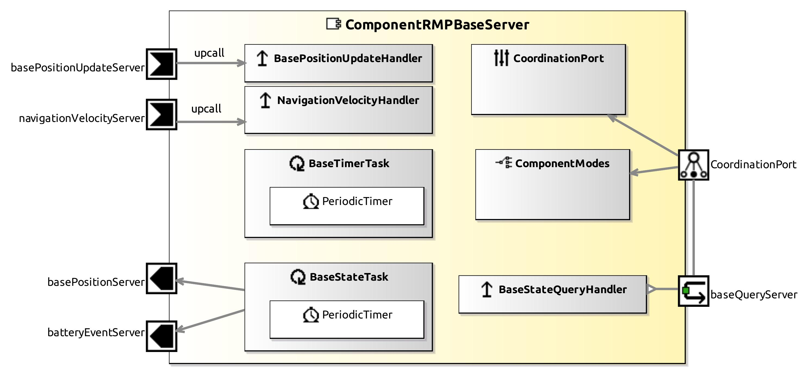

<!--- This file is generated from the ComponentRMPBaseServer.componentDocumentation model --->
<!--- do not modify this file manually as it will by automatically overwritten by the code generator, modify the model instead and re-generate this file --->

# ComponentRMPBaseServer Component

*Component Short Description:* TODO: add short description for ComponentRMPBaseServer datasheet

## Component-Datasheet Properties

<table style="border-collapse:collapse;">
<caption><i>Table:</i> Component-Datasheet Properties</caption>
<tr style="background-color:#ccc;">
<th style="border:1px solid black; padding: 5px;"><i>Property Name</i></th>
<th style="border:1px solid black; padding: 5px;"><i>Property Value</i></th>
<th style="border:1px solid black; padding: 5px;"><i>Property Description</i></th>
</tr>
</table>

## Component Ports

### navigationVelocityServer

*Documentation:*

### basePositionServer

*Documentation:*

### baseQueryServer

*Documentation:*

### batteryEventServer

*Documentation:*

### basePositionUpdateServer

*Documentation:*

## Component Parameters: ComponentRMPBaseServer

### ParameterSetInstance: BaseParams

#### Trigger Instance: BASE_RESET

*Property:* active = **false**

*Documentation:*

#### Trigger Instance: BASE_SONAR

*Property:* active = **false**

*Documentation:*

#### Trigger Instance: SIGNAL_STATE_BUSY

*Property:* active = **false**

*Documentation:*

#### Trigger Instance: SIGNAL_STATE_ERROR

*Property:* active = **false**

*Documentation:*

#### Trigger Instance: SIGNAL_STATE_IDLE

*Property:* active = **false**

*Documentation:*

#### Trigger Instance: SIGNAL_STATE_LOCALIZATION_ERROR

*Property:* active = **false**

*Documentation:*

#### Trigger Instance: SIGNAL_STATE_SAFETY_FIELD

*Property:* active = **false**

*Documentation:*

### Internal Parameter: robot

*Documentation:*

<table style="border-collapse:collapse;">
<caption><i>Table:</i> Internal Parameter <b>robot</b></caption>
<tr style="background-color:#ccc;">
<th style="border:1px solid black; padding: 5px;"><i>Attribute Name</i></th>
<th style="border:1px solid black; padding: 5px;"><i>Attribute Type</i></th>
<th style="border:1px solid black; padding: 5px;"><i>Attribute Value</i></th>
<th style="border:1px solid black; padding: 5px;"><i>Attribute Description</i></th>
</tr>
<tr>
<td style="border:1px solid black; padding: 5px;"><b>verbose</b></td>
<td style="border:1px solid black; padding: 5px;">Boolean</td>
<td style="border:1px solid black; padding: 5px;">false</td>
<td style="border:1px solid black; padding: 5px;"></td>
</tr>
<tr>
<td style="border:1px solid black; padding: 5px;"><b>debug</b></td>
<td style="border:1px solid black; padding: 5px;">Boolean</td>
<td style="border:1px solid black; padding: 5px;">false</td>
<td style="border:1px solid black; padding: 5px;"></td>
</tr>
<tr>
<td style="border:1px solid black; padding: 5px;"><b>back_is_front</b></td>
<td style="border:1px solid black; padding: 5px;">Boolean</td>
<td style="border:1px solid black; padding: 5px;">false</td>
<td style="border:1px solid black; padding: 5px;"></td>
</tr>
<tr>
<td style="border:1px solid black; padding: 5px;"><b>rmp_config_file</b></td>
<td style="border:1px solid black; padding: 5px;">String</td>
<td style="border:1px solid black; padding: 5px;">"data/rmp_config.ini"</td>
<td style="border:1px solid black; padding: 5px;"></td>
</tr>
<tr>
<td style="border:1px solid black; padding: 5px;"><b>enable_motors</b></td>
<td style="border:1px solid black; padding: 5px;">Boolean</td>
<td style="border:1px solid black; padding: 5px;">true</td>
<td style="border:1px solid black; padding: 5px;"></td>
</tr>
<tr>
<td style="border:1px solid black; padding: 5px;"><b>max_vel</b></td>
<td style="border:1px solid black; padding: 5px;">UInt32</td>
<td style="border:1px solid black; padding: 5px;">1000</td>
<td style="border:1px solid black; padding: 5px;"></td>
</tr>
<tr>
<td style="border:1px solid black; padding: 5px;"><b>max_rot_vel</b></td>
<td style="border:1px solid black; padding: 5px;">UInt32</td>
<td style="border:1px solid black; padding: 5px;">600</td>
<td style="border:1px solid black; padding: 5px;"></td>
</tr>
<tr>
<td style="border:1px solid black; padding: 5px;"><b>max_velocity_scale_factor</b></td>
<td style="border:1px solid black; padding: 5px;">UInt16</td>
<td style="border:1px solid black; padding: 5px;">16</td>
<td style="border:1px solid black; padding: 5px;"></td>
</tr>
<tr>
<td style="border:1px solid black; padding: 5px;"><b>max_acceleration_scale_factor</b></td>
<td style="border:1px solid black; padding: 5px;">UInt16</td>
<td style="border:1px solid black; padding: 5px;">16</td>
<td style="border:1px solid black; padding: 5px;"></td>
</tr>
<tr>
<td style="border:1px solid black; padding: 5px;"><b>max_turn_rate_scale_factor</b></td>
<td style="border:1px solid black; padding: 5px;">UInt16</td>
<td style="border:1px solid black; padding: 5px;">16</td>
<td style="border:1px solid black; padding: 5px;"></td>
</tr>
<tr>
<td style="border:1px solid black; padding: 5px;"><b>gain_schedule</b></td>
<td style="border:1px solid black; padding: 5px;">UInt16</td>
<td style="border:1px solid black; padding: 5px;">1</td>
<td style="border:1px solid black; padding: 5px;"></td>
</tr>
<tr>
<td style="border:1px solid black; padding: 5px;"><b>limit_scale_factor</b></td>
<td style="border:1px solid black; padding: 5px;">UInt16</td>
<td style="border:1px solid black; padding: 5px;">256</td>
<td style="border:1px solid black; padding: 5px;"></td>
</tr>
<tr>
<td style="border:1px solid black; padding: 5px;"><b>accelerationForward</b></td>
<td style="border:1px solid black; padding: 5px;">Int32</td>
<td style="border:1px solid black; padding: 5px;">100</td>
<td style="border:1px solid black; padding: 5px;"></td>
</tr>
<tr>
<td style="border:1px solid black; padding: 5px;"><b>decelerationFoward</b></td>
<td style="border:1px solid black; padding: 5px;">Int32</td>
<td style="border:1px solid black; padding: 5px;">1000</td>
<td style="border:1px solid black; padding: 5px;"></td>
</tr>
<tr>
<td style="border:1px solid black; padding: 5px;"><b>accelerationBackward</b></td>
<td style="border:1px solid black; padding: 5px;">Int32</td>
<td style="border:1px solid black; padding: 5px;">100</td>
<td style="border:1px solid black; padding: 5px;"></td>
</tr>
<tr>
<td style="border:1px solid black; padding: 5px;"><b>decelerationBackward</b></td>
<td style="border:1px solid black; padding: 5px;">Int32</td>
<td style="border:1px solid black; padding: 5px;">100</td>
<td style="border:1px solid black; padding: 5px;"></td>
</tr>
<tr>
<td style="border:1px solid black; padding: 5px;"><b>accelerationLeftward</b></td>
<td style="border:1px solid black; padding: 5px;">Double</td>
<td style="border:1px solid black; padding: 5px;">0.4</td>
<td style="border:1px solid black; padding: 5px;"></td>
</tr>
<tr>
<td style="border:1px solid black; padding: 5px;"><b>decelerationLeftward</b></td>
<td style="border:1px solid black; padding: 5px;">Double</td>
<td style="border:1px solid black; padding: 5px;">0.4</td>
<td style="border:1px solid black; padding: 5px;"></td>
</tr>
<tr>
<td style="border:1px solid black; padding: 5px;"><b>accelerationRightward</b></td>
<td style="border:1px solid black; padding: 5px;">Double</td>
<td style="border:1px solid black; padding: 5px;">0.4</td>
<td style="border:1px solid black; padding: 5px;"></td>
</tr>
<tr>
<td style="border:1px solid black; padding: 5px;"><b>decelerationRightward</b></td>
<td style="border:1px solid black; padding: 5px;">Double</td>
<td style="border:1px solid black; padding: 5px;">0.4</td>
<td style="border:1px solid black; padding: 5px;"></td>
</tr>
</table>

### Internal Parameter: kalman_filter

*Documentation:*

<table style="border-collapse:collapse;">
<caption><i>Table:</i> Internal Parameter <b>kalman_filter</b></caption>
<tr style="background-color:#ccc;">
<th style="border:1px solid black; padding: 5px;"><i>Attribute Name</i></th>
<th style="border:1px solid black; padding: 5px;"><i>Attribute Type</i></th>
<th style="border:1px solid black; padding: 5px;"><i>Attribute Value</i></th>
<th style="border:1px solid black; padding: 5px;"><i>Attribute Description</i></th>
</tr>
<tr>
<td style="border:1px solid black; padding: 5px;"><b>lamda_sigma_d</b></td>
<td style="border:1px solid black; padding: 5px;">Double</td>
<td style="border:1px solid black; padding: 5px;">50</td>
<td style="border:1px solid black; padding: 5px;"></td>
</tr>
<tr>
<td style="border:1px solid black; padding: 5px;"><b>lamda_sigma_delta_alpha</b></td>
<td style="border:1px solid black; padding: 5px;">Double</td>
<td style="border:1px solid black; padding: 5px;">5</td>
<td style="border:1px solid black; padding: 5px;"></td>
</tr>
<tr>
<td style="border:1px solid black; padding: 5px;"><b>lamda_sigma_delta_beta</b></td>
<td style="border:1px solid black; padding: 5px;">Double</td>
<td style="border:1px solid black; padding: 5px;">2</td>
<td style="border:1px solid black; padding: 5px;"></td>
</tr>
</table>

