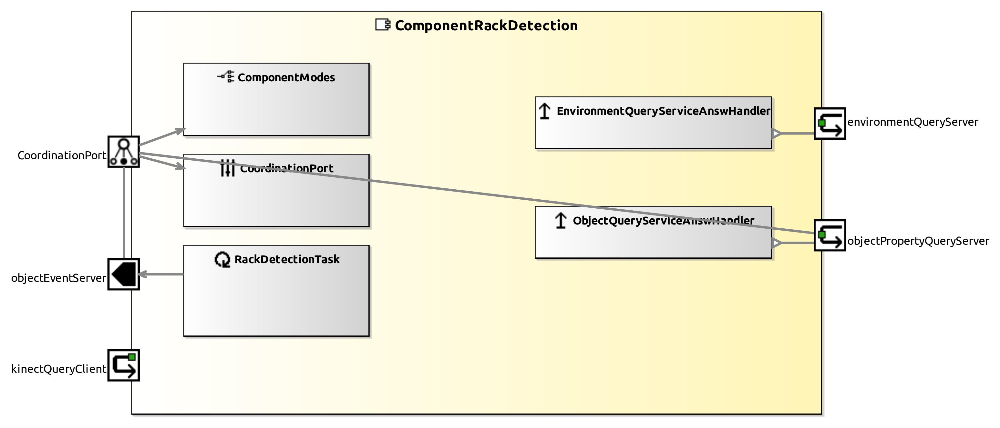

<!--- This file is generated from the ComponentRackDetection.componentDocumentation model --->
<!--- do not modify this file manually as it will by automatically overwritten by the code generator, modify the model instead and re-generate this file --->

# ComponentRackDetection Component

*Component Short Description:* TODO: add short description for ComponentRackDetection datasheet

## Component-Datasheet Properties

<table style="border-collapse:collapse;">
<caption><i>Table:</i> Component-Datasheet Properties</caption>
<tr style="background-color:#ccc;">
<th style="border:1px solid black; padding: 5px;"><i>Property Name</i></th>
<th style="border:1px solid black; padding: 5px;"><i>Property Value</i></th>
<th style="border:1px solid black; padding: 5px;"><i>Property Description</i></th>
</tr>
</table>

## Component Ports

### objectPropertyQueryServer

*Documentation:*

### environmentQueryServer

*Documentation:*

### objectEventServer

*Documentation:*

### kinectQueryClient

*Documentation:*

## Component Parameters: ComponentRackDetection

### Internal Parameter: General

*Documentation:*

<table style="border-collapse:collapse;">
<caption><i>Table:</i> Internal Parameter <b>General</b></caption>
<tr style="background-color:#ccc;">
<th style="border:1px solid black; padding: 5px;"><i>Attribute Name</i></th>
<th style="border:1px solid black; padding: 5px;"><i>Attribute Type</i></th>
<th style="border:1px solid black; padding: 5px;"><i>Attribute Value</i></th>
<th style="border:1px solid black; padding: 5px;"><i>Attribute Description</i></th>
</tr>
<tr>
<td style="border:1px solid black; padding: 5px;"><b>model_path</b></td>
<td style="border:1px solid black; padding: 5px;">String</td>
<td style="border:1px solid black; padding: 5px;">"/mnt/ssh/zafh/tausch/matthias_r/rack_model_cloud.pcd"</td>
<td style="border:1px solid black; padding: 5px;"></td>
</tr>
<tr>
<td style="border:1px solid black; padding: 5px;"><b>send_obstacle_mesh</b></td>
<td style="border:1px solid black; padding: 5px;">Boolean</td>
<td style="border:1px solid black; padding: 5px;">true</td>
<td style="border:1px solid black; padding: 5px;"></td>
</tr>
<tr>
<td style="border:1px solid black; padding: 5px;"><b>max_detection_score</b></td>
<td style="border:1px solid black; padding: 5px;">Float</td>
<td style="border:1px solid black; padding: 5px;">0.016</td>
<td style="border:1px solid black; padding: 5px;"></td>
</tr>
<tr>
<td style="border:1px solid black; padding: 5px;"><b>rack_dimension_min_x</b></td>
<td style="border:1px solid black; padding: 5px;">Float</td>
<td style="border:1px solid black; padding: 5px;">0.0</td>
<td style="border:1px solid black; padding: 5px;"></td>
</tr>
<tr>
<td style="border:1px solid black; padding: 5px;"><b>rack_dimension_max_x</b></td>
<td style="border:1px solid black; padding: 5px;">Float</td>
<td style="border:1px solid black; padding: 5px;">2.0</td>
<td style="border:1px solid black; padding: 5px;"></td>
</tr>
<tr>
<td style="border:1px solid black; padding: 5px;"><b>rack_dimension_min_y</b></td>
<td style="border:1px solid black; padding: 5px;">Float</td>
<td style="border:1px solid black; padding: 5px;">-0.8</td>
<td style="border:1px solid black; padding: 5px;"></td>
</tr>
<tr>
<td style="border:1px solid black; padding: 5px;"><b>rack_dimension_max_y</b></td>
<td style="border:1px solid black; padding: 5px;">Float</td>
<td style="border:1px solid black; padding: 5px;">0.8</td>
<td style="border:1px solid black; padding: 5px;"></td>
</tr>
<tr>
<td style="border:1px solid black; padding: 5px;"><b>rack_dimension_min_z</b></td>
<td style="border:1px solid black; padding: 5px;">Float</td>
<td style="border:1px solid black; padding: 5px;">0.1</td>
<td style="border:1px solid black; padding: 5px;"></td>
</tr>
<tr>
<td style="border:1px solid black; padding: 5px;"><b>rack_dimension_max_z</b></td>
<td style="border:1px solid black; padding: 5px;">Float</td>
<td style="border:1px solid black; padding: 5px;">2.0</td>
<td style="border:1px solid black; padding: 5px;"></td>
</tr>
<tr>
<td style="border:1px solid black; padding: 5px;"><b>init_relative_obj_pose_x</b></td>
<td style="border:1px solid black; padding: 5px;">Float</td>
<td style="border:1px solid black; padding: 5px;">0.027</td>
<td style="border:1px solid black; padding: 5px;"></td>
</tr>
<tr>
<td style="border:1px solid black; padding: 5px;"><b>init_relative_obj_pose_y</b></td>
<td style="border:1px solid black; padding: 5px;">Float</td>
<td style="border:1px solid black; padding: 5px;">0.115</td>
<td style="border:1px solid black; padding: 5px;"></td>
</tr>
<tr>
<td style="border:1px solid black; padding: 5px;"><b>init_relative_obj_pose_z</b></td>
<td style="border:1px solid black; padding: 5px;">Float</td>
<td style="border:1px solid black; padding: 5px;">0.055</td>
<td style="border:1px solid black; padding: 5px;"></td>
</tr>
<tr>
<td style="border:1px solid black; padding: 5px;"><b>relative_obj_pose_x</b></td>
<td style="border:1px solid black; padding: 5px;">Float</td>
<td style="border:1px solid black; padding: 5px;">0.0</td>
<td style="border:1px solid black; padding: 5px;"></td>
</tr>
<tr>
<td style="border:1px solid black; padding: 5px;"><b>relative_obj_pose_y</b></td>
<td style="border:1px solid black; padding: 5px;">Float</td>
<td style="border:1px solid black; padding: 5px;">0.115</td>
<td style="border:1px solid black; padding: 5px;"></td>
</tr>
<tr>
<td style="border:1px solid black; padding: 5px;"><b>relative_obj_pose_z</b></td>
<td style="border:1px solid black; padding: 5px;">Float</td>
<td style="border:1px solid black; padding: 5px;">0.0</td>
<td style="border:1px solid black; padding: 5px;"></td>
</tr>
<tr>
<td style="border:1px solid black; padding: 5px;"><b>relative_obj_pose_pitch</b></td>
<td style="border:1px solid black; padding: 5px;">Float</td>
<td style="border:1px solid black; padding: 5px;">-0.2</td>
<td style="border:1px solid black; padding: 5px;"></td>
</tr>
<tr>
<td style="border:1px solid black; padding: 5px;"><b>obj_width</b></td>
<td style="border:1px solid black; padding: 5px;">Float</td>
<td style="border:1px solid black; padding: 5px;">0.07</td>
<td style="border:1px solid black; padding: 5px;"></td>
</tr>
<tr>
<td style="border:1px solid black; padding: 5px;"><b>obj_height</b></td>
<td style="border:1px solid black; padding: 5px;">Float</td>
<td style="border:1px solid black; padding: 5px;">0.105</td>
<td style="border:1px solid black; padding: 5px;"></td>
</tr>
<tr>
<td style="border:1px solid black; padding: 5px;"><b>obj_depth</b></td>
<td style="border:1px solid black; padding: 5px;">Float</td>
<td style="border:1px solid black; padding: 5px;">0.04</td>
<td style="border:1px solid black; padding: 5px;"></td>
</tr>
<tr>
<td style="border:1px solid black; padding: 5px;"><b>obj_types</b></td>
<td style="border:1px solid black; padding: 5px;">String</td>
<td style="border:1px solid black; padding: 5px;">"CHOCO,SPECIAL,FROSTIES,CORN-FLAKES,SMACKS"</td>
<td style="border:1px solid black; padding: 5px;"></td>
</tr>
</table>

### Internal Parameter: ModelCreation

*Documentation:*

<table style="border-collapse:collapse;">
<caption><i>Table:</i> Internal Parameter <b>ModelCreation</b></caption>
<tr style="background-color:#ccc;">
<th style="border:1px solid black; padding: 5px;"><i>Attribute Name</i></th>
<th style="border:1px solid black; padding: 5px;"><i>Attribute Type</i></th>
<th style="border:1px solid black; padding: 5px;"><i>Attribute Value</i></th>
<th style="border:1px solid black; padding: 5px;"><i>Attribute Description</i></th>
</tr>
<tr>
<td style="border:1px solid black; padding: 5px;"><b>create_model</b></td>
<td style="border:1px solid black; padding: 5px;">Boolean</td>
<td style="border:1px solid black; padding: 5px;">false</td>
<td style="border:1px solid black; padding: 5px;"></td>
</tr>
<tr>
<td style="border:1px solid black; padding: 5px;"><b>capture_model</b></td>
<td style="border:1px solid black; padding: 5px;">Boolean</td>
<td style="border:1px solid black; padding: 5px;">false</td>
<td style="border:1px solid black; padding: 5px;"></td>
</tr>
<tr>
<td style="border:1px solid black; padding: 5px;"><b>transformation_x</b></td>
<td style="border:1px solid black; padding: 5px;">Float</td>
<td style="border:1px solid black; padding: 5px;">-0.65</td>
<td style="border:1px solid black; padding: 5px;"></td>
</tr>
<tr>
<td style="border:1px solid black; padding: 5px;"><b>transformation_y</b></td>
<td style="border:1px solid black; padding: 5px;">Float</td>
<td style="border:1px solid black; padding: 5px;">0.35</td>
<td style="border:1px solid black; padding: 5px;"></td>
</tr>
<tr>
<td style="border:1px solid black; padding: 5px;"><b>transformation_z</b></td>
<td style="border:1px solid black; padding: 5px;">Float</td>
<td style="border:1px solid black; padding: 5px;">-0.75</td>
<td style="border:1px solid black; padding: 5px;"></td>
</tr>
<tr>
<td style="border:1px solid black; padding: 5px;"><b>theta</b></td>
<td style="border:1px solid black; padding: 5px;">Float</td>
<td style="border:1px solid black; padding: 5px;">0.0</td>
<td style="border:1px solid black; padding: 5px;"></td>
</tr>
<tr>
<td style="border:1px solid black; padding: 5px;"><b>save_model_path</b></td>
<td style="border:1px solid black; padding: 5px;">String</td>
<td style="border:1px solid black; padding: 5px;">"/tmp/rack_model_cloud.pcd"</td>
<td style="border:1px solid black; padding: 5px;"></td>
</tr>
<tr>
<td style="border:1px solid black; padding: 5px;"><b>load_model_path</b></td>
<td style="border:1px solid black; padding: 5px;">String</td>
<td style="border:1px solid black; padding: 5px;">"/home/rollenhagen/rack_models/a-frame_model_clouds/model_cloud.pcd"</td>
<td style="border:1px solid black; padding: 5px;"></td>
</tr>
</table>

### ParameterSetInstance: ObjectRecognitionParameter

#### Parameter Instance: BELIEF_THRESHOLD

*Documentation:*

<table style="border-collapse:collapse;">
<caption><i>Table:</i> Parameter-Instance <b>BELIEF_THRESHOLD</b></caption>
<tr style="background-color:#ccc;">
<th style="border:1px solid black; padding: 5px;"><i>Attribute Name</i></th>
<th style="border:1px solid black; padding: 5px;"><i>Attribute Type</i></th>
<th style="border:1px solid black; padding: 5px;"><i>Attribute Value</i></th>
<th style="border:1px solid black; padding: 5px;"><i>Attribute Description</i></th>
</tr>
<tr>
<td style="border:1px solid black; padding: 5px;"><b>threshold</b></td>
<td style="border:1px solid black; padding: 5px;">Double</td>
<td style="border:1px solid black; padding: 5px;">0.0</td>
<td style="border:1px solid black; padding: 5px;"></td>
</tr>
</table>

#### Parameter Instance: CLOUD

*Documentation:*

<table style="border-collapse:collapse;">
<caption><i>Table:</i> Parameter-Instance <b>CLOUD</b></caption>
<tr style="background-color:#ccc;">
<th style="border:1px solid black; padding: 5px;"><i>Attribute Name</i></th>
<th style="border:1px solid black; padding: 5px;"><i>Attribute Type</i></th>
<th style="border:1px solid black; padding: 5px;"><i>Attribute Value</i></th>
<th style="border:1px solid black; padding: 5px;"><i>Attribute Description</i></th>
</tr>
<tr>
<td style="border:1px solid black; padding: 5px;"><b>id</b></td>
<td style="border:1px solid black; padding: 5px;">UInt32</td>
<td style="border:1px solid black; padding: 5px;">0</td>
<td style="border:1px solid black; padding: 5px;"></td>
</tr>
</table>

#### Parameter Instance: CLUSTERING

*Documentation:*

<table style="border-collapse:collapse;">
<caption><i>Table:</i> Parameter-Instance <b>CLUSTERING</b></caption>
<tr style="background-color:#ccc;">
<th style="border:1px solid black; padding: 5px;"><i>Attribute Name</i></th>
<th style="border:1px solid black; padding: 5px;"><i>Attribute Type</i></th>
<th style="border:1px solid black; padding: 5px;"><i>Attribute Value</i></th>
<th style="border:1px solid black; padding: 5px;"><i>Attribute Description</i></th>
</tr>
<tr>
<td style="border:1px solid black; padding: 5px;"><b>doClustering</b></td>
<td style="border:1px solid black; padding: 5px;">Boolean</td>
<td style="border:1px solid black; padding: 5px;">true</td>
<td style="border:1px solid black; padding: 5px;"></td>
</tr>
</table>

#### Parameter Instance: ESTIMATEFILLING

*Documentation:*

<table style="border-collapse:collapse;">
<caption><i>Table:</i> Parameter-Instance <b>ESTIMATEFILLING</b></caption>
<tr style="background-color:#ccc;">
<th style="border:1px solid black; padding: 5px;"><i>Attribute Name</i></th>
<th style="border:1px solid black; padding: 5px;"><i>Attribute Type</i></th>
<th style="border:1px solid black; padding: 5px;"><i>Attribute Value</i></th>
<th style="border:1px solid black; padding: 5px;"><i>Attribute Description</i></th>
</tr>
<tr>
<td style="border:1px solid black; padding: 5px;"><b>estimateObjectProperties</b></td>
<td style="border:1px solid black; padding: 5px;">Boolean</td>
<td style="border:1px solid black; padding: 5px;">false</td>
<td style="border:1px solid black; padding: 5px;"></td>
</tr>
</table>

#### Parameter Instance: SETOBJECTID

*Documentation:*

<table style="border-collapse:collapse;">
<caption><i>Table:</i> Parameter-Instance <b>SETOBJECTID</b></caption>
<tr style="background-color:#ccc;">
<th style="border:1px solid black; padding: 5px;"><i>Attribute Name</i></th>
<th style="border:1px solid black; padding: 5px;"><i>Attribute Type</i></th>
<th style="border:1px solid black; padding: 5px;"><i>Attribute Value</i></th>
<th style="border:1px solid black; padding: 5px;"><i>Attribute Description</i></th>
</tr>
<tr>
<td style="border:1px solid black; padding: 5px;"><b>id</b></td>
<td style="border:1px solid black; padding: 5px;">UInt32</td>
<td style="border:1px solid black; padding: 5px;">0</td>
<td style="border:1px solid black; padding: 5px;"></td>
</tr>
</table>

#### Trigger Instance: RECOGNIZE

*Property:* active = **true**

*Documentation:*

