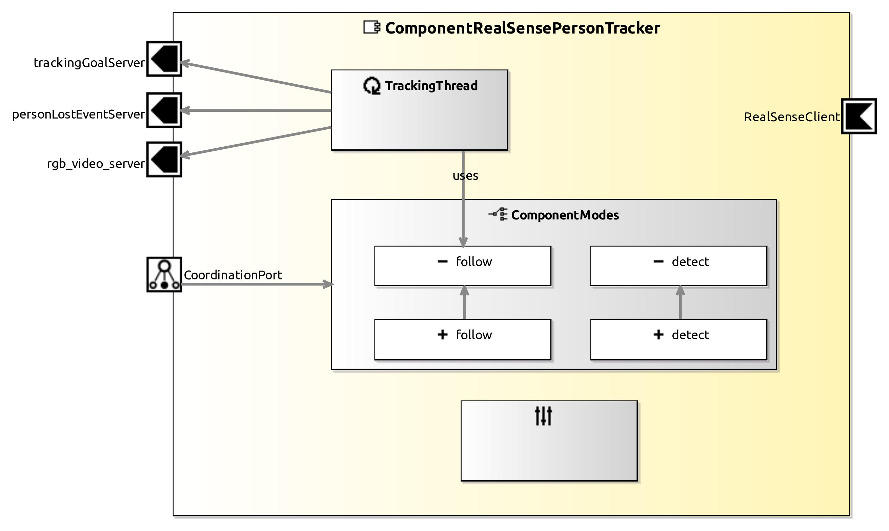

<!--- This file is generated from the ComponentRealSensePersonTracker.componentDocumentation model --->
<!--- do not modify this file manually as it will by automatically overwritten by the code generator, modify the model instead and re-generate this file --->

# ComponentRealSensePersonTracker Component

*Component Short Description:* 
Person following using Real Sense Person Tracking Library

Note: After 'Run Code Generation' is made for this Component, change the code in smartsoft/src-gen/params/ParamUpdateHandler.cc like this:
<pre>
    else if (tag == "PERSONTOFOLLOW")
    {
      answer.setResponse(SmartACE::ParamResponseType::OK);
</pre>

## Component-Datasheet Properties

<table style="border-collapse:collapse;">
<caption><i>Table:</i> Component-Datasheet Properties</caption>
<tr style="background-color:#ccc;">
<th style="border:1px solid black; padding: 5px;"><i>Property Name</i></th>
<th style="border:1px solid black; padding: 5px;"><i>Property Value</i></th>
<th style="border:1px solid black; padding: 5px;"><i>Property Description</i></th>
</tr>
<tr>
<td style="border:1px solid black; padding: 5px;">Supplier</td>
<td style="border:1px solid black; padding: 5px;">Servicerobotics Ulm</td>
<td style="border:1px solid black; padding: 5px;"></td>
</tr>
<tr>
<td style="border:1px solid black; padding: 5px;">Homepage</td>
<td style="border:1px solid black; padding: 5px;">https://wiki.servicerobotik-ulm.de/directory:collection</td>
<td style="border:1px solid black; padding: 5px;"></td>
</tr>
<tr>
<td style="border:1px solid black; padding: 5px;">Purpose</td>
<td style="border:1px solid black; padding: 5px;">Person following using Real Sense Person Tracking Library</td>
<td style="border:1px solid black; padding: 5px;"></td>
</tr>
</table>

## Component Ports

### RealSenseClient

*Documentation:*

### rgb_video_server

*Documentation:*

Port providing the live images with current result annotated

### trackingGoalServer

*Documentation:*

Port providing the pose of detected person infomation as CommTrackingGoal

### personLostEventServer

*Documentation:*

Port providing the event in case the tracking person is not found

## Component Parameters: ComponentRealSensePersonTrackerParams

### Internal Parameter: Settings

*Documentation:*

<table style="border-collapse:collapse;">
<caption><i>Table:</i> Internal Parameter <b>Settings</b></caption>
<tr style="background-color:#ccc;">
<th style="border:1px solid black; padding: 5px;"><i>Attribute Name</i></th>
<th style="border:1px solid black; padding: 5px;"><i>Attribute Type</i></th>
<th style="border:1px solid black; padding: 5px;"><i>Attribute Value</i></th>
<th style="border:1px solid black; padding: 5px;"><i>Attribute Description</i></th>
</tr>
<tr>
<td style="border:1px solid black; padding: 5px;"><b>withDebugWindow</b></td>
<td style="border:1px solid black; padding: 5px;">Boolean</td>
<td style="border:1px solid black; padding: 5px;">false</td>
<td style="border:1px solid black; padding: 5px;"></td>
</tr>
<tr>
<td style="border:1px solid black; padding: 5px;"><b>display_depth_image</b></td>
<td style="border:1px solid black; padding: 5px;">Boolean</td>
<td style="border:1px solid black; padding: 5px;">false</td>
<td style="border:1px solid black; padding: 5px;"></td>
</tr>
<tr>
<td style="border:1px solid black; padding: 5px;"><b>pt_data</b></td>
<td style="border:1px solid black; padding: 5px;">String</td>
<td style="border:1px solid black; padding: 5px;">"./"</td>
<td style="border:1px solid black; padding: 5px;">
Path to the location of person tracking data

</td>
</tr>
</table>

### Extended Trigger: PersonTofollow

*Property:* active = **false**

*Documentation:*

<table style="border-collapse:collapse;">
<caption><i>Table:</i> Attributes of Extended Trigger <b>PersonTofollow</b></caption>
<tr style="background-color:#ccc;">
<th style="border:1px solid black; padding: 5px;"><i>Attribute Name</i></th>
<th style="border:1px solid black; padding: 5px;"><i>Attribute Type</i></th>
<th style="border:1px solid black; padding: 5px;"><i>Attribute Value</i></th>
<th style="border:1px solid black; padding: 5px;"><i>Attribute Description</i></th>
</tr>
<tr>
<td style="border:1px solid black; padding: 5px;"><b>id_to_follow</b></td>
<td style="border:1px solid black; padding: 5px;">Int16</td>
<td style="border:1px solid black; padding: 5px;"></td>
<td style="border:1px solid black; padding: 5px;">
Id of the detected person to follow

</td>
</tr>
</table>

### ParameterSetInstance: TrackingParam

#### Trigger Instance: FOLLOW_RESET

*Property:* active = **false**

*Documentation:*

#### Trigger Instance: SET_MAX_COV

*Property:* active = **false**

*Documentation:*

