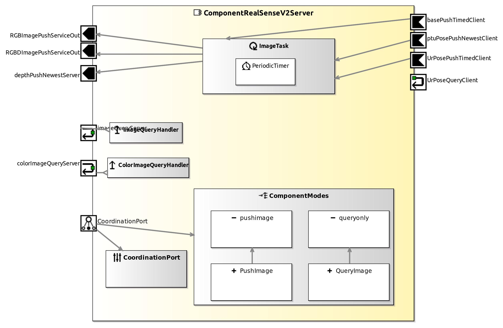

<!--- This file is generated from the ComponentRealSenseV2Server.componentDocumentation model --->
<!--- do not modify this file manually as it will by automatically overwritten by the code generator, modify the model instead and re-generate this file --->

# ComponentRealSenseV2Server Component

| Metaelement | Documentation |
|-------------|---------------|
| License |  |
| Hardware Requirements |  |
| Purpose |  |

## Service Ports

## Component Parameters ComponentRealSenseV2ServerParams

### InternalParameter settings

| Attribute Name | Attribute Type | Description |
|----------------|----------------|-------------|
| debug_info | Boolean |  |
| valid_image_time | Double |  |
| undistort_image | Boolean |  |
| pushnewest_rgbd_image | Boolean |  |
| pushnewest_color_image | Boolean |  |
| pushnewest_depth_image | Boolean |  |
| post_processing | Boolean |  |
| device_serial_number | String |  |

### InternalParameter stereo

| Attribute Name | Attribute Type | Description |
|----------------|----------------|-------------|
| baseline | Float |  |

### InternalParameter sensor_pose

| Attribute Name | Attribute Type | Description |
|----------------|----------------|-------------|
| x | Double | ( in mm ) |
| y | Double | ( in mm ) |
| z | Double | ( in mm ) |
| azimuth | Double | ( in radians ) |
| elevation | Double | ( in radians ) |
| roll | Double | ( in radians ) |

### InternalParameter RGB_config

| Attribute Name | Attribute Type | Description |
|----------------|----------------|-------------|
| width | Int32 |  |
| height | Int32 |  |
| framerate | Int32 |  |

### InternalParameter Depth_config

| Attribute Name | Attribute Type | Description |
|----------------|----------------|-------------|
| width | Int32 |  |
| height | Int32 |  |
| framerate | Int32 |  |

### InternalParameter base

| Attribute Name | Attribute Type | Description |
|----------------|----------------|-------------|
| on_manipulator | Boolean | Subscribe to UR server for pose updates (true)?. |
| on_ptu | Boolean | Subscribe to ptu server for pose updates (true)?. |
| on_base | Boolean | Subscribe to base server for pose updates (true)?. |
| on_ur | Boolean |  |
| x | Int32 | Use fixed values x, y, z [mm] for pose of the camera if not subscribed to base server. See server ports. |
| y | Int32 | Use fixed values x, y, z [mm] for pose of the camera if not subscribed to base server. See server ports. |
| z | Int32 | Use fixed values x, y, z [mm] for pose of the camera if not subscribed to base server. See server ports. |
| base_a | Double | Use fixed value base_a [rad] for pose of the camera if not subscribed to base server. See server ports. |
| steer_a | Double | Use fixed value for steer_a [rad] for pose of the camera if not subscribed to base server. See server ports. |

