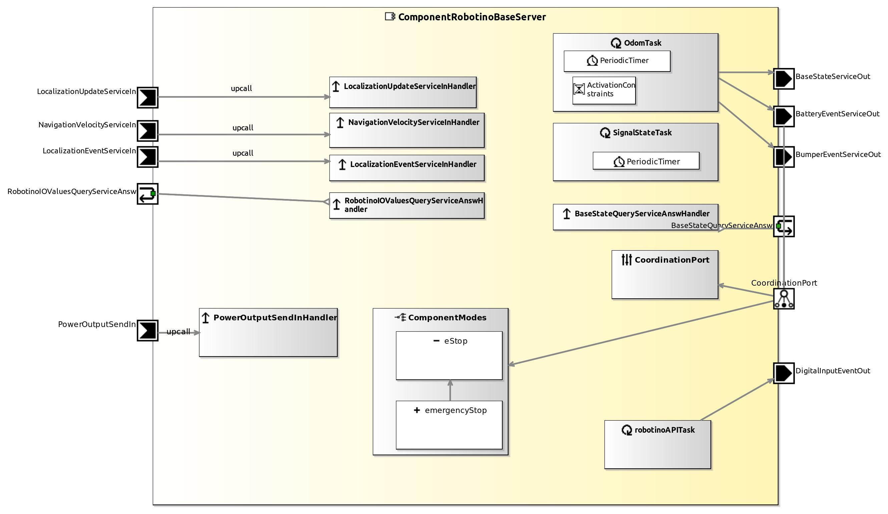

<!--- This file is generated from the ComponentRobotinoBaseServer.componentDocumentation model --->
<!--- do not modify this file manually as it will by automatically overwritten by the code generator, modify the model instead and re-generate this file --->

# ComponentRobotinoBaseServer Component

*Component Short Description:* 
Robotino 3 or 4 from Festo is a mobile robot with omnidrive wheels.

Note: After 'Run Code Generation' is made for this Component, change the code in smartsoft/src-gen/params/ParamUpdateHandler.cc like this:
<pre>
    else if (tag == "SET_RELAY")
    {
      answer.setResponse(SmartACE::ParamResponseType::OK);
</pre>

## Component-Datasheet Properties

<table style="border-collapse:collapse;">
<caption><i>Table:</i> Component-Datasheet Properties</caption>
<tr style="background-color:#ccc;">
<th style="border:1px solid black; padding: 5px;"><i>Property Name</i></th>
<th style="border:1px solid black; padding: 5px;"><i>Property Value</i></th>
<th style="border:1px solid black; padding: 5px;"><i>Property Description</i></th>
</tr>
<tr>
<td style="border:1px solid black; padding: 5px;">MarketName</td>
<td style="border:1px solid black; padding: 5px;">Robotino Base Server</td>
<td style="border:1px solid black; padding: 5px;"></td>
</tr>
<tr>
<td style="border:1px solid black; padding: 5px;">Supplier</td>
<td style="border:1px solid black; padding: 5px;">Servicerobotics Ulm</td>
<td style="border:1px solid black; padding: 5px;"></td>
</tr>
<tr>
<td style="border:1px solid black; padding: 5px;">Homepage</td>
<td style="border:1px solid black; padding: 5px;">http://servicerobotik-ulm.de/components</td>
<td style="border:1px solid black; padding: 5px;"></td>
</tr>
<tr>
<td style="border:1px solid black; padding: 5px;">Purpose</td>
<td style="border:1px solid black; padding: 5px;">RobotBase</td>
<td style="border:1px solid black; padding: 5px;"></td>
</tr>
</table>

## Component Ports

### NavigationVelocityServiceIn

*Documentation:*

### LocalizationEventServiceIn

*Documentation:*

### BatteryEventServiceOut

*Documentation:*

### BaseStateQueryServiceAnsw

*Documentation:*

### RobotinoIOValuesQueryServiceAnsw

*Documentation:*

### BumperEventServiceOut

*Documentation:*

### DigitalInputEventOut

*Documentation:*

### BaseStateServiceOut

*Documentation:*

### LocalizationUpdateServiceIn

*Documentation:*

### PowerOutputSendIn

*Documentation:*

## Component Parameters: ComponentRobotinoBaseServerParams

### Internal Parameter: Robot

*Documentation:*

<table style="border-collapse:collapse;">
<caption><i>Table:</i> Internal Parameter <b>Robot</b></caption>
<tr style="background-color:#ccc;">
<th style="border:1px solid black; padding: 5px;"><i>Attribute Name</i></th>
<th style="border:1px solid black; padding: 5px;"><i>Attribute Type</i></th>
<th style="border:1px solid black; padding: 5px;"><i>Attribute Value</i></th>
<th style="border:1px solid black; padding: 5px;"><i>Attribute Description</i></th>
</tr>
<tr>
<td style="border:1px solid black; padding: 5px;"><b>maxVelX</b></td>
<td style="border:1px solid black; padding: 5px;">Double</td>
<td style="border:1px solid black; padding: 5px;">1.0</td>
<td style="border:1px solid black; padding: 5px;"></td>
</tr>
<tr>
<td style="border:1px solid black; padding: 5px;"><b>maxVelY</b></td>
<td style="border:1px solid black; padding: 5px;">Double</td>
<td style="border:1px solid black; padding: 5px;">1.0</td>
<td style="border:1px solid black; padding: 5px;"></td>
</tr>
<tr>
<td style="border:1px solid black; padding: 5px;"><b>maxRotVel</b></td>
<td style="border:1px solid black; padding: 5px;">Double</td>
<td style="border:1px solid black; padding: 5px;">4.0</td>
<td style="border:1px solid black; padding: 5px;"></td>
</tr>
<tr>
<td style="border:1px solid black; padding: 5px;"><b>daemonIP</b></td>
<td style="border:1px solid black; padding: 5px;">String</td>
<td style="border:1px solid black; padding: 5px;">"127.0.0.1"</td>
<td style="border:1px solid black; padding: 5px;"></td>
</tr>
</table>

### Internal Parameter: Bumper

*Documentation:*

<table style="border-collapse:collapse;">
<caption><i>Table:</i> Internal Parameter <b>Bumper</b></caption>
<tr style="background-color:#ccc;">
<th style="border:1px solid black; padding: 5px;"><i>Attribute Name</i></th>
<th style="border:1px solid black; padding: 5px;"><i>Attribute Type</i></th>
<th style="border:1px solid black; padding: 5px;"><i>Attribute Value</i></th>
<th style="border:1px solid black; padding: 5px;"><i>Attribute Description</i></th>
</tr>
<tr>
<td style="border:1px solid black; padding: 5px;"><b>bumperTimeOutSec</b></td>
<td style="border:1px solid black; padding: 5px;">Int32</td>
<td style="border:1px solid black; padding: 5px;">10</td>
<td style="border:1px solid black; padding: 5px;"></td>
</tr>
<tr>
<td style="border:1px solid black; padding: 5px;"><b>bumperTimeOutMSec</b></td>
<td style="border:1px solid black; padding: 5px;">Int32</td>
<td style="border:1px solid black; padding: 5px;">0</td>
<td style="border:1px solid black; padding: 5px;"></td>
</tr>
</table>

### Internal Parameter: General

*Documentation:*

<table style="border-collapse:collapse;">
<caption><i>Table:</i> Internal Parameter <b>General</b></caption>
<tr style="background-color:#ccc;">
<th style="border:1px solid black; padding: 5px;"><i>Attribute Name</i></th>
<th style="border:1px solid black; padding: 5px;"><i>Attribute Type</i></th>
<th style="border:1px solid black; padding: 5px;"><i>Attribute Value</i></th>
<th style="border:1px solid black; padding: 5px;"><i>Attribute Description</i></th>
</tr>
<tr>
<td style="border:1px solid black; padding: 5px;"><b>verbose</b></td>
<td style="border:1px solid black; padding: 5px;">Boolean</td>
<td style="border:1px solid black; padding: 5px;">false</td>
<td style="border:1px solid black; padding: 5px;"></td>
</tr>
<tr>
<td style="border:1px solid black; padding: 5px;"><b>hasSignalState</b></td>
<td style="border:1px solid black; padding: 5px;">Boolean</td>
<td style="border:1px solid black; padding: 5px;">true</td>
<td style="border:1px solid black; padding: 5px;"></td>
</tr>
<tr>
<td style="border:1px solid black; padding: 5px;"><b>useLocalizationEvent</b></td>
<td style="border:1px solid black; padding: 5px;">Boolean</td>
<td style="border:1px solid black; padding: 5px;">true</td>
<td style="border:1px solid black; padding: 5px;"></td>
</tr>
<tr>
<td style="border:1px solid black; padding: 5px;"><b>poseFileName</b></td>
<td style="border:1px solid black; padding: 5px;">String</td>
<td style="border:1px solid black; padding: 5px;">"/tmp/lastRobotPose.txt"</td>
<td style="border:1px solid black; padding: 5px;"></td>
</tr>
<tr>
<td style="border:1px solid black; padding: 5px;"><b>writePoseFile</b></td>
<td style="border:1px solid black; padding: 5px;">Boolean</td>
<td style="border:1px solid black; padding: 5px;">false</td>
<td style="border:1px solid black; padding: 5px;"></td>
</tr>
</table>

### ParameterSetInstance: BaseParams

#### Trigger Instance: BASE_RESET

*Property:* active = **false**

*Documentation:*

#### Trigger Instance: BASE_SONAR

*Property:* active = **false**

*Documentation:*

#### Trigger Instance: SIGNAL_STATE_BUSY

*Property:* active = **false**

*Documentation:*

#### Trigger Instance: SIGNAL_STATE_ERROR

*Property:* active = **false**

*Documentation:*

#### Trigger Instance: SIGNAL_STATE_IDLE

*Property:* active = **false**

*Documentation:*

#### Trigger Instance: SIGNAL_STATE_LOCALIZATION_ERROR

*Property:* active = **false**

*Documentation:*

#### Trigger Instance: SIGNAL_STATE_SAFETY_FIELD

*Property:* active = **false**

*Documentation:*

### Extended Trigger: SET_RELAY

*Property:* active = **false**

*Documentation:*

<table style="border-collapse:collapse;">
<caption><i>Table:</i> Attributes of Extended Trigger <b>SET_RELAY</b></caption>
<tr style="background-color:#ccc;">
<th style="border:1px solid black; padding: 5px;"><i>Attribute Name</i></th>
<th style="border:1px solid black; padding: 5px;"><i>Attribute Type</i></th>
<th style="border:1px solid black; padding: 5px;"><i>Attribute Value</i></th>
<th style="border:1px solid black; padding: 5px;"><i>Attribute Description</i></th>
</tr>
<tr>
<td style="border:1px solid black; padding: 5px;"><b>number</b></td>
<td style="border:1px solid black; padding: 5px;">UInt32</td>
<td style="border:1px solid black; padding: 5px;"></td>
<td style="border:1px solid black; padding: 5px;"></td>
</tr>
<tr>
<td style="border:1px solid black; padding: 5px;"><b>value</b></td>
<td style="border:1px solid black; padding: 5px;">Boolean</td>
<td style="border:1px solid black; padding: 5px;"></td>
<td style="border:1px solid black; padding: 5px;"></td>
</tr>
</table>

