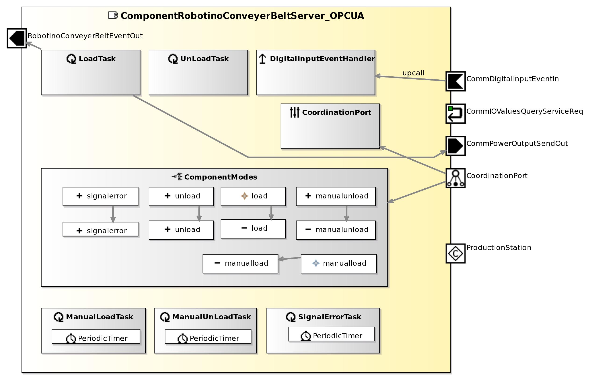

<!--- This file is generated from the ComponentRobotinoConveyerBeltServer_OPCUA.componentDocumentation model --->
<!--- do not modify this file manually as it will by automatically overwritten by the code generator, modify the model instead and re-generate this file --->

# ComponentRobotinoConveyerBeltServer_OPCUA Component

*Component Short Description:* TODO: add short description for ComponentRobotinoConveyerBeltServer_OPCUA datasheet

## Component-Datasheet Properties

<table style="border-collapse:collapse;">
<caption><i>Table:</i> Component-Datasheet Properties</caption>
<tr style="background-color:#ccc;">
<th style="border:1px solid black; padding: 5px;"><i>Property Name</i></th>
<th style="border:1px solid black; padding: 5px;"><i>Property Value</i></th>
<th style="border:1px solid black; padding: 5px;"><i>Property Description</i></th>
</tr>
<tr>
<td style="border:1px solid black; padding: 5px;">MarketName</td>
<td style="border:1px solid black; padding: 5px;">ComponentRobotinoConveyerBeltServer_OPCUA</td>
<td style="border:1px solid black; padding: 5px;"></td>
</tr>
<tr>
<td style="border:1px solid black; padding: 5px;">Supplier</td>
<td style="border:1px solid black; padding: 5px;">Servicerobotics Ulm</td>
<td style="border:1px solid black; padding: 5px;"></td>
</tr>
<tr>
<td style="border:1px solid black; padding: 5px;">Homepage</td>
<td style="border:1px solid black; padding: 5px;">http://servicerobotik-ulm.de/components</td>
<td style="border:1px solid black; padding: 5px;"></td>
</tr>
<tr>
<td style="border:1px solid black; padding: 5px;">Purpose</td>
<td style="border:1px solid black; padding: 5px;">Example</td>
<td style="border:1px solid black; padding: 5px;"></td>
</tr>
</table>

## Component Ports

### CommIOValuesQueryServiceReq

*Documentation:*

### CommDigitalInputEventIn

*Documentation:*

### CommPowerOutputSendOut

*Documentation:*

### RobotinoConveyerBeltEventOut

*Documentation:*

## Component Parameters: ComponentRobotinoConveyerBeltServer_OPCUA

### ParameterSetInstance: RobotinoConveyerParameter

#### Parameter Instance: SetStationID

*Documentation:*

<table style="border-collapse:collapse;">
<caption><i>Table:</i> Parameter-Instance <b>SetStationID</b></caption>
<tr style="background-color:#ccc;">
<th style="border:1px solid black; padding: 5px;"><i>Attribute Name</i></th>
<th style="border:1px solid black; padding: 5px;"><i>Attribute Type</i></th>
<th style="border:1px solid black; padding: 5px;"><i>Attribute Value</i></th>
<th style="border:1px solid black; padding: 5px;"><i>Attribute Description</i></th>
</tr>
<tr>
<td style="border:1px solid black; padding: 5px;"><b>id</b></td>
<td style="border:1px solid black; padding: 5px;">Int16</td>
<td style="border:1px solid black; padding: 5px;">0</td>
<td style="border:1px solid black; padding: 5px;"></td>
</tr>
</table>

### Internal Parameter: OPCUAstatic

*Documentation:*

<table style="border-collapse:collapse;">
<caption><i>Table:</i> Internal Parameter <b>OPCUAstatic</b></caption>
<tr style="background-color:#ccc;">
<th style="border:1px solid black; padding: 5px;"><i>Attribute Name</i></th>
<th style="border:1px solid black; padding: 5px;"><i>Attribute Type</i></th>
<th style="border:1px solid black; padding: 5px;"><i>Attribute Value</i></th>
<th style="border:1px solid black; padding: 5px;"><i>Attribute Description</i></th>
</tr>
<tr>
<td style="border:1px solid black; padding: 5px;"><b>object_name</b></td>
<td style="border:1px solid black; padding: 5px;">String</td>
<td style="border:1px solid black; padding: 5px;">"ProductionStation"</td>
<td style="border:1px solid black; padding: 5px;">
used for raspberry pi pixtend server

</td>
</tr>
<tr>
<td style="border:1px solid black; padding: 5px;"><b>rootObjectPath</b></td>
<td style="border:1px solid black; padding: 5px;">String</td>
<td style="border:1px solid black; padding: 5px;">"Server/CPX-E-CEC-C1-PN/Resources/Application/Programs/PLC_PRG"</td>
<td style="border:1px solid black; padding: 5px;">
used for Festo CPX-E-CEC-C1-PN server

</td>
</tr>
<tr>
<td style="border:1px solid black; padding: 5px;"><b>server_address</b></td>
<td style="border:1px solid black; padding: 5px;">String</td>
<td style="border:1px solid black; padding: 5px;">["NULL_NOT_USED", "opc.tcp://10.36.32.189:4840", "opc.tcp://10.36.32.190:4840", "NULL_NOT_USED", "PASSIVE_STATION"]</td>
<td style="border:1px solid black; padding: 5px;">
station0, station1, ... type: NULL_NOT_USED or PASSIVE_STATION or opc.tcp://ip:port

</td>
</tr>
<tr>
<td style="border:1px solid black; padding: 5px;"><b>is_pixtend</b></td>
<td style="border:1px solid black; padding: 5px;">String</td>
<td style="border:1px solid black; padding: 5px;">["1", "0", "1", "1", "1"]</td>
<td style="border:1px solid black; padding: 5px;">
is the station using an raspberry pi pixtend server (1) or Festo CPX-E-CEC-C1-PN server (0) ?

</td>
</tr>
</table>

### Internal Parameter: Robot

*Documentation:*

<table style="border-collapse:collapse;">
<caption><i>Table:</i> Internal Parameter <b>Robot</b></caption>
<tr style="background-color:#ccc;">
<th style="border:1px solid black; padding: 5px;"><i>Attribute Name</i></th>
<th style="border:1px solid black; padding: 5px;"><i>Attribute Type</i></th>
<th style="border:1px solid black; padding: 5px;"><i>Attribute Value</i></th>
<th style="border:1px solid black; padding: 5px;"><i>Attribute Description</i></th>
</tr>
<tr>
<td style="border:1px solid black; padding: 5px;"><b>belt_time_out_sec</b></td>
<td style="border:1px solid black; padding: 5px;">UInt32</td>
<td style="border:1px solid black; padding: 5px;">10</td>
<td style="border:1px solid black; padding: 5px;">
timeout in seconds (load a box)

</td>
</tr>
<tr>
<td style="border:1px solid black; padding: 5px;"><b>unload_motor_direction</b></td>
<td style="border:1px solid black; padding: 5px;">Float</td>
<td style="border:1px solid black; padding: 5px;">1</td>
<td style="border:1px solid black; padding: 5px;">
robotino belt motor (unload a box): 1=normal -1=inverse

</td>
</tr>
<tr>
<td style="border:1px solid black; padding: 5px;"><b>load_motor_direction</b></td>
<td style="border:1px solid black; padding: 5px;">Float</td>
<td style="border:1px solid black; padding: 5px;">1</td>
<td style="border:1px solid black; padding: 5px;">
robotino belt motor (load a box): 1=normal -1=inverse

</td>
</tr>
<tr>
<td style="border:1px solid black; padding: 5px;"><b>signal_loading_dout</b></td>
<td style="border:1px solid black; padding: 5px;">Int16</td>
<td style="border:1px solid black; padding: 5px;">6</td>
<td style="border:1px solid black; padding: 5px;">
signal loading process with DOUT high (DOUT number in case >=0, otherwise (-1) disabled)

</td>
</tr>
<tr>
<td style="border:1px solid black; padding: 5px;"><b>signal_unloading_dout</b></td>
<td style="border:1px solid black; padding: 5px;">Int16</td>
<td style="border:1px solid black; padding: 5px;">7</td>
<td style="border:1px solid black; padding: 5px;">
"signal unloading process with DOUT high (DOUT number in case >=0, otherwise (-1) disabled)"

</td>
</tr>
<tr>
<td style="border:1px solid black; padding: 5px;"><b>signal_error_dout</b></td>
<td style="border:1px solid black; padding: 5px;">Int16</td>
<td style="border:1px solid black; padding: 5px;">5</td>
<td style="border:1px solid black; padding: 5px;">
signal error ack with DOUT high

</td>
</tr>
<tr>
<td style="border:1px solid black; padding: 5px;"><b>manual_load_dout</b></td>
<td style="border:1px solid black; padding: 5px;">Int16</td>
<td style="border:1px solid black; padding: 5px;">5</td>
<td style="border:1px solid black; padding: 5px;">
signal manual Load or UnLoad with DOUT high

</td>
</tr>
<tr>
<td style="border:1px solid black; padding: 5px;"><b>ack_pressed_din</b></td>
<td style="border:1px solid black; padding: 5px;">Int16</td>
<td style="border:1px solid black; padding: 5px;">4</td>
<td style="border:1px solid black; padding: 5px;"></td>
</tr>
<tr>
<td style="border:1px solid black; padding: 5px;"><b>box_present_din</b></td>
<td style="border:1px solid black; padding: 5px;">UInt16</td>
<td style="border:1px solid black; padding: 5px;">2</td>
<td style="border:1px solid black; padding: 5px;"></td>
</tr>
<tr>
<td style="border:1px solid black; padding: 5px;"><b>ignore_station_communication</b></td>
<td style="border:1px solid black; padding: 5px;">Boolean</td>
<td style="border:1px solid black; padding: 5px;">false</td>
<td style="border:1px solid black; padding: 5px;">
with true the communication with the station is disabled

</td>
</tr>
<tr>
<td style="border:1px solid black; padding: 5px;"><b>ignore_station_communication_unload_time_sec</b></td>
<td style="border:1px solid black; padding: 5px;">Int32</td>
<td style="border:1px solid black; padding: 5px;">4</td>
<td style="border:1px solid black; padding: 5px;"></td>
</tr>
</table>

