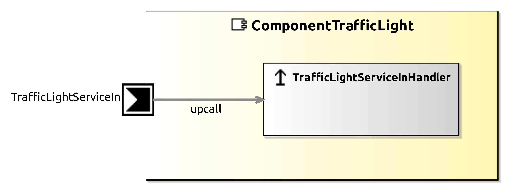

<!--- This file is generated from the ComponentTrafficLight.componentDocumentation model --->
<!--- do not modify this file manually as it will by automatically overwritten by the code generator, modify the model instead and re-generate this file --->

# ComponentTrafficLight Component

This component provides a LED control on a Raspberry Pi with WiringPi library. 
This Component is based on a Raspberry Pi, it uses WiringPi Library, it uses Pin 8,10 and 12 to Control LEDs,
Pin 8, 10, 12 are equivalents of WiringPi 15, 16, 1.

Note: Development and usage of this component is described in tutorial lesson on Raspberry Pi: 
Raspberry Pi: https://wiki.servicerobotik-ulm.de/tutorials

| Metaelement | Documentation |
|-------------|---------------|
| License | LGPL |
| Hardware Requirements | Raspberry Pi 2 Model B |
| Purpose | Hardware access |

## Service Ports

### TrafficLightServiceIn

Used to turn traffic light LEDs on or off. Receives a CommTrafficLight object that contains 3 boolean values to indicate the status of the light.

