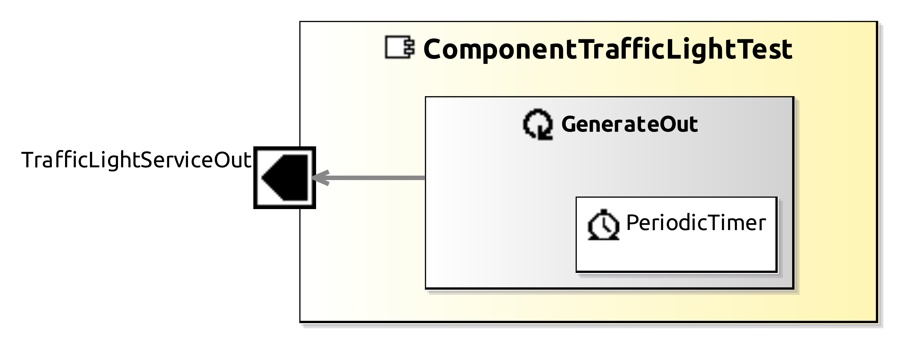

<!--- This file is generated from the ComponentTrafficLightTest.componentDocumentation model --->
<!--- do not modify this file manually as it will by automatically overwritten by the code generator, modify the model instead and re-generate this file --->

# ComponentTrafficLightTest Component

This component is an example to use with the traffic light (ComponentTrafficLight). 
        It generates traffic light signals in the following pattern 'Red', 'Yellow, 'Green', Yellow'.
The signals are generated with a frequency of 1 Hz.

Note: Development and usage of this Component is described in Tutorial Lesson 6: Raspberry Pi

| Metaelement | Documentation |
|-------------|---------------|
| License | LGPL |
| Hardware Requirements | - |
| Purpose | Demo component |

## Service Ports

### TrafficLightServiceOut

Typically used for Traffic Light Control. Sends 3 boolean values called 'Red', 'Yellow', 'Green'

