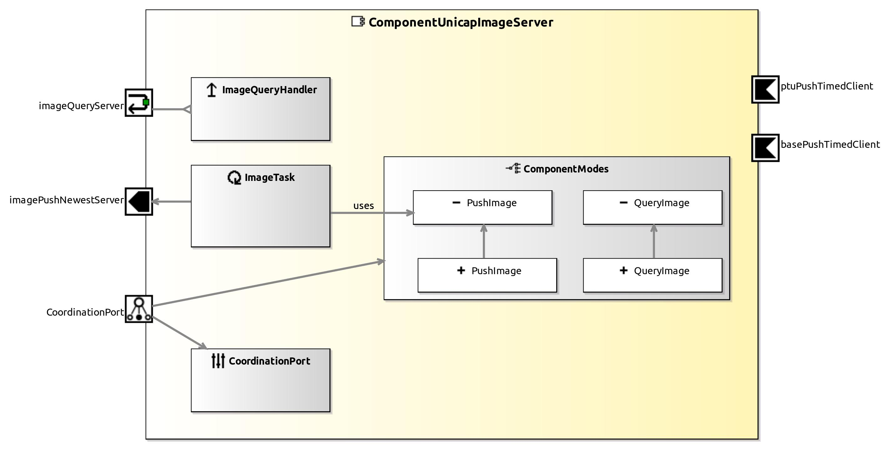

<!--- This file is generated from the ComponentUnicapImageServer.componentDocumentation model --->
<!--- do not modify this file manually as it will by automatically overwritten by the code generator, modify the model instead and re-generate this file --->

# ComponentUnicapImageServer Component

| Metaelement | Documentation |
|-------------|---------------|
| License |  |
| Hardware Requirements |  |
| Purpose |  |

## Service Ports

## Component Parameters ComponentUnicapImageServerParams

### InternalParameter settings

| Attribute Name | Attribute Type | Description |
|----------------|----------------|-------------|
| debug_info | Boolean |  |

### InternalParameter hardware

| Attribute Name | Attribute Type | Description |
|----------------|----------------|-------------|
| device | String |  |
| debug_info | Boolean |  |
| identifier | String |  |
| camera_type | String |  |

### InternalParameter hardware_properties

| Attribute Name | Attribute Type | Description |
|----------------|----------------|-------------|
| brightness | Double |  |
| auto_exposure | Double |  |
| sharpness | Double |  |
| white_balance_mode | Double |  |
| white_balance_u | Double |  |
| white_balance_v | Double |  |
| hue | Double |  |
| saturation | Double |  |
| gamma | Double |  |
| shutter | Double |  |
| gain | Double |  |
| trigger_mode | UInt32 |  |
| trigger_polarity | UInt32 |  |
| framerate | Double |  |
| autoflag_white_balance_mode | Boolean |  |
| autoflag_shutter | Boolean |  |
| format | String |  |
| width | UInt32 |  |
| height | UInt32 |  |

### InternalParameter push_newest

| Attribute Name | Attribute Type | Description |
|----------------|----------------|-------------|
| debug_info | Boolean |  |

### InternalParameter push_timed

| Attribute Name | Attribute Type | Description |
|----------------|----------------|-------------|
| debug_info | Boolean |  |

### InternalParameter sensor_pose

| Attribute Name | Attribute Type | Description |
|----------------|----------------|-------------|
| x | Int32 |  |
| y | Int32 |  |
| z | Int32 |  |
| azimuth | Double |  |
| elevation | Double |  |
| roll | Double |  |

### InternalParameter base

| Attribute Name | Attribute Type | Description |
|----------------|----------------|-------------|
| on_base | Boolean |  |
| on_ptu | Boolean |  |
| x | Int32 |  |
| y | Int32 |  |
| z | Int32 |  |
| azimuth | Double |  |
| elevation | Double |  |
| roll | Double |  |

### InternalParameter Image

| Attribute Name | Attribute Type | Description |
|----------------|----------------|-------------|
| debug_info | Boolean |  |
| smart_format | String |  |
| valid_time_in_sec | Float |  |

