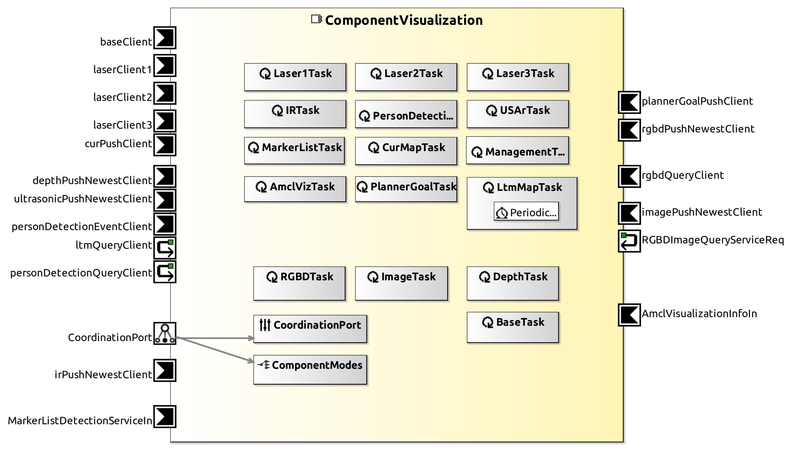

<!--- This file is generated from the ComponentVisualization.componentDocumentation model --->
<!--- do not modify this file manually as it will by automatically overwritten by the code generator, modify the model instead and re-generate this file --->

# ComponentVisualization Component

*Component Short Description:* 

Displays a visualization of a mobile robot position and path, current or long term map, distance laser, color or depth image, 3D-model from images etc. 

See also [User Guide for the Visualization Component](https://wiki.servicerobotik-ulm.de/tutorials:guide-visualization-of-communication-objects:start)

Often this ComponentVisualization has no links to other Components in the System, but it can connect to other Components during runtime: 

1) in the termial of ComponentVisualization, enter the number 0 to choose 'connect'
2) enter the number of what you want to display, e.g. 0 for BasePose_push_client (see list below)
3) enter the number of Component/Port you want to display
4) output is in another window with icon 'MRPT' and title 'SmartVisualization'

You can do this again to add another thing to the output window, or you can remove things by entering the number 1 to choose 'disconnect' etc.
It can display a base position of a mobile robot, its map, 3 lasers, etc. at the same time.
But it can't connect two things of same type at the same time, e.g. after connecting one mobile robot by (0) BasePose_push_client, disconnect it before connecting the second one.
(ComponentWebots can display multiple mobile robots, but is not as powerful)

## ( 0) BasePose_push_client
Shows estimated position from a mobile robot like ComponentWebotsMobileRobot, ComponentRobotinoBaseServer etc. (not from SmartPlannerBreathFirstSearch)
* blue cylinder/arrow = present position/heading (localization) in world frame
* yellow dots = future positions (based on actual speed/rotation)
* green line = past path (localization) 
* red line = past path (odometry only)

## ( 1) GridMap_push_client
Shows the current map from SmartMapperGridMap:
* white = free cell
* blue = inflated (grown) circles or crosses around present obstacles 
* black = past obstacles (from mapping etc.)
* red = can't be deleted
* gray = unknown area 

## ( 2) Laser1_push_client
Shows where a obstacle is hit from a laser (a rotating lidar with one horizontal layer of rays)
* green dot = position of reflection in world frame

## ( 3) Laser2_push_client
like above, but second laser

## ( 4) Laser3_push_client
like above, but third laser

## ( 5) PersonDetection_query_client

## ( 6) UltraSonic_push_client

## ( 7) Infrared_push_client

## ( 8) LTM_query_client
LTM = Long Term Map from SmartMapperGridMap
* white = free cell
* black = past obstacles (from mapping etc.)
* red = can't be deleted
* gray = unknown area 

## ( 9) RGB_image_push_client
Shows color (RGB) image from a camera like ComponentWebots3DCamera, ComponentKinectV2Server, ComponentRealSenseV2Server etc.
in a window 'Color Image' or 'RGB Image'.

## (10) RGBD_push_client
Uses both color (RGB) and depth image from a camera. Shows a colorful 3D-model.
If the camera is mounted on a mobile robot, the model is relative to the mobile robot frame, but not the world frame.

## (11) Depth_image_push_client
Shows a depth image from a depth camera in a window 'Depth Image'. Distance is represented by shades of gray, black=minimum distance of camera, white=maximum distance of camera.  

## (12) MarkerDetectionList_client

## (13) ParticleFilterInfo_client

## (14) PlannerGoal_client

## (15) VisualLocalizationMap_client

## (16) PlannerWavefrontGridMap_client
Shows a map with color-coded directions from SmartPlannerBreathFirstSearch only:
What is the fastest path from the actual mobile robot position to one of the goal cells if you move from one cell to horizontal/vertical adjacent cells only? 
The algorithm starts at the goal cells and paints adjacent cells with a color for the correct direction until it finds the actual mobile robot cell. 
To find the path from a cell (pixel) to the next one towards the goal, look at its color.
* &nbsp;&nbsp;&nbsp; goal cell
* &nbsp;&nbsp;&nbsp; first part of path (see below)
* &nbsp;&nbsp;&nbsp; obstacle
* &nbsp;&nbsp;&nbsp; free
* &nbsp;&nbsp;&nbsp; growing obstacle (see below)
* &nbsp;&nbsp;&nbsp; towards goal in -y direction
* &nbsp;&nbsp;&nbsp; towards goal in +x direction
* &nbsp;&nbsp;&nbsp; towards goal in +y direction 
* &nbsp;&nbsp;&nbsp; towards goal in -x direction

Note to **growing obstacle**: assume the robot as a point, but grow (inflate) obstacles by robot size, e.g. instead of checking a circular robot of radius 0.3 radius hitting a wall, make the wall surface 0.3m thicker in all directions and check if the middle point of the robot is hitting these 'grown' wall cells.

Note to **first part of path**: a combination of one horizontal and one vertical movement, move diagonal instead if it is free. 

## Component-Datasheet Properties

<table style="border-collapse:collapse;">
<caption><i>Table:</i> Component-Datasheet Properties</caption>
<tr style="background-color:#ccc;">
<th style="border:1px solid black; padding: 5px;"><i>Property Name</i></th>
<th style="border:1px solid black; padding: 5px;"><i>Property Value</i></th>
<th style="border:1px solid black; padding: 5px;"><i>Property Description</i></th>
</tr>
<tr>
<td style="border:1px solid black; padding: 5px;">Supplier</td>
<td style="border:1px solid black; padding: 5px;">Servicerobotics Ulm</td>
<td style="border:1px solid black; padding: 5px;"></td>
</tr>
<tr>
<td style="border:1px solid black; padding: 5px;">Homepage</td>
<td style="border:1px solid black; padding: 5px;">https://wiki.servicerobotik-ulm.de/directory:collection</td>
<td style="border:1px solid black; padding: 5px;"></td>
</tr>
<tr>
<td style="border:1px solid black; padding: 5px;">Purpose</td>
<td style="border:1px solid black; padding: 5px;">Displays a visualization of a mobile robot position and path, current or long term map, distance laser, color or depth image, 3D-model from images etc.</td>
<td style="border:1px solid black; padding: 5px;"></td>
</tr>
</table>

## Component Ports

### rgbdPushNewestClient

*Documentation:*

### RGBDImageQueryServiceReq

*Documentation:*

### rgbdQueryClient

*Documentation:*

### baseClient

*Documentation:*

### laserClient1

*Documentation:*

### laserClient2

*Documentation:*

### laserClient3

*Documentation:*

### irPushNewestClient

*Documentation:*

### imagePushNewestClient

*Documentation:*

### ltmQueryClient

*Documentation:*

### curPushClient

*Documentation:*

### depthPushNewestClient

*Documentation:*

### ultrasonicPushNewestClient

*Documentation:*

### personDetectionQueryClient

*Documentation:*

### personDetectionEventClient

*Documentation:*

### MarkerListDetectionServiceIn

*Documentation:*

### AmclVisualizationInfoIn

*Documentation:*

### plannerGoalPushClient

*Documentation:*

### VisualMarkers

*Documentation:*

### plannerWavefrontGridMap

*Documentation:*

## Component Parameters: ComponentVisualizationParams

### Internal Parameter: Services

*Documentation:*

<table style="border-collapse:collapse;">
<caption><i>Table:</i> Internal Parameter <b>Services</b></caption>
<tr style="background-color:#ccc;">
<th style="border:1px solid black; padding: 5px;"><i>Attribute Name</i></th>
<th style="border:1px solid black; padding: 5px;"><i>Attribute Type</i></th>
<th style="border:1px solid black; padding: 5px;"><i>Attribute Value</i></th>
<th style="border:1px solid black; padding: 5px;"><i>Attribute Description</i></th>
</tr>
<tr>
<td style="border:1px solid black; padding: 5px;"><b>show_base</b></td>
<td style="border:1px solid black; padding: 5px;">Boolean</td>
<td style="border:1px solid black; padding: 5px;">true</td>
<td style="border:1px solid black; padding: 5px;"></td>
</tr>
<tr>
<td style="border:1px solid black; padding: 5px;"><b>show_laser_1</b></td>
<td style="border:1px solid black; padding: 5px;">Boolean</td>
<td style="border:1px solid black; padding: 5px;">true</td>
<td style="border:1px solid black; padding: 5px;"></td>
</tr>
<tr>
<td style="border:1px solid black; padding: 5px;"><b>show_laser_2</b></td>
<td style="border:1px solid black; padding: 5px;">Boolean</td>
<td style="border:1px solid black; padding: 5px;">true</td>
<td style="border:1px solid black; padding: 5px;"></td>
</tr>
<tr>
<td style="border:1px solid black; padding: 5px;"><b>show_laser_3</b></td>
<td style="border:1px solid black; padding: 5px;">Boolean</td>
<td style="border:1px solid black; padding: 5px;">true</td>
<td style="border:1px solid black; padding: 5px;"></td>
</tr>
<tr>
<td style="border:1px solid black; padding: 5px;"><b>show_tof_image</b></td>
<td style="border:1px solid black; padding: 5px;">Boolean</td>
<td style="border:1px solid black; padding: 5px;">false</td>
<td style="border:1px solid black; padding: 5px;"></td>
</tr>
<tr>
<td style="border:1px solid black; padding: 5px;"><b>show_ltm</b></td>
<td style="border:1px solid black; padding: 5px;">Boolean</td>
<td style="border:1px solid black; padding: 5px;">true</td>
<td style="border:1px solid black; padding: 5px;"></td>
</tr>
<tr>
<td style="border:1px solid black; padding: 5px;"><b>show_cur_map</b></td>
<td style="border:1px solid black; padding: 5px;">Boolean</td>
<td style="border:1px solid black; padding: 5px;">true</td>
<td style="border:1px solid black; padding: 5px;"></td>
</tr>
<tr>
<td style="border:1px solid black; padding: 5px;"><b>show_kinect_image</b></td>
<td style="border:1px solid black; padding: 5px;">Boolean</td>
<td style="border:1px solid black; padding: 5px;">false</td>
<td style="border:1px solid black; padding: 5px;"></td>
</tr>
<tr>
<td style="border:1px solid black; padding: 5px;"><b>show_person_detection</b></td>
<td style="border:1px solid black; padding: 5px;">Boolean</td>
<td style="border:1px solid black; padding: 5px;">false</td>
<td style="border:1px solid black; padding: 5px;"></td>
</tr>
<tr>
<td style="border:1px solid black; padding: 5px;"><b>show_ultrasonic_point_cloud</b></td>
<td style="border:1px solid black; padding: 5px;">Boolean</td>
<td style="border:1px solid black; padding: 5px;">false</td>
<td style="border:1px solid black; padding: 5px;"></td>
</tr>
<tr>
<td style="border:1px solid black; padding: 5px;"><b>show_ir</b></td>
<td style="border:1px solid black; padding: 5px;">Boolean</td>
<td style="border:1px solid black; padding: 5px;">false</td>
<td style="border:1px solid black; padding: 5px;"></td>
</tr>
<tr>
<td style="border:1px solid black; padding: 5px;"><b>simple_laser_visualization</b></td>
<td style="border:1px solid black; padding: 5px;">Boolean</td>
<td style="border:1px solid black; padding: 5px;">true</td>
<td style="border:1px solid black; padding: 5px;"></td>
</tr>
<tr>
<td style="border:1px solid black; padding: 5px;"><b>show_trajectory</b></td>
<td style="border:1px solid black; padding: 5px;">Boolean</td>
<td style="border:1px solid black; padding: 5px;">true</td>
<td style="border:1px solid black; padding: 5px;"></td>
</tr>
</table>

### Internal Parameter: Settings

*Documentation:*

<table style="border-collapse:collapse;">
<caption><i>Table:</i> Internal Parameter <b>Settings</b></caption>
<tr style="background-color:#ccc;">
<th style="border:1px solid black; padding: 5px;"><i>Attribute Name</i></th>
<th style="border:1px solid black; padding: 5px;"><i>Attribute Type</i></th>
<th style="border:1px solid black; padding: 5px;"><i>Attribute Value</i></th>
<th style="border:1px solid black; padding: 5px;"><i>Attribute Description</i></th>
</tr>
<tr>
<td style="border:1px solid black; padding: 5px;"><b>verbose</b></td>
<td style="border:1px solid black; padding: 5px;">Boolean</td>
<td style="border:1px solid black; padding: 5px;">false</td>
<td style="border:1px solid black; padding: 5px;"></td>
</tr>
</table>

### ParameterSetInstance: VisualizationParams

#### Trigger Instance: SHOW_BASE1

*Property:* active = **false**

*Documentation:*

#### Trigger Instance: STOP_BASE1

*Property:* active = **false**

*Documentation:*

#### Trigger Instance: SHOW_LASER1

*Property:* active = **false**

*Documentation:*

#### Trigger Instance: STOP_LASER1

*Property:* active = **false**

*Documentation:*

#### Trigger Instance: SHOW_LASER2

*Property:* active = **false**

*Documentation:*

#### Trigger Instance: STOP_LASER2

*Property:* active = **false**

*Documentation:*

#### Trigger Instance: SHOW_LASER3

*Property:* active = **false**

*Documentation:*

#### Trigger Instance: STOP_LASER3

*Property:* active = **false**

*Documentation:*

#### Trigger Instance: SHOW_IR1

*Property:* active = **false**

*Documentation:*

#### Trigger Instance: STOP_IR1

*Property:* active = **false**

*Documentation:*

#### Trigger Instance: SHOW_MAP1

*Property:* active = **false**

*Documentation:*

#### Trigger Instance: STOP_MAP1

*Property:* active = **false**

*Documentation:*

#### Trigger Instance: SHOW_RGB1

*Property:* active = **false**

*Documentation:*

#### Trigger Instance: STOP_RGB1

*Property:* active = **false**

*Documentation:*

#### Trigger Instance: SHOW_RGBD1

*Property:* active = **false**

*Documentation:*

#### Trigger Instance: STOP_RGBD1

*Property:* active = **false**

*Documentation:*

#### Trigger Instance: SHOW_DEPTHIMAGE1

*Property:* active = **false**

*Documentation:*

#### Trigger Instance: STOP_DEPTHIMAGE1

*Property:* active = **false**

*Documentation:*

