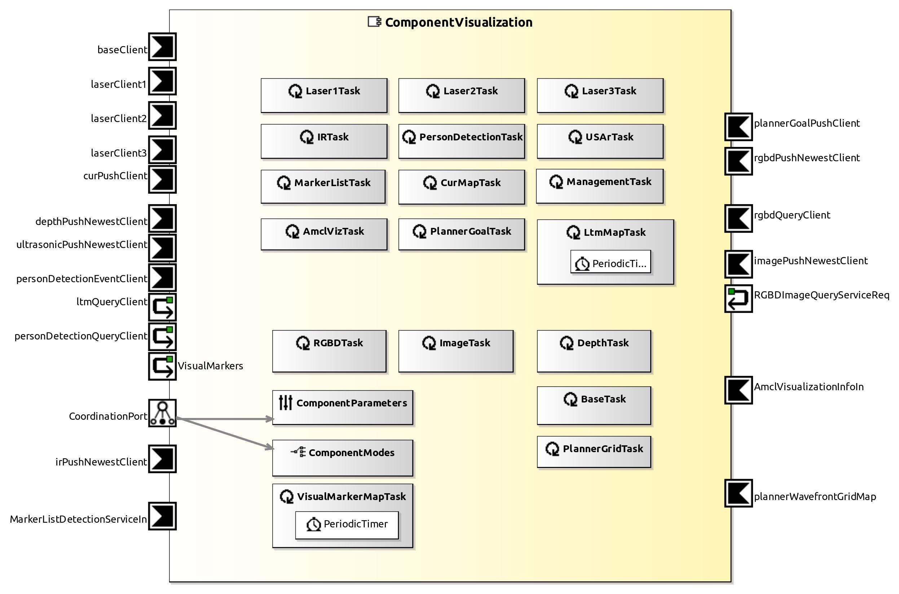

<!--- This file is generated from the ComponentVisualization.componentDocumentation model --->
<!--- do not modify this file manually as it will by automatically overwritten by the code generator, modify the model instead and re-generate this file --->

# ComponentVisualization Component

| Metaelement | Documentation |
|-------------|---------------|
| License |  |
| Hardware Requirements |  |
| Purpose |  |

## Service Ports

## Component Parameters ComponentVisualizationParams

### InternalParameter Services

| Attribute Name | Attribute Type | Description |
|----------------|----------------|-------------|
| show_base | Boolean |  |
| show_laser_1 | Boolean |  |
| show_laser_2 | Boolean |  |
| show_laser_3 | Boolean |  |
| show_tof_image | Boolean |  |
| show_ltm | Boolean |  |
| show_cur_map | Boolean |  |
| show_kinect_image | Boolean |  |
| show_person_detection | Boolean |  |
| show_ultrasonic_point_cloud | Boolean |  |
| show_ir | Boolean |  |
| simple_laser_visualization | Boolean |  |

### InternalParameter Settings

| Attribute Name | Attribute Type | Description |
|----------------|----------------|-------------|
| verbose | Boolean |  |

