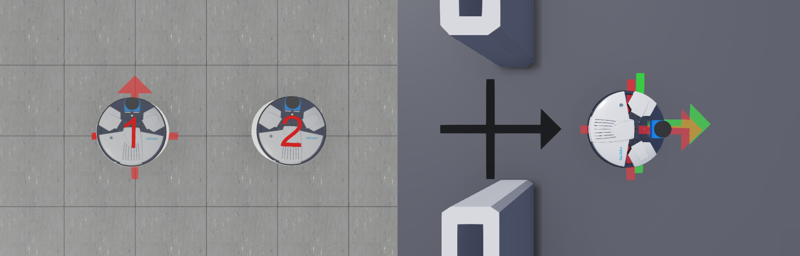

### [Back to main documentation](README.md)

### Developer Documentation

Two real robots 1 and 2 (left side) and one simulated robot (right side):


Different types of position:
* Location of a named landmark (a black cross on the floor)
* true position of a robot (can only be seen for the simulated robot on the right side)
* odometry position of a robot (a red cross on the floor)
* localization position of a robot (robot 1 and 2 on the left side, or a green cross on the floor for the simulated robot on the right side)

Odometry (raw position from base component):
* The odometry position is calculated by sensing the wheel rotations.
* If a robot has two wheels on the left/right side, than forward movement is done by rotating both wheel forwards, and a rotation counterclockwise is done by rotating the left wheel backwards and the right wheel forwards. As the wheel position can be measured very accurately and the wheel diameter is known, the moved distance or rotated angle can be measured too, but has some small error getting bigger over time.
* For a simulated robot, its true position is known and the odometry position is initialized automatically here, but for a real robot the initial odometry position is at (0/0/0), at the origin of the map and heading to the x-axis direction. In the picture the real robots 1 and 2 have the same initial odometry position.

Localization (corrected position from SmartAmcl):
* First the localization position is initialized.
* Then the robot orientates itself by a map and a look at its environment, correcting the localization position.
* The uncorrected/corrected position is send to the base component. If the robot moves, both the raw odometry position and the localization position is updated and send to other components.

Difference of simulated and real robot:
* simulated robot: The Localization is shown as a green cross on the floor. The user can see/move the simulated robot at its true position, both Odometry and Localization position is automatically initialized at its true position.
* real robot: The Localization is shown as a model of a robot. The true position of a real robot is unknown in the simulation, the Odometry is initialized at (0/0/0) and the user must initialize the Localization close to the true position.

Fields of MobileRobotPose (read only):
* *baseComponent* is the name of the base component (alphabetically ordered)
* *translationLocation* is x/y/z coordinate of the Localization position of the mobile robot [meters]
* *rotationLocation* is an axis–angle representation of the rotation of the Localization (4 numbers, the first three are a vector of length 1, the last is an angle in radians: rotate counterclockwise around that vector by that angle, e.g. "0 0 1 0.5236" means heading=0.5236 [radians]
* *translationOdometry* / *rotationOdometry* is the odometry position (see *translationLocation* / *rotationLocation* above)
* velocityForward is forward velocity [m/s]
* velocityLeft is sideways velocity [m/s]
* velocityRotation is rotational velocity [radians/s]
* covMatrixDiagonal are the 3 diagonal values of the covariance matrix (x/y/heading)

Fields of Localization (most of these fields can be edited by the user and can be saved/restored)
* *baseComponent* is the name of the base component (alphabetically ordered, read only)
* *translation* / *rotation* is the Localization position (see *translationLocation* / *rotationLocation* above)
* *service*: use 'baseComponent' or 'localizationComponent' to update the Localization position ?
* *localizationComponent* is the last part of an entry of *localizationComponentNames*, e.g. 'SmartAmcl_1' or '1' or ''
* *localizationComponentNames* it the alphabetically ordered list of localization components (recognized by LocalizationEventServiceOut)
* *type* is automatically set for real robots
* *INITIALPOSE_requires_neutral*: see below

The mainstate 'Neutral' is used to turn off the activities of a Component, other mainstates can turn on some or all activities of that Component. Service ports can only communicate if the component is turned on, and triggers are used to initialize values if the component is turned off.

If *INITIALPOSE_requires_neutral* is set to TRUE, the following calls are done to update the localization component:
* set mainstate to 'Neutral' (and substates to 'neutral')
* call trigger INITIAL_POSE
* set mainstate to 'Active' (and substates to 'active' and 'nonneutral')

If *INITIALPOSE_requires_neutral* is set to FALSE, the trigger is called without turning off/on the component. This is possible in actual implementation of SmartAmcl, enabling to change localization at any time. If a localization component may require to be turned off, set INITIALPOSE_requires_neutral to TRUE.

If ComponentWebots detects a robot but its Localization field is yet missing, these fields are automatically set with correct values if these naming conventions are true:

base component name starts with:
* real robot Larry/Robotino/Pioneer => ComponentRMPBaseServer/ComponentRobotinoBaseServer/SmartPioneerBaseServer
* simulated robot => ComponentWebotsMobileRobot

All components names of one robot must have the same ending, e.g. ComponentRobotBaseServer_1 and SmartAmcl_1, and must have a different ending for different robots. The ending must start with an underscore '_' or no ending at all. If the robot base component ends with _0 to _9, that red digit is shown on top of the robot. 

#### How to install Webots in Linux (Ubuntu 20.04)

if webots was already installed, deinstall the old version first:

```
sudo dpkg -r webots
```

go to [https://cyberbotics.com/](https://cyberbotics.com/)

click on 'Download', download [webots_2022b_amd64.deb](https://github.com/cyberbotics/webots/releases/download/R2022b/webots_2022b_amd64.deb) into your Downloads-folder, then do:

```
sudo apt install ~/Downloads/webots_2022b_amd64.deb
```

Add to your ~/.profile:

```
export WEBOTS_HOME=/usr/local/webots
export LD_LIBRARY_PATH=$LD_LIBRARY_PATH:$WEBOTS_HOME/lib/controller
```

#### Add Webots library and include path to an component project

Add to component's smartsoft/CMakeLists.txt the following lines:

```
INCLUDE_DIRECTORIES($ENV{WEBOTS_HOME}/include/controller/cpp)
TARGET_LINK_LIBRARIES(${PROJECT_NAME} $ENV{WEBOTS_HOME}/lib/controller/libCppController.so)
```

Then do:
- right click on Component in Project Explorer
- properties
- expand 'C/C++ General'
- Paths and Symbols
- includes
- GNU C++
- Add...<br>
  <code>${WEBOTS_HOME}/include/controller/cpp</code>
- rebuild index (e.g. by closing and opening this project)

#### Other Webots components

- [ComponentWebotsMobileRobot](../ComponentWebotsMobileRobot)
- [ComponentWebots2DLidar](../ComponentWebots2DLidar)
- [ComponentWebots3DCamera](../ComponentWebots3DCamera)
- [ComponentWebotsURServer](../ComponentWebotsURServer)
- [ComponentWebotsPTUServer](../ComponentWebotsPTUServer)
- [ComponentWebotsConveyorBeltOpcua](../ComponentWebotsConveyorBeltOpcua)
- [ComponentWebotsMpsDocking](../ComponentWebotsMpsDocking)

#### Webots in the Virtual machine

It is best to start the virtual machine with VMWare Player in Windows. [[1]](https://www.cyberbotics.com/doc/guide/general-bugs#virtualization)
It was tested with VMWare Workstation Player 15 (both non-commercial and PRO version).

You need at least 8 MB Ram and a good graphics card on your computer.
In the settings of the virtual machine, give it at least 4 GB Ram, 512 MB graphics memory and turn on graphics card acceleration. OpenGl is required by webots to run fast.

If your computer has not a very good graphics card, webots may run slowly in the virtual machine. The simulation speed should be near to '1.00x' at the top of the webots window. If it is below, you can speed up graphics:
* make the graphics window smaller (if graphics window height and width is halved, the speed is 4 times faster)
* webots menu > Tools > Preferences > OpenGL > Disable shadows
* webots window, at the left side is the Scene Tree, first entry is WorldInfo, double click on it, it expands, now click on basicTimeStep, double the value from 32 to 64 or again to 128. This will speed up the simulation but makes it less accurate as changes are done less frequently. [[2]](https://cyberbotics.com/doc/guide/the-scene-tree) [[3]](https://www.cyberbotics.com/doc/reference/glossary)
* you can reduce here the value FPS too (frames per second, how often graphics is done)
* turn off/on graphics rendering by pressing the cube button or pressing CTRL+4

Known Bugs:
* VirtualBox does not support OpenGL, making Webots graphics very slow (use VMWare Player instead)
* a lidar in Webots sometimes does not detect distances at left/right side correct. this bug happens if VMWare Player is startet from Linux (use Windows instead)
* if System\*/model/\*.target HostAddress is set to 'localhost', then the System Menu "menu-stop" does not close all terminals: right-click on the x-term symbol on the left side of ubuntu and select 'Quit xx windows' to close them manually
* if System\*/model/\*.target HostAddress is set to the hostname of a computer (e.g. 'ubuntu'), then the System Menu "menu-stop" does close all terminals, but Webots graphics is very slow in the virtual machine => in the virtual machine, use 'localhost'

##### Shared Folders

If you want to share files among virtual machine and the host computer, enable the shared folders [[5]](https://www.vmware.com/support/ws5/doc/ws_running_shared_folders.html). If it does not work, execute this command in the virtual machine (don't add this to an login-script):


```
sudo vmhgfs-fuse .host:/ /mnt/hgfs/ -o allow_other -o uid=1000
```

##### Gazebo in the virtual machine

If you want to start Gazebo directly from the virtual machine's console, do the following line first:

```
export SVGA_VGPU10=0
```
