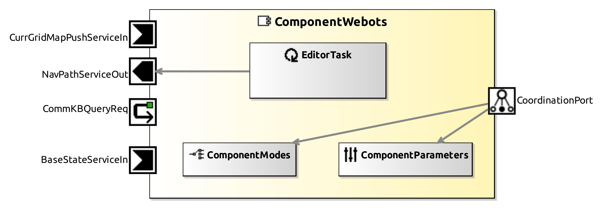

<!--- This file is generated from the ComponentWebots.componentDocumentation model --->
<!--- do not modify this file manually as it will by automatically overwritten by the code generator, modify the model instead and re-generate this file --->

# ComponentWebots Component



*Component Short Description:* 

This component starts the [Webots](https://cyberbotics.com) simulator.
 
If another webots simulator is already running, this component will ask to end it first before starting the new one, because two simulations could make the computer very slow.
 
Edit the system model *.systemParam file to change which world file is loaded by webots in this system.

Example:

```
    ComponentParameterInstance ComponentWebots refinesParamStruct ComponentWebots {
        ParameterRefinement General{
            WorldPath = "/the/path/to/my/folder/MyWorldName.wbt"
        }
    }
```

#### How to install Webots in Linux (Ubuntu 20.04)

if webots was already installed, deinstall the old version first:

```
sudo dpkg -r webots
```

go to [https://github.com/cyberbotics/webots/releases](https://github.com/cyberbotics/webots/releases)

click on 'Nightly Build', download webots_2021a-rev1_amd64.deb into your Downloads-folder, then do:

```
sudo apt install ~/Downloads/webots_2021a-rev1_amd64.deb
```

Add to your ~/.profile:

```
export WEBOTS_HOME=/usr/local/webots
export LD_LIBRARY_PATH=$LD_LIBRARY_PATH:$WEBOTS_HOME/lib/controller
```

#### Add Webots library and include path to an component project

Add to component's smartsoft/CMakeLists.txt the following lines:

```
INCLUDE_DIRECTORIES($ENV{WEBOTS_HOME}/include/controller/cpp)
TARGET_LINK_LIBRARIES(${PROJECT_NAME} $ENV{WEBOTS_HOME}/lib/controller/libCppController.so)
```

Then do:
- right click on Component in Project Explorer
- properties
- expand 'C/C++ General'
- Paths and Symbols
- includes
- GNU C++
- Add...<br>
  <code>${WEBOTS_HOME}/include/controller/cpp</code>
- rebuild index (e.g. by closing and opening this project)

#### Other Webots components

- [ComponentWebotsMobileRobot](../ComponentWebotsMobileRobot)
- [ComponentWebots2DLidar](../ComponentWebots2DLidar)
- [ComponentWebots3DCamera](../ComponentWebots3DCamera)
- [ComponentWebotsURServer](../ComponentWebotsURServer)
- [ComponentWebotsPTUServer](../ComponentWebotsPTUServer)
- [ComponentWebotsConveyorBeltOpcua](../ComponentWebotsConveyorBeltOpcua)
- [ComponentWebotsMpsDocking](../ComponentWebotsMpsDocking)

#### Webots in the Virtual machine

It is best to start the virtual machine with VMWare Player in Windows. [[1]](https://www.cyberbotics.com/doc/guide/general-bugs#virtualization)
It was tested with VMWare Workstation Player 15 (both non-commercial and PRO version).

You need at least 8 MB Ram and a good graphics card on your computer.
In the settings of the virtual machine, give it at least 4 GB Ram, 512 MB graphics memory and turn on graphics card acceleration. OpenGl is required by webots to run fast.

If your computer has not a very good graphics card, webots may run slowly in the virtual machine. The simulation speed should be near to '1.00x' at the top of the webots window. If it is below, you can speed things up: 
* webots window, at the left side is the Scene Tree, first entry is WorldInfo, double click on it, it expands, now click on basicTimeStep, double the value from 32 to 64 or again to 128. This will speed up the simulation but makes it less accurate as changes are done less frequently. [[2]](https://cyberbotics.com/doc/guide/the-scene-tree) [[3]](https://www.cyberbotics.com/doc/reference/glossary)
* you can reduce here the value FPS too (frames per second, how often graphics is done)
* turn off/on graphics rendering by pressing the cube button or pressing CTRL+4

##### Shared Folders

If you want to share files among virtual machine and the host computer, enable the shared folders [[5]](https://www.vmware.com/support/ws5/doc/ws_running_shared_folders.html). If it does not work, execute this command in the virtual machine (don't add this to an login-script):


```
sudo vmhgfs-fuse .host:/ /mnt/hgfs/ -o allow_other -o uid=1000
```

##### Gazebo in the virtual machine

If you want to start Gazebo directly from the virtual machine's console, do the following line first:

```
export SVGA_VGPU10=0
```


## Component-Datasheet Properties

<table style="border-collapse:collapse;">
<caption><i>Table:</i> Component-Datasheet Properties</caption>
<tr style="background-color:#ccc;">
<th style="border:1px solid black; padding: 5px;"><i>Property Name</i></th>
<th style="border:1px solid black; padding: 5px;"><i>Property Value</i></th>
<th style="border:1px solid black; padding: 5px;"><i>Property Description</i></th>
</tr>
<tr>
<td style="border:1px solid black; padding: 5px;">Supplier</td>
<td style="border:1px solid black; padding: 5px;">Servicerobotics Ulm</td>
<td style="border:1px solid black; padding: 5px;"></td>
</tr>
<tr>
<td style="border:1px solid black; padding: 5px;">Homepage</td>
<td style="border:1px solid black; padding: 5px;">https://wiki.servicerobotik-ulm.de/directory:collection</td>
<td style="border:1px solid black; padding: 5px;"></td>
</tr>
<tr>
<td style="border:1px solid black; padding: 5px;">Purpose</td>
<td style="border:1px solid black; padding: 5px;">Start the Webots simulator.</td>
<td style="border:1px solid black; padding: 5px;"></td>
</tr>
</table>

## Component Ports


## Component Parameters: ComponentWebots

### Internal Parameter: General

*Documentation:*

<table style="border-collapse:collapse;">
<caption><i>Table:</i> Internal Parameter <b>General</b></caption>
<tr style="background-color:#ccc;">
<th style="border:1px solid black; padding: 5px;"><i>Attribute Name</i></th>
<th style="border:1px solid black; padding: 5px;"><i>Attribute Type</i></th>
<th style="border:1px solid black; padding: 5px;"><i>Attribute Value</i></th>
<th style="border:1px solid black; padding: 5px;"><i>Attribute Description</i></th>
</tr>
<tr>
<td style="border:1px solid black; padding: 5px;"><b>WorldPath</b></td>
<td style="border:1px solid black; padding: 5px;">String</td>
<td style="border:1px solid black; padding: 5px;">"$SMART_ROOT_ACE/repos/DataRepository/webots/worlds/ConveyorBeltIntralogistic.wbt"</td>
<td style="border:1px solid black; padding: 5px;"><p>The webots simulator will load this world file (path and filename of an .wbt file).
</p></td>
</tr>
</table>

