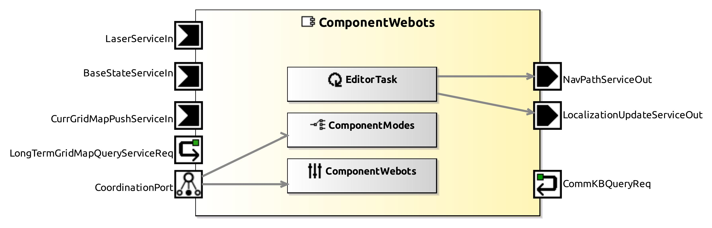
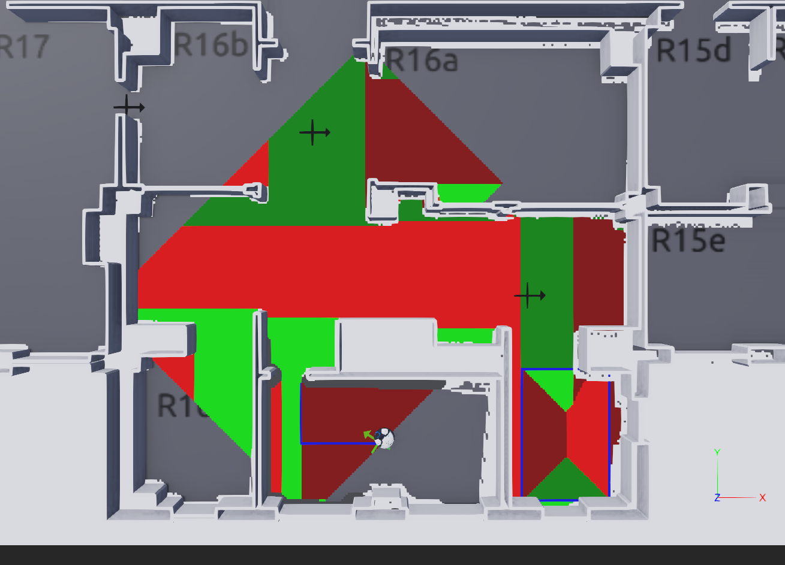

<!--- This file is generated from the ComponentWebots.componentDocumentation model --->
<!--- do not modify this file manually as it will by automatically overwritten by the code generator, modify the model instead and re-generate this file --->

# ComponentWebots Component



*Component Short Description:* 

Videos [1](https://www.youtube.com/watch?v=wykpdKlzwuE) and [2](https://www.youtube.com/watch?v=YrkvbOH4svI). For developers, see also the [Developer Documentation](DEVELOPER.md).

This component starts the [Webots](https://cyberbotics.com) simulator.
 
If another webots simulator is already running, this component will ask to end it first before starting the new one, because two simulations could make the computer very slow.
 
Edit the system model *.systemParam file to change which world file is loaded by webots in this system.

Example:

```
    ComponentParameterInstance ComponentWebots refinesParamStruct ComponentWebots {
        ParameterRefinement General{
            WorldPath = "/the/path/to/my/folder/MyWorldName.wbt"
            isEditorPresent = false
        }
    }
```
### Editor

The Editor can 
* add, move, change and delete Locations, Stations or Waypoints
* show a map (from Mapper or Planner) of one robot
* show the position and movement path of all robots
* set the position of a robot (directly for simulated robots, localization for real robots)

To turn on the editor:
* in system > model > *.systemParam, change the parameter 'isEditorPresent = true'
* in system > model > componentArch, connect the port from ComponentWebots to ComponentKB (if you use Locations/Stations) and/or ComponentNavigationGraph (if you use Waypoints/Connections) (to unhide ports in the diagram, click on the component, wait, a menu appears)
* system > run code generation 
* add the following lines to the world file:

```
Editor {
}
```

In the System, connect ComponentWebots to ComponentKB (or ComponentKB_Master in case of a master-slave system). The other connections are done by ComponentWebots itself.


The Editor will add/use these Groups in the [Scene Tree](https://cyberbotics.com/doc/guide/the-scene-tree):

```
DEF Locations Group
DEF Stations Group
DEF Waypoints Group
DEF WaypointConnections Group
DEF MobileRobotsPoses Group
DEF RealRobots Group
```

(if you don't see the Scene Tree on the left side of Webots, press <kbd>CTRL</kbd>+<kbd>J</kbd> to reset the layout)
 
A **Location** is shown by a cross on the floor. A mobile robot can find a path to a goal Location by using its map and avoid obstacles by using its sensors.

To add a Location:
* double click on the Group 'Locations'
* click on 'children'
* right-click 'Add New'
* find 'Location' or select it from 'PROTO nodes (Current Project)'

Double click on the newly added Location, enter an unique name.

To move an Location:
* click on the cross and press <kdb>shift</kdb> while moving it with the mouse [(moving a solid object)](https://cyberbotics.com/doc/guide/the-3d-window#moving-a-solid-object)
* to rotate it, use the blue curved arrow
* or edit its translation/rotation values in the Scene Tree

Fields of the Location:
* *name* : the name of the Location
* *translation* : (x y z) coordinates in meters, z should be 0 (up) 
* *rotation* : (0 0 1 angle) = rotate around (0 0 1) axis (up) by angle radians  
* *radius* : robot will move to the Location until its distance is less than double this value in meters
* *smallerRadius* : after *radius* distance is reached and if *smallerRadius* is greater than zero then move again to *smallerRadius* distance
* *waypointId* : If this number is 0 or greater, generate a Waypoint with this *waypointId* and at same position than this Location. If this Location is moved, the generated Waypoint is moved too. 

To add a Station:
* double click on the Group 'Stations'
* click on 'children'
* right-click 'Add New'
* select one of these:

* A-Frame
* AssemblyWorkstation
* CrateStation
* InclinedShelf
* ManualStation (brown cross on floor)
* OPC_UA_Station
* RollerConveyorStation

Picture with all kinds of **Station** (from left to right): 


Fields of the Station:
* *name* : The name of the Station. OPC_UA_Station and RollerConveyorStation should have a positive number as a name.
* *Locations* : A list of Locations relative to this Station, e.g. translation 1 2 0 means 1 meter forward and 2 meters left and 0 meters upwards than this station. Must have at least one Location (if a robot goes to a station, it uses the first Location of that station). 
* *data* : These additional data strings of the Station are automatically written into the knowledge base. 
* *port* : (OPC_UA_Station only) Default port for OPC UA communication is 4840. Each OPC_UA_Station must have an different port number e.g. 4840 4841 ... [List](https://en.wikipedia.org/wiki/List_of_TCP_and_UDP_port_numbers). port -1 disables communication. Changing the port restarts the OPC UA program.

To select a Location of a Station in the graphics window, click on the Location twice: the first click selects the Station, the second click selects the Location.

If you added a Station outside the DEF Stations Group, it will not be detected and its Location not listed. To fix this, cut and paste it into 'children' of the DEF Stations Group instead.

**Waypoints** can be connected by one-way **WaypointConnections**. Mobile robots can travel on these connections between waypoints, avoiding other robots. Robots can use intersections of two connections too. Connections are one-way only, e.g. if there is a connection from A to B, there can't be a direct connection from B to A. A selected Waypoint is red if it is too close to other Waypoints. The length of a connection can be counted by the green arrow stripes: one dark green stripe each meter. (The gray floor tiles in Lab/THU worlds have exactly 0.5 meter size) 

Keys used in the graphics window of Webots:
* <kbd>Insert</kbd> or <kbd>+</kbd> : create a new Waypoint, connect it to the old selected Waypoint if possible
* <kbd>Del</kbd> or <kbd>-</kbd> : delete the selected Waypoint or WaypointConnection
* <kbd>*</kbd> : while pressing this key and selecting a new Waypoint, a new connection from the old selected Waypoint to the new one is created
* <kbd>/</kbd> : while pressing this key and selecting a Waypoint or WaypointConnection, the defaultWaypointWidth of the Editor is applied to it

To delete a OPC_UA_Station during runtime:
* pause the simulation
* use Scene Tree (left side of Webots) to delete the station
* unpause the simulation

Fields of the Editor:
* *showMobileRobotsPoses* : can be set to show the position and movement path of real or simulated robots
* *mapType* : Current (map with currently seen obstacles) or LongTerm or Planner or none
* *mapComponent* : select the first entry from *mapComponentNames* which ends with this value (e.g. if mapComponentNames has entries "SmartMapperGridMap_1" "SmartMapperGridMap_2" "SmartMapperGridMap_3", then "GridMap_2" or "2" selects the second entry, and "GridMap_1" or "1" or "" selects the first entry)
* *mapComponentNames* : alphabetically sorted list of components who generate *mapType*
* *showWaypoints* : if set to false, all Waypoints and WaypointConnections are invisible
* *defaultWaypointWidth* : The diameter of newly added Waypoints or the width of newly added WaypointConnections (in meters). To apply this value to an existing Waypoint/WaypointConnection, select it while pressing the <kbd>/</kbd> key.
* *stopSimulation* : set this value to 'TRUE' before saving the world (it removes the map, MobileRobotsPoses and velocities to make the save files smaller)

Example of a map (Current) from SmartMapperGridMap (blue pixels show the area where the robot center point can't go):


Example of a map (Planner) from SmartPlannerBreadthFirstSearch: 



Colors of the path planner map:
* blue = path or goal area
* red/green = move in X/Y axis direction of world (light color=+axis, dark color=-axis)
* white = obstacle (from loaded map)
* dark grey = 'growing' obstacle (from laser)

If the robot is inactive, the map could be invisible or not updated. The map will be visible again if the robot has to move to some place.

**MobileRobotsPoses**
* blue route: The future movement is shown by 10 blue triangles (using the current speed, 0.5 seconds per triangle). The past movement is shown by a blue line.
* red odometry: A red cross on the floor shows the odometry position (the driven distance etc. is measured by sensors for the wheel rotatation)

**Localizations**
The Localization is the estimated position of a robot, based on odometry (wheel rotation sensors), a laser or depth camera to see the environment, and a map of the environment.
Note that the true position of a simulated robot can be seen in the simulation and not in the real world, and the true position of a real robot can be seen in the real world and not in the simulation.
For simulated robots (ComponentWebotsMobileRobot), the true robot is visible in the simulation and the Localization is a green cross on the floor.
For real robots (ComponentRobotinoBaseServer/ComponentRMPBaseServer/SmartPioneerBaseServer), the true robot is not visible in the simulation and the Localization is a cylinder or box with same size as the robot.
If at the end of the component name is '_0' or '_1' or  ... '_9', that red number is shown on top of the model.

**different ways to set the estimated position (Localization) of a robot**
* set in System model/*.systemParam > SmartAmcl* > General > initialType = INI_POSE and initial_x/y/a on position [meters] and heading [radians] OR
* in the System's Behavior, add in startUp.smartTcl "(execute '(localizationModInst.localizationSetRobotPose x y heading))" (x y are position numbers in meters, heading is in radians) OR
* click on the Localization in the 3D window and press shift and left mouse button to move it to the correct position or click on the curved/straight arrows to rotate/slide (red=x-axis, green=y, blue=z) OR
* click on the Localization in the Scene Tree on the left side, edit the first two numbers of 'translation' [meters] and the last of 'rotation' [radians] OR
* edit the System's webots worldfile (*.wbt) like this:

	DEF Localizations Group {
		children [
			Localization {
				baseComponent "SmartAmcl_1"
				translation 0 -2 0
				rotation 0 0 1 0
			}
		]
	}

For simulated robots, it is better to move the robot and not its Localization (the green cross on the floor).

If you save a world with Larry, sometimes it's robot arm pose will be reset. To fix this bug, copy-paste from another world file with Larry the 'hidden' positions/rotations of Larry.

Note that the laser of the real Robotino3 needs half a minute to start, only after that time the initial position will be shown correctly.


## Component-Datasheet Properties

<table style="border-collapse:collapse;">
<caption><i>Table:</i> Component-Datasheet Properties</caption>
<tr style="background-color:#ccc;">
<th style="border:1px solid black; padding: 5px;"><i>Property Name</i></th>
<th style="border:1px solid black; padding: 5px;"><i>Property Value</i></th>
<th style="border:1px solid black; padding: 5px;"><i>Property Description</i></th>
</tr>
<tr>
<td style="border:1px solid black; padding: 5px;">Supplier</td>
<td style="border:1px solid black; padding: 5px;">Servicerobotics Ulm</td>
<td style="border:1px solid black; padding: 5px;"></td>
</tr>
<tr>
<td style="border:1px solid black; padding: 5px;">Homepage</td>
<td style="border:1px solid black; padding: 5px;">https://wiki.servicerobotik-ulm.de/directory:collection</td>
<td style="border:1px solid black; padding: 5px;"></td>
</tr>
<tr>
<td style="border:1px solid black; padding: 5px;">Purpose</td>
<td style="border:1px solid black; padding: 5px;">Start the Webots simulator.</td>
<td style="border:1px solid black; padding: 5px;"></td>
</tr>
</table>

## Component Ports

### BaseStateServiceIn

*Documentation:*


### CurrGridMapPushServiceIn

*Documentation:*


### CommKBQueryReq

*Documentation:*


### NavPathServiceOut

*Documentation:*


### LocalizationUpdateServiceOut

*Documentation:*


### LongTermGridMapQueryServiceReq

*Documentation:*


## Component Parameters: ComponentWebots

### Internal Parameter: General

*Documentation:*

<table style="border-collapse:collapse;">
<caption><i>Table:</i> Internal Parameter <b>General</b></caption>
<tr style="background-color:#ccc;">
<th style="border:1px solid black; padding: 5px;"><i>Attribute Name</i></th>
<th style="border:1px solid black; padding: 5px;"><i>Attribute Type</i></th>
<th style="border:1px solid black; padding: 5px;"><i>Attribute Value</i></th>
<th style="border:1px solid black; padding: 5px;"><i>Attribute Description</i></th>
</tr>
<tr>
<td style="border:1px solid black; padding: 5px;"><b>WorldPath</b></td>
<td style="border:1px solid black; padding: 5px;">String</td>
<td style="border:1px solid black; padding: 5px;">"$SMART_ROOT_ACE/repos/DataRepository/webots/worlds/ConveyorBeltIntralogistic.wbt"</td>
<td style="border:1px solid black; padding: 5px;"><p>The webots simulator will load this world file (path and filename of an .wbt file).
</p></td>
</tr>
<tr>
<td style="border:1px solid black; padding: 5px;"><b>isEditorPresent</b></td>
<td style="border:1px solid black; padding: 5px;">Boolean</td>
<td style="border:1px solid black; padding: 5px;">false</td>
<td style="border:1px solid black; padding: 5px;"><p>is Editor node present in world file ?
</p></td>
</tr>
</table>

