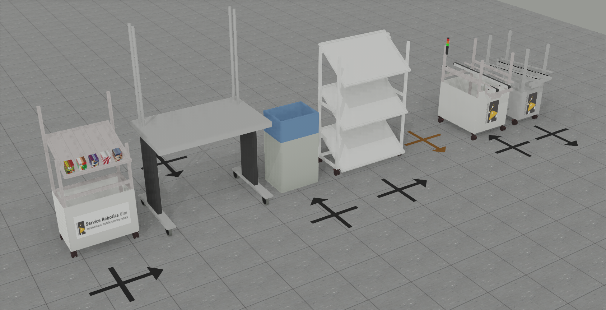

<!--- This file is generated from the ComponentWebots.componentDocumentation model --->
<!--- do not modify this file manually as it will by automatically overwritten by the code generator, modify the model instead and re-generate this file --->

# ComponentWebots Component


*Component Short Description:* 

Videos [1](https://www.youtube.com/watch?v=wykpdKlzwuE) and [2](https://www.youtube.com/watch?v=YrkvbOH4svI).

This component starts the [Webots](https://cyberbotics.com) simulator.
 
If another webots simulator is already running, this component will ask to end it first before starting the new one, because two simulations could make the computer very slow.
 
Edit the system model *.systemParam file to change which world file is loaded by webots in this system.

Example:

```
    ComponentParameterInstance ComponentWebots refinesParamStruct ComponentWebots {
        ParameterRefinement General{
            WorldPath = "/the/path/to/my/folder/MyWorldName.wbt"
            isEditorPresent = false
        }
    }
```
### Editor

The Editor can 
* add, move, change and delete Locations, Stations or Waypoints
* show a map (from Mapper or Planner) of one robot
* show the position and movement path of all robots
* set the position of a robot (directly for simulated robots, localization for real robots)

To turn on the editor:
* in system > model > *.systemParam, change the parameter 'isEditorPresent = true'
* in system > model > componentArch, connect the port from ComponentWebots to ComponentKB (if you use Locations/Stations) and/or ComponentNavigationGraph (if you use Waypoints/Connections) (to unhide ports in the diagram, click on the component, wait, a menu appears)
* system > run code generation 
* add the following lines to the world file:

```
Editor {
}
```

In the System, connect ComponentWebots to ComponentKB (or ComponentKB_Master in case of a master-slave system). The other connections are done by ComponentWebots itself.


The Editor will add/use these Groups in the [Scene Tree](https://cyberbotics.com/doc/guide/the-scene-tree):

```
DEF Locations Group
DEF Stations Group
DEF Waypoints Group
DEF WaypointConnections Group
DEF MobileRobotsPoses Group
DEF RealRobots Group
```

(if you don't see the Scene Tree on the left side of Webots, press <kbd>CTRL</kbd>+<kbd>J</kbd> to reset the layout)
 
A **Location** is shown by a cross on the floor. A mobile robot can find a path to a goal Location by using its map and avoid obstacles by using its sensors.

To add a Location:
* double click on the Group 'Locations'
* click on 'children'
* right-click 'Add New'
* find 'Location' or select it from 'PROTO nodes (Current Project)'

Double click on the newly added Location, enter an unique name.

To move an Location:
* click on the cross and press <kdb>shift</kdb> while moving it with the mouse [(moving a solid object)](https://cyberbotics.com/doc/guide/the-3d-window#moving-a-solid-object)
* to rotate it, use the blue curved arrow
* or edit its translation/rotation values in the Scene Tree

Fields of the Location:
* *name* : the name of the Location
* *translation* : (x y z) coordinates in meters, z should be 0 (up) 
* *rotation* : (0 0 1 angle) = rotate around (0 0 1) axis (up) by angle radians  
* *radius* : robot will move to the Location until its distance is less than double this value in meters
* *smallerRadius* : after *radius* distance is reached and if *smallerRadius* is greater than zero then move again to *smallerRadius* distance
* *waypointId* : If this number is 0 or greater, generate a Waypoint with this *waypointId* and at same position than this Location. If this Location is moved, the generated Waypoint is moved too. 

To add a Station:
* double click on the Group 'Stations'
* click on 'children'
* right-click 'Add New'
* select one of these:

* A-Frame
* AssemblyWorkstation
* CrateStation
* InclinedShelf
* ManualStation (brown cross on floor)
* OPC_UA_Station
* RollerConveyorStation

Picture with all kinds of **Station** (from left to right): 


Fields of the Station:
* *name* : The name of the Station. OPC_UA_Station and RollerConveyorStation should have a positive number as a name.
* *Locations* : A list of Locations relative to this Station, e.g. translation 1 2 0 means 1 meter forward and 2 meters left and 0 meters upwards than this station. Must have at least one Location (if a robot goes to a station, it uses the first Location of that station). 
* *data* : These additional data strings of the Station are automatically written into the knowledge base. 
* *port* : (OPC_UA_Station only) Default port for OPC UA communication is 4840. Each OPC_UA_Station must have an different port number e.g. 4840 4841 ... [List](https://en.wikipedia.org/wiki/List_of_TCP_and_UDP_port_numbers). port -1 disables communication. Changing the port restarts the OPC UA program.

To select a Location of a Station in the graphics window, click on the Location twice: the first click selects the Station, the second click selects the Location.

If you added a Station outside the DEF Stations Group, it will not be detected and its Location not listed. To fix this, cut and paste it into 'children' of the DEF Stations Group instead.

**Waypoints** can be connected by one-way **WaypointConnections**. Mobile robots can travel on these connections between waypoints, avoiding other robots. Robots can use intersections of two connections too. Connections are one-way only, e.g. if there is a connection from A to B, there can't be a direct connection from B to A. A selected Waypoint is red if it is too close to other Waypoints. The length of a connection can be counted by the green arrow stripes: one dark green stripe each meter. (The gray floor tiles in Lab/THU worlds have exactly 0.5 meter size) 

Keys used in the graphics window of Webots:
* <kbd>Insert</kbd> or <kbd>+</kbd> : create a new Waypoint, connect it to the old selected Waypoint if possible
* <kbd>Del</kbd> or <kbd>-</kbd> : delete the selected Waypoint or WaypointConnection
* <kbd>*</kbd> : while pressing this key and selecting a new Waypoint, a new connection from the old selected Waypoint to the new one is created
* <kbd>/</kbd> : while pressing this key and selecting a Waypoint or WaypointConnection, the defaultWaypointWidth of the Editor is applied to it

To delete a OPC_UA_Station during runtime:
* pause the simulation
* use Scene Tree (left side of Webots) to delete the station
* unpause the simulation

Fields of the Editor:
* *showMobileRobotsPoses* : can be set to show the position and movement path of real or simulated robots
* *mapType* : Current (map with currently seen obstacles) or LongTerm or Planner or none
* *mapComponent* : enter here the ending of the component name to diplay its map, e.g. if in mapComponentNames are 'MapComponent_1' and 'MapComponent_2', enter '2' or '_2' or 'MapComponent_2' for the second one  
* *mapComponentNames* : alphabetically sorted list of components who generate *mapType*
* *showWaypoints* : if set to false, all Waypoints and WaypointConnections are invisible
* *defaultWaypointWidth* : The diameter of newly added Waypoints or the width of newly added WaypointConnections (in meters). To apply this value to an existing Waypoint/WaypointConnection, select it while pressing the <kbd>/</kbd> key.
* *stopSimulation* : set this value to 'TRUE' before saving the world (it removes the map, MobileRobotsPoses and velocities to make the save files smaller)
* *lidarComponent*: name ending of the lidar component to display, e.g. '_2' (to turn the lidar display off, enter 'off')
* *lidarPointHeight*: third value is height lidar points above ground in meters. choose a different height than the simulated lidars or a simulated lidar would detect these points as obstacles

Example of a map (Current) from SmartMapperGridMap (blue pixels show the area where the robot center point can't go):


Example of a map (Planner) from SmartPlannerBreadthFirstSearch: 


Colors of the path planner map:
* blue = path or goal area
* red/green = move in X/Y axis direction of world (light color=+axis, dark color=-axis)
* white = obstacle (from loaded map)
* dark grey = 'growing' obstacle (from laser)

If the robot is inactive, the map could be invisible or not updated. The map will be visible again if the robot has to move to some place.

**MobileRobotsPoses**
* blue route: The future movement is shown by 10 blue triangles (using the current speed, 0.5 seconds per triangle). The past movement is shown by a blue line.
* red odometry: A red cross on the floor shows the odometry position (the driven distance etc. is measured by sensors for the wheel rotatation)

**Localizations**
The Localization is the estimated position of a robot, based on odometry (wheel rotation sensors), a laser or depth camera to see the environment, and a map of the environment.
Note that the true position of a simulated robot can be seen in the simulation and not in the real world, and the true position of a real robot can be seen in the real world and not in the simulation.
For simulated robots (ComponentWebotsMobileRobot), the true robot is visible in the simulation and the Localization is a green cross on the floor.
For real robots (ComponentRobotinoBaseServer/ComponentRMPBaseServer/SmartPioneerBaseServer), the true robot is not visible in the simulation and the Localization is a cylinder or box with same size as the robot.
If at the end of the component name is '_0' or '_1' or  ... '_9', that red number is shown on top of the model.

**different ways to set the estimated position (Localization) of a robot**
* set in System model/*.systemParam > SmartAmcl* > General > initialType = INI_POSE and initial_x/y/a on position [meters] and heading [radians] OR
* in the System's Behavior, add in startUp.smartTcl "(execute '(localizationModInst.localizationSetRobotPose x y heading))" (x y are position numbers in meters, heading is in radians) OR
* click on the Localization in the 3D window and press shift and left mouse button to move it to the correct position or click on the curved/straight arrows to rotate/slide (red=x-axis, green=y, blue=z) OR
* click on the Localization in the Scene Tree on the left side, edit the first two numbers of 'translation' [meters] and the last of 'rotation' [radians] OR
* edit the System's webots worldfile (*.wbt) like this:

	DEF Localizations Group {
		children [
			Localization {
				baseComponent "SmartAmcl_1"
				translation 0 -2 0
				rotation 0 0 1 0
			}
		]
	}

For simulated robots, it is better to move the robot and not its Localization (the green cross on the floor).

If you save a world with Larry, sometimes it's robot arm pose will be reset. To fix this bug, copy-paste from another world file with Larry the 'hidden' positions/rotations of Larry.

Note that the laser of the real Robotino3 needs half a minute to start, only after that time the initial position will be shown correctly.

### Developer Documentation

Two real robots 1 and 2 (left side) and one simulated robot (right side):


Different types of position:
* Location of a named landmark (a black cross on the floor)
* true position of a robot (can only be seen for the simulated robot on the right side)
* odometry position of a robot (a red cross on the floor)
* localization position of a robot (robot 1 and 2 on the left side, or a green cross on the floor for the simulated robot on the right side)

Odometry (raw position from base component):
* The odometry position is calculated by sensing the wheel rotations.
* If a robot has two wheels on the left/right side, than forward movement is done by rotating both wheel forwards, and a rotation counterclockwise is done by rotating the left wheel backwards and the right wheel forwards. As the wheel position can be measured very accurately and the wheel diameter is known, the moved distance or rotated angle can be measured too, but has some small error getting bigger over time.
* For a simulated robot, its true position is known and the odometry position is initialized automatically here, but for a real robot the initial odometry position is at (0/0/0), at the origin of the map and heading to the x-axis direction. In the picture the real robots 1 and 2 have the same initial odometry position.

Localization (corrected position from SmartAmcl):
* First the localization position is initialized.
* Then the robot orientates itself by a map and a look at its environment, correcting the localization position.
* The uncorrected/corrected position is send to the base component. If the robot moves, both the raw odometry position and the localization position is updated and send to other components.

Difference of simulated and real robot:
* simulated robot: The Localization is shown as a green cross on the floor. The user can see/move the simulated robot at its true position, both Odometry and Localization position is automatically initialized at its true position.
* real robot: The Localization is shown as a model of a robot. The true position of a real robot is unknown in the simulation, the Odometry is initialized at (0/0/0) and the user must initialize the Localization close to the true position.

Fields of MobileRobotPose (read only):
* *baseComponent* is the name of the base component (alphabetically ordered)
* *translationLocation* is x/y/z coordinate of the Localization position of the mobile robot [meters]
* *rotationLocation* is an axis–angle representation of the rotation of the Localization (4 numbers, the first three are a vector of length 1, the last is an angle in radians: rotate counterclockwise around that vector by that angle, e.g. "0 0 1 0.5236" means heading=0.5236 [radians]
* *translationOdometry* / *rotationOdometry* is the odometry position (see *translationLocation* / *rotationLocation* above)
* velocityForward is forward velocity [m/s]
* velocityLeft is sideways velocity [m/s]
* velocityRotation is rotational velocity [radians/s]
* covMatrixDiagonal are the 3 diagonal values of the covariance matrix (x/y/heading)

Fields of Localization (most of these fields can be edited by the user and can be saved/restored)
* *baseComponent* is the name of the base component (alphabetically ordered, read only)
* *translation* / *rotation* is the Localization position (see *translationLocation* / *rotationLocation* above)
* *service*: use 'baseComponent' or 'localizationComponent' to update the Localization position ?
* *localizationComponent* is the last part of an entry of *localizationComponentNames*, e.g. 'SmartAmcl_1' or '1' or ''
* *localizationComponentNames* it the alphabetically ordered list of localization components (recognized by LocalizationEventServiceOut)
* *type* is automatically set for real robots
* *INITIALPOSE_requires_neutral*: see below

The mainstate 'Neutral' is used to turn off the activities of a Component, other mainstates can turn on some or all activities of that Component. Service ports can only communicate if the component is turned on, and triggers are used to initialize values if the component is turned off.

If *INITIALPOSE_requires_neutral* is set to TRUE, the following calls are done to update the localization component:
* set mainstate to 'Neutral' (and substates to 'neutral')
* call trigger INITIAL_POSE
* set mainstate to 'Active' (and substates to 'active' and 'nonneutral')

If *INITIALPOSE_requires_neutral* is set to FALSE, the trigger is called without turning off/on the component. This is possible in actual implementation of SmartAmcl, enabling to change localization at any time. If a localization component may require to be turned off, set INITIALPOSE_requires_neutral to TRUE.

If ComponentWebots detects a robot but its Localization field is yet missing, these fields are automatically set with correct values if these naming conventions are true:

base component name starts with:
* real robot Larry/Robotino/Pioneer => ComponentRMPBaseServer/ComponentRobotinoBaseServer/SmartPioneerBaseServer
* simulated robot => ComponentWebotsMobileRobot

All components names of one robot must have the same ending, e.g. ComponentRobotBaseServer_1 and SmartAmcl_1, and must have a different ending for different robots. The ending must start with an underscore '_' or no ending at all. If the robot base component ends with _0 to _9, that red digit is shown on top of the robot. 

#### How to install Webots in Linux (Ubuntu 20.04)

if webots was already installed, deinstall the old version first:

```
sudo dpkg -r webots
```

go to [https://cyberbotics.com/](https://cyberbotics.com/)

click on 'Download', download [webots_2023b_amd64.deb](https://github.com/cyberbotics/webots/releases/download/R2023a/webots_2023b_amd64.deb) into your Downloads-folder, then do:

```
sudo apt install ~/Downloads/webots_2023b_amd64.deb
```

Add to your ~/.profile:

```
export WEBOTS_HOME=/usr/local/webots
export LD_LIBRARY_PATH=$LD_LIBRARY_PATH:$WEBOTS_HOME/lib/controller
```

After starting webots, in menu "Overlays" check (turn on) the 3 boxes "Hide all Camera Overlays" and "Hide all RangeFinder Overlays" and "Hide all Display Overlays".

#### Add Webots library and include path to an component project

Add to component's smartsoft/CMakeLists.txt the following lines:

```
INCLUDE_DIRECTORIES($ENV{WEBOTS_HOME}/include/controller/cpp)
TARGET_LINK_LIBRARIES(${PROJECT_NAME} $ENV{WEBOTS_HOME}/lib/controller/libCppController.so)
```

Then do:
- right click on Component in Project Explorer
- properties
- expand 'C/C++ General'
- Paths and Symbols
- includes
- GNU C++
- Add...<br>
  <code>${WEBOTS_HOME}/include/controller/cpp</code>
- rebuild index (e.g. by closing and opening this project)

#### Other Webots components

- [ComponentWebotsMobileRobot](../ComponentWebotsMobileRobot)
- [ComponentWebots2DLidar](../ComponentWebots2DLidar)
- [ComponentWebots3DCamera](../ComponentWebots3DCamera)
- [ComponentWebotsURServer](../ComponentWebotsURServer)
- [ComponentWebotsPTUServer](../ComponentWebotsPTUServer)
- [ComponentWebotsConveyorBeltOpcua](../ComponentWebotsConveyorBeltOpcua)
- [ComponentWebotsMpsDocking](../ComponentWebotsMpsDocking)

#### Webots in the Virtual machine

It is best to start the virtual machine with VMWare Player in Windows. [[1]](https://www.cyberbotics.com/doc/guide/general-bugs#virtualization)
It was tested with VMWare Workstation Player 15 (both non-commercial and PRO version).

You need at least 8 MB Ram and a good graphics card on your computer.
In the settings of the virtual machine, give it at least 4 GB Ram, 512 MB graphics memory and turn on graphics card acceleration. OpenGl is required by webots to run fast.

At the first run of webots, it will automatically turn off shadows and reduce texture quality to medium. Select 'Tools' > 'Preferences...' > 'OpenGl' > 'Texture Quality' to 'High'.

If your computer has not a very good graphics card, webots may run slowly in the virtual machine. The simulation speed should be near to '1.00x' at the top of the webots window. If it is below, you can speed up graphics:
* make the graphics window smaller (if graphics window height and width is halved, the speed is 4 times faster)
* webots menu > Tools > Preferences > OpenGL > Disable shadows
* webots window, at the left side is the Scene Tree, first entry is WorldInfo, double click on it, it expands, now click on basicTimeStep, double the value from 32 to 64 or again to 128. This will speed up the simulation but makes it less accurate as changes are done less frequently. [[2]](https://cyberbotics.com/doc/guide/the-scene-tree) [[3]](https://www.cyberbotics.com/doc/reference/glossary)
* you can reduce here the value FPS too (frames per second, how often graphics is done)
* turn off/on graphics rendering by pressing the cube button or pressing CTRL+4

Known Bugs:
* VirtualBox does not support OpenGL, making Webots graphics very slow (use VMWare Player instead)
* a lidar in Webots sometimes does not detect distances at left/right side correct. this bug happens if VMWare Player is startet from Linux (use Windows instead)
* if System\*/model/\*.target HostAddress is set to 'localhost', then the System Menu "menu-stop" does not close all terminals: right-click on the x-term symbol on the left side of ubuntu and select 'Quit xx windows' to close them manually
* if System\*/model/\*.target HostAddress is set to the hostname of a computer (e.g. 'ubuntu'), then the System Menu "menu-stop" does close all terminals, but Webots graphics is very slow in the virtual machine => in the virtual machine, use 'localhost'

##### Shared Folders

If you want to share files among virtual machine and the host computer, enable the shared folders [[5]](https://www.vmware.com/support/ws5/doc/ws_running_shared_folders.html). If it does not work, execute this command in the virtual machine (don't add this to an login-script):


```
sudo vmhgfs-fuse .host:/ /mnt/hgfs/ -o allow_other -o uid=1000
```

##### Gazebo in the virtual machine

If you want to start Gazebo directly from the virtual machine's console, do the following line first:

```
export SVGA_VGPU10=0
```


## Component-Datasheet Properties

<table style="border-collapse:collapse;">
<caption><i>Table:</i> Component-Datasheet Properties</caption>
<tr style="background-color:#ccc;">
<th style="border:1px solid black; padding: 5px;"><i>Property Name</i></th>
<th style="border:1px solid black; padding: 5px;"><i>Property Value</i></th>
<th style="border:1px solid black; padding: 5px;"><i>Property Description</i></th>
</tr>
<tr>
<td style="border:1px solid black; padding: 5px;">Supplier</td>
<td style="border:1px solid black; padding: 5px;">Servicerobotics Ulm</td>
<td style="border:1px solid black; padding: 5px;"></td>
</tr>
<tr>
<td style="border:1px solid black; padding: 5px;">Homepage</td>
<td style="border:1px solid black; padding: 5px;">https://wiki.servicerobotik-ulm.de/directory:collection</td>
<td style="border:1px solid black; padding: 5px;"></td>
</tr>
<tr>
<td style="border:1px solid black; padding: 5px;">Purpose</td>
<td style="border:1px solid black; padding: 5px;">Start the Webots simulator.</td>
<td style="border:1px solid black; padding: 5px;"></td>
</tr>
</table>

## Component Ports

### BaseStateServiceIn

*Documentation:*


### CurrGridMapPushServiceIn

*Documentation:*


### CommKBQueryReq

*Documentation:*


### NavPathServiceOut

*Documentation:*


### LocalizationUpdateServiceOut

*Documentation:*


### LongTermGridMapQueryServiceReq

*Documentation:*


### LaserServiceIn

*Documentation:*


## Component Parameters: ComponentWebots

### Internal Parameter: General

*Documentation:*

<table style="border-collapse:collapse;">
<caption><i>Table:</i> Internal Parameter <b>General</b></caption>
<tr style="background-color:#ccc;">
<th style="border:1px solid black; padding: 5px;"><i>Attribute Name</i></th>
<th style="border:1px solid black; padding: 5px;"><i>Attribute Type</i></th>
<th style="border:1px solid black; padding: 5px;"><i>Attribute Value</i></th>
<th style="border:1px solid black; padding: 5px;"><i>Attribute Description</i></th>
</tr>
<tr>
<td style="border:1px solid black; padding: 5px;"><b>WorldPath</b></td>
<td style="border:1px solid black; padding: 5px;">String</td>
<td style="border:1px solid black; padding: 5px;">"$SMART_ROOT_ACE/repos/DataRepository/webots/worlds/ConveyorBeltIntralogistic.wbt"</td>
<td style="border:1px solid black; padding: 5px;"><p>The webots simulator will load this world file (path and filename of an .wbt file).
</p></td>
</tr>
<tr>
<td style="border:1px solid black; padding: 5px;"><b>isEditorPresent</b></td>
<td style="border:1px solid black; padding: 5px;">Boolean</td>
<td style="border:1px solid black; padding: 5px;">false</td>
<td style="border:1px solid black; padding: 5px;"><p>is Editor node present in world file ?
</p></td>
</tr>
</table>

