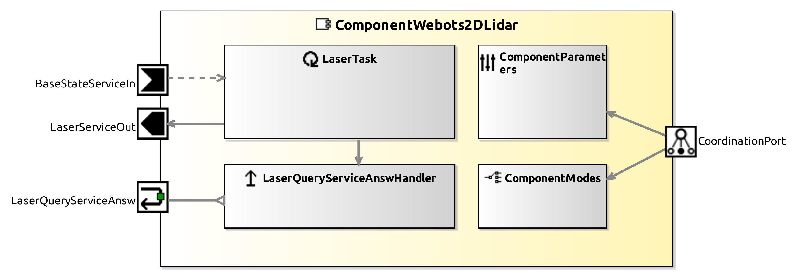

<!--- This file is generated from the ComponentWebots2DLidar.componentDocumentation model --->
<!--- do not modify this file manually as it will by automatically overwritten by the code generator, modify the model instead and re-generate this file --->

# ComponentWebots2DLidar Component



*Component Short Description:* 

ComponentWebots2DLidar connects to an lidar (laser scanner) in the Webots simulator, measuring horizontal distances with laser rays.
 
The laser scans are made each Webots timeStep, at the same time (see Time of flight (ToF)). The laser rays are ordered horizontal from right to left. Distances are in measured in mm.

Note that it is possible to reduce the data size by changing the minimal or maximal range or by reducing the resolution (angle between two rays) or the opening_angle (angle of all rays in the reduced data set).

Webots can display the laser rays: Menu 'View' 'Optional Rendering' 'Show Lidar Point Cloud' or press the key CTRL+F8. Webots displays only these rays which are hitting obstacles within minimal or maximal range.

How a new lidar can be added to Webots:
* Add a new Robot node for this lidar, set its controller to '&lt;extern&gt;', its coordinate system should be x=front, y=left, z=up of the lidar ray origin.
* give same robot name in webots and in parameter <a href="#internal-parameter-webots">'webots'</a> 'robotName'

Example:
  
```
Robot {
  children [
    Lidar {
    }
  ]
  name "exampleRobot"
  controller "<extern>"
}
```

Example program:

```cpp
CommBasicObjects::CommMobileLaserScan scan;
status = this->laserServiceInGetUpdate(scan);
if(status != Smart::SMART_OK) {
    std::cout << "laser error " << status << std::endl;
	return 0;
}
int count = scan.get_scan_size();
for (int i = 0; i < count; ++i) {
    // scan.get_scan_distance(i) returns the distance in mm
    double distance = scan.get_scan_distance(i);
    // scan.get_scan_angle returns an angle between 0 and 2*pi, angle 0 means front of lidar, counterclockwise
    double angle = scan.get_scan_angle(i);
    // this ray hits an obstacle at this position relative of lidar:  x mm to front and y mm to left
    double x = distance * cos(angle);
    double y = distance * sin(angle);
    ...
}
```

other similar components:

- [ComponentLaserHokuyoURGServer](../ComponentLaserHokuyoURGServer)
- [ComponentLaserLMS1xx](../ComponentLaserLMS1xx)
- [SmartLaserLMS200Server](../SmartLaserLMS200Server)
- [ComponentLaserS300Server](../ComponentLaserS300Server)
- [ComponentOPCUALaser](../ComponentOPCUALaser)
- [ComponentRobotinoLaserServer](../ComponentRobotinoLaserServer)
- [SmartGazeboBaseServer](../SmartGazeboBaseServer)


## Component-Datasheet Properties

<table style="border-collapse:collapse;">
<caption><i>Table:</i> Component-Datasheet Properties</caption>
<tr style="background-color:#ccc;">
<th style="border:1px solid black; padding: 5px;"><i>Property Name</i></th>
<th style="border:1px solid black; padding: 5px;"><i>Property Value</i></th>
<th style="border:1px solid black; padding: 5px;"><i>Property Description</i></th>
</tr>
<tr>
<td style="border:1px solid black; padding: 5px;">MarketName</td>
<td style="border:1px solid black; padding: 5px;">ComponentWebots2DLidar</td>
<td style="border:1px solid black; padding: 5px;"></td>
</tr>
<tr>
<td style="border:1px solid black; padding: 5px;">Supplier</td>
<td style="border:1px solid black; padding: 5px;">Servicerobotics Ulm</td>
<td style="border:1px solid black; padding: 5px;"></td>
</tr>
<tr>
<td style="border:1px solid black; padding: 5px;">Homepage</td>
<td style="border:1px solid black; padding: 5px;">https://wiki.servicerobotik-ulm.de/directory:collection</td>
<td style="border:1px solid black; padding: 5px;"></td>
</tr>
<tr>
<td style="border:1px solid black; padding: 5px;">Purpose</td>
<td style="border:1px solid black; padding: 5px;">universal horizontal laser device in Webots simulator</td>
<td style="border:1px solid black; padding: 5px;"></td>
</tr>
</table>

## Component Ports

### BaseStateServiceIn

*Documentation:*
<p>Reads periodically the position etc. of the robot which has this laser: CommBasicObjects::CommBaseState
</p>
<p> Connect to port <a href="../ComponentWebotsMobileRobot#BaseStateServiceOut">BaseStateServiceOut of ComponentWebotsMobileRobot</a>
</p>
<p></p>


### LaserServiceOut

*Documentation:*
<p>Writes periodically the laser scans: CommBasicObjects::CommMobileLaserScan
</p>
<p></p>


### LaserQueryServiceAnsw

*Documentation:*
<p>Writes on request the latest laser scan: CommBasicObjects::CommMobileLaserScan
</p>
<p></p>


## Component Parameters: ComponentWebots2DLidarParams

### Internal Parameter: webots

*Documentation:*

<table style="border-collapse:collapse;">
<caption><i>Table:</i> Internal Parameter <b>webots</b></caption>
<tr style="background-color:#ccc;">
<th style="border:1px solid black; padding: 5px;"><i>Attribute Name</i></th>
<th style="border:1px solid black; padding: 5px;"><i>Attribute Type</i></th>
<th style="border:1px solid black; padding: 5px;"><i>Attribute Value</i></th>
<th style="border:1px solid black; padding: 5px;"><i>Attribute Description</i></th>
</tr>
<tr>
<td style="border:1px solid black; padding: 5px;"><b>robotName</b></td>
<td style="border:1px solid black; padding: 5px;">String</td>
<td style="border:1px solid black; padding: 5px;">"Lidar"</td>
<td style="border:1px solid black; padding: 5px;"><p>the webots lidar must be a children of an extra robot with this name
</p></td>
</tr>
</table>

### Internal Parameter: scanner

*Documentation:*

<table style="border-collapse:collapse;">
<caption><i>Table:</i> Internal Parameter <b>scanner</b></caption>
<tr style="background-color:#ccc;">
<th style="border:1px solid black; padding: 5px;"><i>Attribute Name</i></th>
<th style="border:1px solid black; padding: 5px;"><i>Attribute Type</i></th>
<th style="border:1px solid black; padding: 5px;"><i>Attribute Value</i></th>
<th style="border:1px solid black; padding: 5px;"><i>Attribute Description</i></th>
</tr>
<tr>
<td style="border:1px solid black; padding: 5px;"><b>verbose</b></td>
<td style="border:1px solid black; padding: 5px;">Boolean</td>
<td style="border:1px solid black; padding: 5px;">false</td>
<td style="border:1px solid black; padding: 5px;"><p>true: print more debug information
</p></td>
</tr>
<tr>
<td style="border:1px solid black; padding: 5px;"><b>on_turret</b></td>
<td style="border:1px solid black; padding: 5px;">Boolean</td>
<td style="border:1px solid black; padding: 5px;">false</td>
<td style="border:1px solid black; padding: 5px;"></td>
</tr>
<tr>
<td style="border:1px solid black; padding: 5px;"><b>x</b></td>
<td style="border:1px solid black; padding: 5px;">Int32</td>
<td style="border:1px solid black; padding: 5px;">0</td>
<td style="border:1px solid black; padding: 5px;"><p>position of the lidar relative to the robot [mm]
</p></td>
</tr>
<tr>
<td style="border:1px solid black; padding: 5px;"><b>y</b></td>
<td style="border:1px solid black; padding: 5px;">Int32</td>
<td style="border:1px solid black; padding: 5px;">0</td>
<td style="border:1px solid black; padding: 5px;"><p>position of the lidar relative to the robot [mm]
</p></td>
</tr>
<tr>
<td style="border:1px solid black; padding: 5px;"><b>z</b></td>
<td style="border:1px solid black; padding: 5px;">Int32</td>
<td style="border:1px solid black; padding: 5px;">0</td>
<td style="border:1px solid black; padding: 5px;"><p>position of the lidar relative to the robot [mm]
</p></td>
</tr>
<tr>
<td style="border:1px solid black; padding: 5px;"><b>azimuth</b></td>
<td style="border:1px solid black; padding: 5px;">Double</td>
<td style="border:1px solid black; padding: 5px;">0</td>
<td style="border:1px solid black; padding: 5px;"><p>position of the lidar relative to the robot [radians]
</p></td>
</tr>
<tr>
<td style="border:1px solid black; padding: 5px;"><b>elevation</b></td>
<td style="border:1px solid black; padding: 5px;">Double</td>
<td style="border:1px solid black; padding: 5px;">0</td>
<td style="border:1px solid black; padding: 5px;"><p>position of the lidar relative to the robot [radians]
</p></td>
</tr>
<tr>
<td style="border:1px solid black; padding: 5px;"><b>roll</b></td>
<td style="border:1px solid black; padding: 5px;">Double</td>
<td style="border:1px solid black; padding: 5px;">0</td>
<td style="border:1px solid black; padding: 5px;"><p>position of the lidar relative to the robot [radians]
</p></td>
</tr>
<tr>
<td style="border:1px solid black; padding: 5px;"><b>min_range</b></td>
<td style="border:1px solid black; padding: 5px;">UInt32</td>
<td style="border:1px solid black; padding: 5px;">10</td>
<td style="border:1px solid black; padding: 5px;"><p>if one laser scan distance value is less than this, it is removed from the scan. may differ from webots minRange. [mm]
</p></td>
</tr>
<tr>
<td style="border:1px solid black; padding: 5px;"><b>max_range</b></td>
<td style="border:1px solid black; padding: 5px;">UInt32</td>
<td style="border:1px solid black; padding: 5px;">20000</td>
<td style="border:1px solid black; padding: 5px;"><p>if one laser scan distance value is more than this, it is removed from the scan. may differ from webots maxRange. [mm]
</p></td>
</tr>
<tr>
<td style="border:1px solid black; padding: 5px;"><b>opening_angle</b></td>
<td style="border:1px solid black; padding: 5px;">UInt32</td>
<td style="border:1px solid black; padding: 5px;">270</td>
<td style="border:1px solid black; padding: 5px;"><p>only the lidar rays within this angle are kept in a scan, may be less than webots fieldOfView. [degrees]
</p></td>
</tr>
<tr>
<td style="border:1px solid black; padding: 5px;"><b>resolution</b></td>
<td style="border:1px solid black; padding: 5px;">Double</td>
<td style="border:1px solid black; padding: 5px;">0.5</td>
<td style="border:1px solid black; padding: 5px;"><p>the angle between two lidar rays, should be set to webots fieldOfView/Pi*180/(horizontalResolution-1) [degrees]
</p></td>
</tr>
<tr>
<td style="border:1px solid black; padding: 5px;"><b>length_unit</b></td>
<td style="border:1px solid black; padding: 5px;">UInt32</td>
<td style="border:1px solid black; padding: 5px;">1</td>
<td style="border:1px solid black; padding: 5px;"><p>the length unit of distances (values are 16 bit only, so length_unit=1 means the biggest number for distance can be 65535mm) [mm]
</p></td>
</tr>
<tr>
<td style="border:1px solid black; padding: 5px;"><b>frequency</b></td>
<td style="border:1px solid black; padding: 5px;">UInt32</td>
<td style="border:1px solid black; padding: 5px;">50</td>
<td style="border:1px solid black; padding: 5px;"><p>not used yet, a webots lidar scans every WorldInfo.basicTimeStep ms (see webots timeStep)
</p></td>
</tr>
</table>

### Internal Parameter: base_manipulator

*Documentation:*

<table style="border-collapse:collapse;">
<caption><i>Table:</i> Internal Parameter <b>base_manipulator</b></caption>
<tr style="background-color:#ccc;">
<th style="border:1px solid black; padding: 5px;"><i>Attribute Name</i></th>
<th style="border:1px solid black; padding: 5px;"><i>Attribute Type</i></th>
<th style="border:1px solid black; padding: 5px;"><i>Attribute Value</i></th>
<th style="border:1px solid black; padding: 5px;"><i>Attribute Description</i></th>
</tr>
<tr>
<td style="border:1px solid black; padding: 5px;"><b>on_base</b></td>
<td style="border:1px solid black; padding: 5px;">Boolean</td>
<td style="border:1px solid black; padding: 5px;">true</td>
<td style="border:1px solid black; padding: 5px;"><p><ul><li>true: lidar is mounted on top of an moving robot</li><li>false: lidar has a fixed position in the world, set by the x/y/z/base_a parameters</li></ul>
</p></td>
</tr>
<tr>
<td style="border:1px solid black; padding: 5px;"><b>x</b></td>
<td style="border:1px solid black; padding: 5px;">Int32</td>
<td style="border:1px solid black; padding: 5px;">0</td>
<td style="border:1px solid black; padding: 5px;"><p>x-coordinate of fixed lidar position in world if <b>on_base</b> is false [mm]
</p></td>
</tr>
<tr>
<td style="border:1px solid black; padding: 5px;"><b>y</b></td>
<td style="border:1px solid black; padding: 5px;">Int32</td>
<td style="border:1px solid black; padding: 5px;">0</td>
<td style="border:1px solid black; padding: 5px;"><p>y-coordinate [mm]
</p></td>
</tr>
<tr>
<td style="border:1px solid black; padding: 5px;"><b>z</b></td>
<td style="border:1px solid black; padding: 5px;">Int32</td>
<td style="border:1px solid black; padding: 5px;">0</td>
<td style="border:1px solid black; padding: 5px;"><p>z-coordinate [mm]
</p></td>
</tr>
<tr>
<td style="border:1px solid black; padding: 5px;"><b>base_a</b></td>
<td style="border:1px solid black; padding: 5px;">Double</td>
<td style="border:1px solid black; padding: 5px;">0</td>
<td style="border:1px solid black; padding: 5px;"><p>azimuth (horizontal rotation) of fixed lidar position in world if <b>on_base</b> is false [radians]
</p></td>
</tr>
<tr>
<td style="border:1px solid black; padding: 5px;"><b>steer_a</b></td>
<td style="border:1px solid black; padding: 5px;">Double</td>
<td style="border:1px solid black; padding: 5px;">0</td>
<td style="border:1px solid black; padding: 5px;"><p>not used
</p></td>
</tr>
<tr>
<td style="border:1px solid black; padding: 5px;"><b>turret_a</b></td>
<td style="border:1px solid black; padding: 5px;">Double</td>
<td style="border:1px solid black; padding: 5px;">0</td>
<td style="border:1px solid black; padding: 5px;"><p>not used
</p></td>
</tr>
</table>

### Internal Parameter: services

*Documentation:*

<table style="border-collapse:collapse;">
<caption><i>Table:</i> Internal Parameter <b>services</b></caption>
<tr style="background-color:#ccc;">
<th style="border:1px solid black; padding: 5px;"><i>Attribute Name</i></th>
<th style="border:1px solid black; padding: 5px;"><i>Attribute Type</i></th>
<th style="border:1px solid black; padding: 5px;"><i>Attribute Value</i></th>
<th style="border:1px solid black; padding: 5px;"><i>Attribute Description</i></th>
</tr>
<tr>
<td style="border:1px solid black; padding: 5px;"><b>activate_push_newest</b></td>
<td style="border:1px solid black; padding: 5px;">Boolean</td>
<td style="border:1px solid black; padding: 5px;">true</td>
<td style="border:1px solid black; padding: 5px;"><p>turn off/on the port <a href="#LaserServiceOut">LaserServiceOut</a>
</p></td>
</tr>
<tr>
<td style="border:1px solid black; padding: 5px;"><b>active_push_timed</b></td>
<td style="border:1px solid black; padding: 5px;">Boolean</td>
<td style="border:1px solid black; padding: 5px;">true</td>
<td style="border:1px solid black; padding: 5px;"><p>not used
</p></td>
</tr>
</table>

