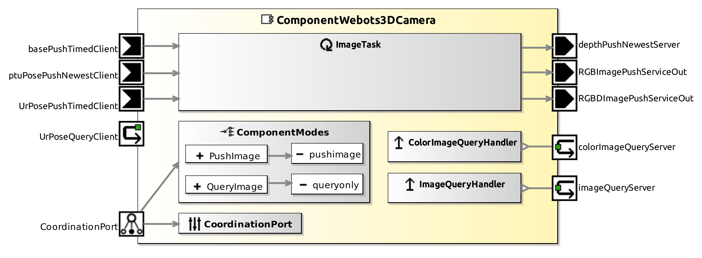

<!--- This file is generated from the ComponentWebots3DCamera.componentDocumentation model --->
<!--- do not modify this file manually as it will by automatically overwritten by the code generator, modify the model instead and re-generate this file --->

# ComponentWebots3DCamera Component



*Component Short Description:* 

Delivers color images and/or range images from an Camera and RangeFinder (depth camera) device in the Webots simulator.

The images are made each Webots timeStep, at the same time. Range distances are measured in meters (see Time of Flight (ToF)).

How a new Camera and RangeFinder can be added to Webots:
* Add a new Robot, set its controller to '&lt;extern&gt;' and supervisor TRUE
* Add the Camera and RangeFinder in children of the robot
* give same names in webots and in parameter <a href="#internal-parameter-webots">'webots'</a>

Example:

```
Robot {
  name "exampleRobot"
  controller "<extern>"
  supervisor TRUE
  children [
    Camera {
      name "exampleCamera"
    }
    RangeFinder {
      name "exampleRangeFinder"
    }
  ]
}
```

If you don't need the range images, don't add the RangeFinder in Webots and set rangeFinderName = "none" in parameter <a href="#internal-parameter-webots">'webots'</a>.

If you don't need the color images, don't add the Camera in Webots and set cameraName = "none" in parameter <a href="#internal-parameter-webots">'webots'</a>.

other similar components:

- [ComponentKinectV1Server](../ComponentKinectV1Server)
- [ComponentKinectV2Server](../ComponentKinectV2Server)
- [ComponentRealSenseV2Server](../ComponentRealSenseV2Server)
- [SmartGazeboCameraServer](../SmartGazeboCameraServer)


## Component-Datasheet Properties

<table style="border-collapse:collapse;">
<caption><i>Table:</i> Component-Datasheet Properties</caption>
<tr style="background-color:#ccc;">
<th style="border:1px solid black; padding: 5px;"><i>Property Name</i></th>
<th style="border:1px solid black; padding: 5px;"><i>Property Value</i></th>
<th style="border:1px solid black; padding: 5px;"><i>Property Description</i></th>
</tr>
<tr>
<td style="border:1px solid black; padding: 5px;">Supplier</td>
<td style="border:1px solid black; padding: 5px;">Servicerobotics Ulm</td>
<td style="border:1px solid black; padding: 5px;"></td>
</tr>
<tr>
<td style="border:1px solid black; padding: 5px;">Homepage</td>
<td style="border:1px solid black; padding: 5px;">https://wiki.servicerobotik-ulm.de/directory:collection</td>
<td style="border:1px solid black; padding: 5px;"></td>
</tr>
<tr>
<td style="border:1px solid black; padding: 5px;">Purpose</td>
<td style="border:1px solid black; padding: 5px;">Universal RangeFinder (depth camera) device in the Webots simulator.</td>
<td style="border:1px solid black; padding: 5px;"></td>
</tr>
</table>

## Component Ports

### basePushTimedClient

*Documentation:*
<p>x Reads periodically the position etc. of the robot (if the camera is mounted on it): CommBasicObjects::CommBaseState
</p>
<p> Connect to port <a href="../ComponentWebotsMobileRobot#BaseStateServiceOut">BaseStateServiceOut of ComponentWebotsMobileRobot</a>
</p>
<p></p>


### ptuPosePushNewestClient

*Documentation:*
<p>Reads periodically the position etc. of the Pan-Tilt-Unit (if the camera is mounted on it): CommBasicObjects::CommBaseState
</p>
<p> Connect to port <a href="../ComponentWebotsPTUServer#DevicePoseStateServer">DevicePoseStateServer of ComponentWebotsPTUServer</a>
</p>
<p></p>


### UrPosePushTimedClient

*Documentation:*
<p>Reads periodically the robot arm position (if the camera is mounted on it): CommManipulatorObjects.CommMobileManipulatorState
</p>
<p></p>


### UrPoseQueryClient

*Documentation:*
<p>Reads on request the robot arm position (if the camera is mounted on it): CommManipulatorObjects.CommMobileManipulatorState
</p>
<p></p>


### RGBImagePushServiceOut

*Documentation:*
<p>Writes periodically the color image: DomainVision.CommRGBDImage
</p>
<p></p>


### depthPushNewestServer

*Documentation:*
<p>Writes periodically the range image: DomainVision.CommDepthImage
</p>
<p></p>


### RGBDImagePushServiceOut

*Documentation:*
<p>Writes periodically the color image and range image: DomainVision.CommRGBDImage
</p>
<p></p>


### colorImageQueryServer

*Documentation:*
<p>Writes on request the color image: DomainVision.CommVideoImage
</p>
<p></p>


### imageQueryServer

*Documentation:*
<p>Writes on request color image and range image: DomainVision.CommRGBDImage
</p>
<p></p>


## Component Parameters: ComponentWebots3DCameraParams

### Internal Parameter: webots

*Documentation:*

<table style="border-collapse:collapse;">
<caption><i>Table:</i> Internal Parameter <b>webots</b></caption>
<tr style="background-color:#ccc;">
<th style="border:1px solid black; padding: 5px;"><i>Attribute Name</i></th>
<th style="border:1px solid black; padding: 5px;"><i>Attribute Type</i></th>
<th style="border:1px solid black; padding: 5px;"><i>Attribute Value</i></th>
<th style="border:1px solid black; padding: 5px;"><i>Attribute Description</i></th>
</tr>
<tr>
<td style="border:1px solid black; padding: 5px;"><b>robotName</b></td>
<td style="border:1px solid black; padding: 5px;">String</td>
<td style="border:1px solid black; padding: 5px;">"kinect_v2"</td>
<td style="border:1px solid black; padding: 5px;"><p>the webots Camera and RangeFinder device must be in children of an extra robot with this name
</p></td>
</tr>
<tr>
<td style="border:1px solid black; padding: 5px;"><b>cameraName</b></td>
<td style="border:1px solid black; padding: 5px;">String</td>
<td style="border:1px solid black; padding: 5px;">"kinect_v2_color"</td>
<td style="border:1px solid black; padding: 5px;"><p>the name of the Camera device in Webots, or "none" if not used
</p></td>
</tr>
<tr>
<td style="border:1px solid black; padding: 5px;"><b>rangeFinderName</b></td>
<td style="border:1px solid black; padding: 5px;">String</td>
<td style="border:1px solid black; padding: 5px;">"kinect_v2_range"</td>
<td style="border:1px solid black; padding: 5px;"><p>the name of the RangeFinder device, or "none" if not used
</p></td>
</tr>
<tr>
<td style="border:1px solid black; padding: 5px;"><b>frequency</b></td>
<td style="border:1px solid black; padding: 5px;">Double</td>
<td style="border:1px solid black; padding: 5px;">31.25</td>
<td style="border:1px solid black; padding: 5px;"><p>how many images per second should be pushed; can't be higher than 1000/basicTimeStep of Webots WorldInfo
</p></td>
</tr>
</table>

### Internal Parameter: settings

*Documentation:*

<table style="border-collapse:collapse;">
<caption><i>Table:</i> Internal Parameter <b>settings</b></caption>
<tr style="background-color:#ccc;">
<th style="border:1px solid black; padding: 5px;"><i>Attribute Name</i></th>
<th style="border:1px solid black; padding: 5px;"><i>Attribute Type</i></th>
<th style="border:1px solid black; padding: 5px;"><i>Attribute Value</i></th>
<th style="border:1px solid black; padding: 5px;"><i>Attribute Description</i></th>
</tr>
<tr>
<td style="border:1px solid black; padding: 5px;"><b>debug_info</b></td>
<td style="border:1px solid black; padding: 5px;">Boolean</td>
<td style="border:1px solid black; padding: 5px;">true</td>
<td style="border:1px solid black; padding: 5px;"><p>print debug information in console
</p></td>
</tr>
<tr>
<td style="border:1px solid black; padding: 5px;"><b>pushnewest_rgbd_image</b></td>
<td style="border:1px solid black; padding: 5px;">Boolean</td>
<td style="border:1px solid black; padding: 5px;">false</td>
<td style="border:1px solid black; padding: 5px;"><p>turn on RGBDImagePushServiceOut?
</p></td>
</tr>
<tr>
<td style="border:1px solid black; padding: 5px;"><b>pushnewest_color_image</b></td>
<td style="border:1px solid black; padding: 5px;">Boolean</td>
<td style="border:1px solid black; padding: 5px;">true</td>
<td style="border:1px solid black; padding: 5px;"><p>turn on RGBImagePushServiceOut?
</p></td>
</tr>
<tr>
<td style="border:1px solid black; padding: 5px;"><b>pushnewest_depth_image</b></td>
<td style="border:1px solid black; padding: 5px;">Boolean</td>
<td style="border:1px solid black; padding: 5px;">false</td>
<td style="border:1px solid black; padding: 5px;"><p>turn on depthPushNewestServer?
</p></td>
</tr>
</table>

### Internal Parameter: sensor_pose

*Documentation:*
<p>camera position and orientation relative to (see <a href="#internal-parameter-base">parameter base</a>):
 <ul>
 <li>on_base = true: center point between wheels axis of an moving robot</li>
 <li>on_ptu = true : tilt axis of pan-tilt-unit</li>
 <li>on_ur = true : end point of robot arm = TCP = Tool Center Point</li>
 </ul>
</p>
<p></p>

<table style="border-collapse:collapse;">
<caption><i>Table:</i> Internal Parameter <b>sensor_pose</b></caption>
<tr style="background-color:#ccc;">
<th style="border:1px solid black; padding: 5px;"><i>Attribute Name</i></th>
<th style="border:1px solid black; padding: 5px;"><i>Attribute Type</i></th>
<th style="border:1px solid black; padding: 5px;"><i>Attribute Value</i></th>
<th style="border:1px solid black; padding: 5px;"><i>Attribute Description</i></th>
</tr>
<tr>
<td style="border:1px solid black; padding: 5px;"><b>x</b></td>
<td style="border:1px solid black; padding: 5px;">Double</td>
<td style="border:1px solid black; padding: 5px;">90</td>
<td style="border:1px solid black; padding: 5px;"><p>front [mm]
</p></td>
</tr>
<tr>
<td style="border:1px solid black; padding: 5px;"><b>y</b></td>
<td style="border:1px solid black; padding: 5px;">Double</td>
<td style="border:1px solid black; padding: 5px;">0</td>
<td style="border:1px solid black; padding: 5px;"><p>left [mm]
</p></td>
</tr>
<tr>
<td style="border:1px solid black; padding: 5px;"><b>z</b></td>
<td style="border:1px solid black; padding: 5px;">Double</td>
<td style="border:1px solid black; padding: 5px;">350</td>
<td style="border:1px solid black; padding: 5px;"><p>up [mm]
</p></td>
</tr>
<tr>
<td style="border:1px solid black; padding: 5px;"><b>azimuth</b></td>
<td style="border:1px solid black; padding: 5px;">Double</td>
<td style="border:1px solid black; padding: 5px;">1.5707963</td>
<td style="border:1px solid black; padding: 5px;"><p>rotate left(+)/right(-) [radians]
</p></td>
</tr>
<tr>
<td style="border:1px solid black; padding: 5px;"><b>elevation</b></td>
<td style="border:1px solid black; padding: 5px;">Double</td>
<td style="border:1px solid black; padding: 5px;">3.14159265</td>
<td style="border:1px solid black; padding: 5px;"><p>rotate down(+)/up(-) [radians]
</p></td>
</tr>
<tr>
<td style="border:1px solid black; padding: 5px;"><b>roll</b></td>
<td style="border:1px solid black; padding: 5px;">Double</td>
<td style="border:1px solid black; padding: 5px;">1.32</td>
<td style="border:1px solid black; padding: 5px;"><p>rotate around front direction counterclockwise [radians]
</p></td>
</tr>
</table>

### Internal Parameter: base

*Documentation:*

<table style="border-collapse:collapse;">
<caption><i>Table:</i> Internal Parameter <b>base</b></caption>
<tr style="background-color:#ccc;">
<th style="border:1px solid black; padding: 5px;"><i>Attribute Name</i></th>
<th style="border:1px solid black; padding: 5px;"><i>Attribute Type</i></th>
<th style="border:1px solid black; padding: 5px;"><i>Attribute Value</i></th>
<th style="border:1px solid black; padding: 5px;"><i>Attribute Description</i></th>
</tr>
<tr>
<td style="border:1px solid black; padding: 5px;"><b>on_base</b></td>
<td style="border:1px solid black; padding: 5px;">Boolean</td>
<td style="border:1px solid black; padding: 5px;">false</td>
<td style="border:1px solid black; padding: 5px;"><p>is Camera mounted on top of an mobile robot?
</p></td>
</tr>
<tr>
<td style="border:1px solid black; padding: 5px;"><b>on_ptu</b></td>
<td style="border:1px solid black; padding: 5px;">Boolean</td>
<td style="border:1px solid black; padding: 5px;">false</td>
<td style="border:1px solid black; padding: 5px;"><p>is Camera mounted on top of an pan-tilt-unit?
</p></td>
</tr>
<tr>
<td style="border:1px solid black; padding: 5px;"><b>on_ur</b></td>
<td style="border:1px solid black; padding: 5px;">Boolean</td>
<td style="border:1px solid black; padding: 5px;">false</td>
<td style="border:1px solid black; padding: 5px;"><p>is Camera mounted on top of an UR5 robot arm?
</p></td>
</tr>
<tr>
<td style="border:1px solid black; padding: 5px;"><b>x</b></td>
<td style="border:1px solid black; padding: 5px;">Int32</td>
<td style="border:1px solid black; padding: 5px;">0</td>
<td style="border:1px solid black; padding: 5px;"><p>stationary Camera only: x coordinate (on_ptu and on_base and on_ur are false) [mm]
</p></td>
</tr>
<tr>
<td style="border:1px solid black; padding: 5px;"><b>y</b></td>
<td style="border:1px solid black; padding: 5px;">Int32</td>
<td style="border:1px solid black; padding: 5px;">0</td>
<td style="border:1px solid black; padding: 5px;"><p>stationary Camera only: y coordinate [mm]
</p></td>
</tr>
<tr>
<td style="border:1px solid black; padding: 5px;"><b>z</b></td>
<td style="border:1px solid black; padding: 5px;">Int32</td>
<td style="border:1px solid black; padding: 5px;">0</td>
<td style="border:1px solid black; padding: 5px;"><p>stationary Camera only: z coordinate [mm]
</p></td>
</tr>
<tr>
<td style="border:1px solid black; padding: 5px;"><b>base_a</b></td>
<td style="border:1px solid black; padding: 5px;">Double</td>
<td style="border:1px solid black; padding: 5px;">0</td>
<td style="border:1px solid black; padding: 5px;"><p>stationary Camera only: horizontal heading [radians]
</p></td>
</tr>
</table>

### Internal Parameter: hardware_properties

*Documentation:*

<table style="border-collapse:collapse;">
<caption><i>Table:</i> Internal Parameter <b>hardware_properties</b></caption>
<tr style="background-color:#ccc;">
<th style="border:1px solid black; padding: 5px;"><i>Attribute Name</i></th>
<th style="border:1px solid black; padding: 5px;"><i>Attribute Type</i></th>
<th style="border:1px solid black; padding: 5px;"><i>Attribute Value</i></th>
<th style="border:1px solid black; padding: 5px;"><i>Attribute Description</i></th>
</tr>
<tr>
<td style="border:1px solid black; padding: 5px;"><b>min_distance</b></td>
<td style="border:1px solid black; padding: 5px;">Double</td>
<td style="border:1px solid black; padding: 5px;">500</td>
<td style="border:1px solid black; padding: 5px;"><p>Defines the minimal distance in the range image. Values less than this value will be discarded. [mm]
</p></td>
</tr>
<tr>
<td style="border:1px solid black; padding: 5px;"><b>max_distance</b></td>
<td style="border:1px solid black; padding: 5px;">Double</td>
<td style="border:1px solid black; padding: 5px;">4500</td>
<td style="border:1px solid black; padding: 5px;"><p>Defines the maximal distance in in the range image. Values greater than this value will be discarded. [mm]
</p></td>
</tr>
</table>

