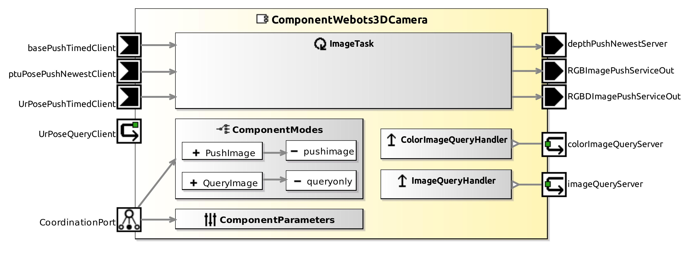

<!--- This file is generated from the ComponentWebots3DCamera.componentDocumentation model --->
<!--- do not modify this file manually as it will by automatically overwritten by the code generator, modify the model instead and re-generate this file --->

# ComponentWebots3DCamera Component



*Component Short Description:* 

A generic driver for a RangeFinder (depth camera) in the Webots simulator.

The scans are made each Webots timeStep, at the same time (see Time of flight (ToF)). measured in ...

How a new RangeFinder can be added to Webots:
* Add a new Robot, set its controller to '&lt;extern&gt;', its coordinate system should be x=front, y=left, z=up of the RangeFinder.
* The robots name must set the same in Webots and here.
* Add the RangeFinder in children of the robot, rotate it to match the coordinate system above.

example code:

```cpp
CommBasicObjects::CommMobileLaserScan scan;
if(this->laserServiceInGetUpdate(scan) != Smart::SMART_OK) (some error handling here)
int count = scan.get_scan_size();
for (int i = 0; i < count; ++i) {
	// scan.get_scan_angle is between 0 and 2*pi, 0=front of lidar
	double angle = scan.get_scan_angle(i) / M_PI * 180;
	// angle should be between -180 and +180 degrees, 0=front of lidar
	if( angle > 180 )
		angle -= 360;
	double distance = scan.get_scan_distance(i);
    ...
}
```


## Component-Datasheet Properties

<table style="border-collapse:collapse;">
<caption><i>Table:</i> Component-Datasheet Properties</caption>
<tr style="background-color:#ccc;">
<th style="border:1px solid black; padding: 5px;"><i>Property Name</i></th>
<th style="border:1px solid black; padding: 5px;"><i>Property Value</i></th>
<th style="border:1px solid black; padding: 5px;"><i>Property Description</i></th>
</tr>
<tr>
<td style="border:1px solid black; padding: 5px;">MarketName</td>
<td style="border:1px solid black; padding: 5px;">Webots 3D Camera</td>
<td style="border:1px solid black; padding: 5px;"></td>
</tr>
<tr>
<td style="border:1px solid black; padding: 5px;">Supplier</td>
<td style="border:1px solid black; padding: 5px;">Servicerobotics Ulm</td>
<td style="border:1px solid black; padding: 5px;"></td>
</tr>
<tr>
<td style="border:1px solid black; padding: 5px;">Homepage</td>
<td style="border:1px solid black; padding: 5px;">https://github.com/Servicerobotics-Ulm/ComponentRepository</td>
<td style="border:1px solid black; padding: 5px;"></td>
</tr>
<tr>
<td style="border:1px solid black; padding: 5px;">Purpose</td>
<td style="border:1px solid black; padding: 5px;">Webots 3D Camera</td>
<td style="border:1px solid black; padding: 5px;"></td>
</tr>
</table>

## Component Ports

### basePushTimedClient

*Documentation:*


### ptuPosePushNewestClient

*Documentation:*


### UrPoseQueryClient

*Documentation:*


### UrPosePushTimedClient

*Documentation:*


### depthPushNewestServer

*Documentation:*


### imageQueryServer

*Documentation:*


### RGBDImagePushServiceOut

*Documentation:*


### RGBImagePushServiceOut

*Documentation:*


### colorImageQueryServer

*Documentation:*


## Component Parameters: ComponentWebots3DCameraParams

### Internal Parameter: webots

*Documentation:*

<table style="border-collapse:collapse;">
<caption><i>Table:</i> Internal Parameter <b>webots</b></caption>
<tr style="background-color:#ccc;">
<th style="border:1px solid black; padding: 5px;"><i>Attribute Name</i></th>
<th style="border:1px solid black; padding: 5px;"><i>Attribute Type</i></th>
<th style="border:1px solid black; padding: 5px;"><i>Attribute Value</i></th>
<th style="border:1px solid black; padding: 5px;"><i>Attribute Description</i></th>
</tr>
<tr>
<td style="border:1px solid black; padding: 5px;"><b>robotName</b></td>
<td style="border:1px solid black; padding: 5px;">String</td>
<td style="border:1px solid black; padding: 5px;">"kinect_v2"</td>
<td style="border:1px solid black; padding: 5px;"><p>the webots Camera and RangeFinder device must be in children of an extra robot with this name
</p></td>
</tr>
<tr>
<td style="border:1px solid black; padding: 5px;"><b>cameraName</b></td>
<td style="border:1px solid black; padding: 5px;">String</td>
<td style="border:1px solid black; padding: 5px;">"kinect_v2_color"</td>
<td style="border:1px solid black; padding: 5px;"><p>the name of the Camera device
</p></td>
</tr>
<tr>
<td style="border:1px solid black; padding: 5px;"><b>rangeFinderName</b></td>
<td style="border:1px solid black; padding: 5px;">String</td>
<td style="border:1px solid black; padding: 5px;">"kinect_v2_range"</td>
<td style="border:1px solid black; padding: 5px;"><p>the name of the RangeFinder device
</p></td>
</tr>
</table>

### Internal Parameter: settings

*Documentation:*

<table style="border-collapse:collapse;">
<caption><i>Table:</i> Internal Parameter <b>settings</b></caption>
<tr style="background-color:#ccc;">
<th style="border:1px solid black; padding: 5px;"><i>Attribute Name</i></th>
<th style="border:1px solid black; padding: 5px;"><i>Attribute Type</i></th>
<th style="border:1px solid black; padding: 5px;"><i>Attribute Value</i></th>
<th style="border:1px solid black; padding: 5px;"><i>Attribute Description</i></th>
</tr>
<tr>
<td style="border:1px solid black; padding: 5px;"><b>debug_info</b></td>
<td style="border:1px solid black; padding: 5px;">Boolean</td>
<td style="border:1px solid black; padding: 5px;">true</td>
<td style="border:1px solid black; padding: 5px;"><p>print debug information in console
</p></td>
</tr>
<tr>
<td style="border:1px solid black; padding: 5px;"><b>pushnewest_rgbd_image</b></td>
<td style="border:1px solid black; padding: 5px;">Boolean</td>
<td style="border:1px solid black; padding: 5px;">false</td>
<td style="border:1px solid black; padding: 5px;"><p>turn on RGBDImagePushServiceOut?
</p></td>
</tr>
<tr>
<td style="border:1px solid black; padding: 5px;"><b>pushnewest_color_image</b></td>
<td style="border:1px solid black; padding: 5px;">Boolean</td>
<td style="border:1px solid black; padding: 5px;">true</td>
<td style="border:1px solid black; padding: 5px;"><p>turn on RGBImagePushServiceOut?
</p></td>
</tr>
<tr>
<td style="border:1px solid black; padding: 5px;"><b>pushnewest_depth_image</b></td>
<td style="border:1px solid black; padding: 5px;">Boolean</td>
<td style="border:1px solid black; padding: 5px;">false</td>
<td style="border:1px solid black; padding: 5px;"><p>turn on depthPushNewestServer?
</p></td>
</tr>
</table>

### Internal Parameter: sensor_pose

*Documentation:*
<p>camera pose in robot frame
</p>

<table style="border-collapse:collapse;">
<caption><i>Table:</i> Internal Parameter <b>sensor_pose</b></caption>
<tr style="background-color:#ccc;">
<th style="border:1px solid black; padding: 5px;"><i>Attribute Name</i></th>
<th style="border:1px solid black; padding: 5px;"><i>Attribute Type</i></th>
<th style="border:1px solid black; padding: 5px;"><i>Attribute Value</i></th>
<th style="border:1px solid black; padding: 5px;"><i>Attribute Description</i></th>
</tr>
<tr>
<td style="border:1px solid black; padding: 5px;"><b>x</b></td>
<td style="border:1px solid black; padding: 5px;">Double</td>
<td style="border:1px solid black; padding: 5px;">90</td>
<td style="border:1px solid black; padding: 5px;"><p>[mm]
</p></td>
</tr>
<tr>
<td style="border:1px solid black; padding: 5px;"><b>y</b></td>
<td style="border:1px solid black; padding: 5px;">Double</td>
<td style="border:1px solid black; padding: 5px;">0</td>
<td style="border:1px solid black; padding: 5px;"><p>[mm]
</p></td>
</tr>
<tr>
<td style="border:1px solid black; padding: 5px;"><b>z</b></td>
<td style="border:1px solid black; padding: 5px;">Double</td>
<td style="border:1px solid black; padding: 5px;">350</td>
<td style="border:1px solid black; padding: 5px;"><p>[mm]
</p></td>
</tr>
<tr>
<td style="border:1px solid black; padding: 5px;"><b>azimuth</b></td>
<td style="border:1px solid black; padding: 5px;">Double</td>
<td style="border:1px solid black; padding: 5px;">1.5707963</td>
<td style="border:1px solid black; padding: 5px;"><p>[radians]
</p></td>
</tr>
<tr>
<td style="border:1px solid black; padding: 5px;"><b>elevation</b></td>
<td style="border:1px solid black; padding: 5px;">Double</td>
<td style="border:1px solid black; padding: 5px;">3.14159265</td>
<td style="border:1px solid black; padding: 5px;"><p>[radians]
</p></td>
</tr>
<tr>
<td style="border:1px solid black; padding: 5px;"><b>roll</b></td>
<td style="border:1px solid black; padding: 5px;">Double</td>
<td style="border:1px solid black; padding: 5px;">1.32</td>
<td style="border:1px solid black; padding: 5px;"><p>[radians]
</p></td>
</tr>
</table>

### Internal Parameter: base

*Documentation:*

<table style="border-collapse:collapse;">
<caption><i>Table:</i> Internal Parameter <b>base</b></caption>
<tr style="background-color:#ccc;">
<th style="border:1px solid black; padding: 5px;"><i>Attribute Name</i></th>
<th style="border:1px solid black; padding: 5px;"><i>Attribute Type</i></th>
<th style="border:1px solid black; padding: 5px;"><i>Attribute Value</i></th>
<th style="border:1px solid black; padding: 5px;"><i>Attribute Description</i></th>
</tr>
<tr>
<td style="border:1px solid black; padding: 5px;"><b>on_ptu</b></td>
<td style="border:1px solid black; padding: 5px;">Boolean</td>
<td style="border:1px solid black; padding: 5px;">false</td>
<td style="border:1px solid black; padding: 5px;"><p>is Camera mounted on top of an pan-tilt-unit?
</p></td>
</tr>
<tr>
<td style="border:1px solid black; padding: 5px;"><b>on_base</b></td>
<td style="border:1px solid black; padding: 5px;">Boolean</td>
<td style="border:1px solid black; padding: 5px;">false</td>
<td style="border:1px solid black; padding: 5px;"><p>is Camera mounted on top of an mobile robot?
</p></td>
</tr>
<tr>
<td style="border:1px solid black; padding: 5px;"><b>on_ur</b></td>
<td style="border:1px solid black; padding: 5px;">Boolean</td>
<td style="border:1px solid black; padding: 5px;">false</td>
<td style="border:1px solid black; padding: 5px;"><p>is Camera mounted on top of an UR5 robot arm?
</p></td>
</tr>
<tr>
<td style="border:1px solid black; padding: 5px;"><b>x</b></td>
<td style="border:1px solid black; padding: 5px;">Int32</td>
<td style="border:1px solid black; padding: 5px;">0</td>
<td style="border:1px solid black; padding: 5px;"><p>stationary Camera only: x coordinate [mm]
</p></td>
</tr>
<tr>
<td style="border:1px solid black; padding: 5px;"><b>y</b></td>
<td style="border:1px solid black; padding: 5px;">Int32</td>
<td style="border:1px solid black; padding: 5px;">0</td>
<td style="border:1px solid black; padding: 5px;"><p>stationary Camera only: y coordinate [mm]
</p></td>
</tr>
<tr>
<td style="border:1px solid black; padding: 5px;"><b>z</b></td>
<td style="border:1px solid black; padding: 5px;">Int32</td>
<td style="border:1px solid black; padding: 5px;">0</td>
<td style="border:1px solid black; padding: 5px;"><p>stationary Camera only: z coordinate [mm]
</p></td>
</tr>
<tr>
<td style="border:1px solid black; padding: 5px;"><b>base_a</b></td>
<td style="border:1px solid black; padding: 5px;">Double</td>
<td style="border:1px solid black; padding: 5px;">0</td>
<td style="border:1px solid black; padding: 5px;"><p>stationary Camera only: heading [radians]
</p></td>
</tr>
</table>

### Internal Parameter: hardware_properties

*Documentation:*

<table style="border-collapse:collapse;">
<caption><i>Table:</i> Internal Parameter <b>hardware_properties</b></caption>
<tr style="background-color:#ccc;">
<th style="border:1px solid black; padding: 5px;"><i>Attribute Name</i></th>
<th style="border:1px solid black; padding: 5px;"><i>Attribute Type</i></th>
<th style="border:1px solid black; padding: 5px;"><i>Attribute Value</i></th>
<th style="border:1px solid black; padding: 5px;"><i>Attribute Description</i></th>
</tr>
<tr>
<td style="border:1px solid black; padding: 5px;"><b>min_distance</b></td>
<td style="border:1px solid black; padding: 5px;">Double</td>
<td style="border:1px solid black; padding: 5px;">500</td>
<td style="border:1px solid black; padding: 5px;"><p>Defines the min distance of the measurements in the depth image[mm]. Values with distances less than this value will be discarded.
</p></td>
</tr>
<tr>
<td style="border:1px solid black; padding: 5px;"><b>max_distance</b></td>
<td style="border:1px solid black; padding: 5px;">Double</td>
<td style="border:1px solid black; padding: 5px;">4500</td>
<td style="border:1px solid black; padding: 5px;"><p>Defines the max distance of the measurements in the depth image[mm]. Values with distances greater than this value will be discarded.
</p></td>
</tr>
</table>

