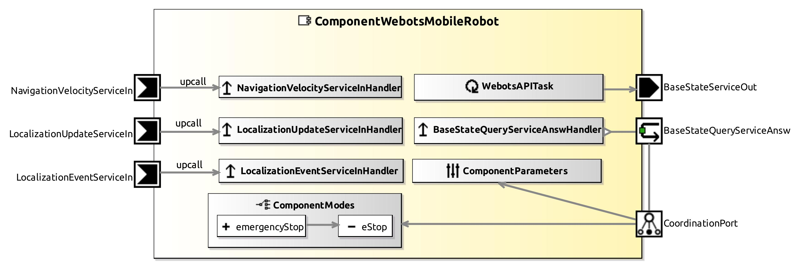

<!--- This file is generated from the ComponentWebotsMobileRobot.componentDocumentation model --->
<!--- do not modify this file manually as it will by automatically overwritten by the code generator, modify the model instead and re-generate this file --->

# ComponentWebotsMobileRobot Component



*Component Short Description:* 

ComponentWebotsMobileRobot moves an mobile robot in the Webots simulator, with 2 differential wheels or 3 omni wheels or 4 mecanum wheels.

The robots coordinate system should be like this:
* x=front, y=left (x=y=0 is at the turning point of the robot (center between wheels))  
* z=up (z=0 is at floor level)

Set the robots controller, supervisor, name and the coordinate system like the following example:  

```
TiagoIron {
  controller "&lt;extern&gt;"
  supervisor TRUE
  name "Tiago example"
  lidarSlot [
    DEF CoordinateSystemTiago_example Transform {
      translation 0 -0.0913 0.202
      rotation -0.5773492691885823 0.5773502691890485 0.5773512691895147 2.09439
    }
    ...
  ]
}
```

### Example for 2 differential wheels:

distanceToRobotCentre is negative for left wheel, positive for the right

heading is 0 for all wheels

the second value for maxAcceleration is 0 (robot cannot move sideways)

```
  ParameterRefinement Webots { 
      robotName = "Pioneer 3-DX"
      motorName = ["left wheel", "right wheel"]
      radius = [0.0975, 0.0975]
      distanceToRobotCentre = [-0.165, 0.165]
      heading = [0, 0]
      maxAcceleration = [1.0, 0.0, 15.0]
  }
```

### Example for 3 omni wheels:

If clockwise rotation of the robot is done by clockwise rotation of the wheel, distanceToRobotCentre is positive, else negative.

heading is the orientation of the wheels relative to the front direction of the robot [degrees] 

```
  ParameterRefinement Webots { 
      robotName = "Robotino 3"
      motorName = ["wheel0_joint", "wheel1_joint", "wheel2_joint"]
      radius = [0.063, 0.063, 0.063]
      distanceToRobotCentre = [-0.1826, -0.1826, -0.1826]
      heading = [90.0, 210.0, 330.0]
      maxAcceleration = [1.0, 1.0, 5.0]
  }
```

Don't forget to add contactProperties in the world for the wheels to work: e.g. [Robotino](https://www.cyberbotics.com/doc/guide/robotino3#sample) 

### Example for 4 mecanum wheels:

distanceToRobotCentre = x-offset + y-offset of wheel relative to robot center = 0.228m + 0.158m = 0.386m

motorName must be in this order: front left, front right, back left, back right

```
ParameterRefinement Webots { 
	robotName = "youBot"
	motorName = ["wheel2", "wheel1", "wheel4", "wheel3"]
	radius = [0.05, 0.05, 0.05, 0.05]
	distanceToRobotCentre = [0.386, 0.386, 0.386, 0.386]
	heading = [0, 0, 0, 0]
	maxAcceleration = [1.0, 1.0, 5.0]
}
```

The mecanum wheels must have an angle of 45 degrees (0.785398 radians) between the small wheels and the big wheel.

Add this to Worldinfo:

```
  contactProperties [
    ContactProperties {
      material1 "InteriorWheelMat"
      coulombFriction [
        0, 2, 0
      ]
      frictionRotation -0.785398 0
      bounce 0
    }
    ContactProperties {
      material1 "ExteriorWheelMat"
      coulombFriction [
        0, 2, 0
      ]
      frictionRotation 0.785398 0
      bounce 0
    }
  ] 
```

### Example program: 

```cpp
CommBasicObjects::CommNavigationVelocity navigationVelocity;
// vx: velocity front direction [mm/s]
// vy: velocity left direction [mm/s]
// omega: counterclockwise rotation [radians/s] 
navigationVelocity.setVX(vx).setVY(vy).setOmega(omega);
// set target movement speed of mobile robot
COMP->navigationVelocityServiceOut->send(navigationVelocity);


```

### other similar components:
- [ComponentRMPBaseServer](../ComponentRMPBaseServer)
- [ComponentRobotinoBaseServer](../ComponentRobotinoBaseServer)
- [SmartPioneerBaseServer](../SmartPioneerBaseServer)
- [SmartGazeboBaseServer](../SmartGazeboBaseServer)

### keyboard control:

* click on the robot in the graphical window to select it
* press <kbd>W</kbd> or <kbd>&#8593;</kbd> to move forwards
* press <kbd>S</kbd> or <kbd>&#8595;</kbd> to move backwards
* press <kbd>A</kbd> or <kbd>&#8592;</kbd> to rotate left (counterclockwise)
* press <kbd>D</kbd> or <kbd>&#8594;</kbd> to rotate right (clockwise)
* press <kbd>Q</kbd> to move sideways left
* press <kbd>E</kbd> to move sideways right
* press <kbd>SPACE</kbd> to stop
* don't press any key to allow the robot to move on its own (default)
* or press <kbd>C</kbd> to turn on cruise control: slowly change the speed by pressing a movement key, and keep that speed if no key is pressed (press <kbd>X</kbd> to turn off cruise control)

Note that as long as cruise control is active, the robot is not able to move on its own (e.g. approach a given location).


## Component-Datasheet Properties

<table style="border-collapse:collapse;">
<caption><i>Table:</i> Component-Datasheet Properties</caption>
<tr style="background-color:#ccc;">
<th style="border:1px solid black; padding: 5px;"><i>Property Name</i></th>
<th style="border:1px solid black; padding: 5px;"><i>Property Value</i></th>
<th style="border:1px solid black; padding: 5px;"><i>Property Description</i></th>
</tr>
<tr>
<td style="border:1px solid black; padding: 5px;">MarketName</td>
<td style="border:1px solid black; padding: 5px;">Webots mobile robot</td>
<td style="border:1px solid black; padding: 5px;"></td>
</tr>
<tr>
<td style="border:1px solid black; padding: 5px;">Supplier</td>
<td style="border:1px solid black; padding: 5px;">Servicerobotics Ulm</td>
<td style="border:1px solid black; padding: 5px;"></td>
</tr>
<tr>
<td style="border:1px solid black; padding: 5px;">Homepage</td>
<td style="border:1px solid black; padding: 5px;">https://wiki.servicerobotik-ulm.de/directory:collection</td>
<td style="border:1px solid black; padding: 5px;"></td>
</tr>
<tr>
<td style="border:1px solid black; padding: 5px;">Purpose</td>
<td style="border:1px solid black; padding: 5px;">Universal mobile robot in the Webots simulator, with 2 differential wheels or 3 omni wheels or 4 mecanum wheels</td>
<td style="border:1px solid black; padding: 5px;"></td>
</tr>
</table>

## Component Ports

### NavigationVelocityServiceIn

*Documentation:*
<p>Reads periodically translational and rotational velocity commands: CommBasicObjects.CommNavigationVelocity
</p>


### LocalizationUpdateServiceIn

*Documentation:*
<p>Reads periodically updated position and orientation of the robot in the world: CommBasicObjects.CommBasePositionUpdate
</p>


### LocalizationEventServiceIn

*Documentation:*
<p>Reads events from localization: CommLocalizationObjects:LocalizationEventType
</p>


### BaseStateServiceOut

*Documentation:*
<p>Writes periodically the position etc.: CommBasicObjects.CommBaseState
</p>


### BaseStateQueryServiceAnsw

*Documentation:*
<p>Writes on request the position etc.: CommBasicObjects.CommBaseState
</p>


## Component Parameters: ComponentWebotsMobileRobotParams

### Internal Parameter: OdometryRandomError

*Documentation:*

<table style="border-collapse:collapse;">
<caption><i>Table:</i> Internal Parameter <b>OdometryRandomError</b></caption>
<tr style="background-color:#ccc;">
<th style="border:1px solid black; padding: 5px;"><i>Attribute Name</i></th>
<th style="border:1px solid black; padding: 5px;"><i>Attribute Type</i></th>
<th style="border:1px solid black; padding: 5px;"><i>Attribute Value</i></th>
<th style="border:1px solid black; padding: 5px;"><i>Attribute Description</i></th>
</tr>
<tr>
<td style="border:1px solid black; padding: 5px;"><b>varianceOfDistancePerMeter</b></td>
<td style="border:1px solid black; padding: 5px;">Double</td>
<td style="border:1px solid black; padding: 5px;">2.5E-5</td>
<td style="border:1px solid black; padding: 5px;"><p>e.g. 0.005m * 0.005m / 1m = 0.000025 m (after traveling 1m, distance error has standard deviation of 0.005m)
</p></td>
</tr>
<tr>
<td style="border:1px solid black; padding: 5px;"><b>varianceOfHeadingPerRadians</b></td>
<td style="border:1px solid black; padding: 5px;">Double</td>
<td style="border:1px solid black; padding: 5px;">1.212E-5</td>
<td style="border:1px solid black; padding: 5px;"><p>e.g. (0.5°*0.5°)/360° /180°*pi = 0.00001212 (after rotating 360 degrees, heading error has standard deviation of 0.5 degrees)
</p></td>
</tr>
<tr>
<td style="border:1px solid black; padding: 5px;"><b>varianceOfHeadingPerMeter</b></td>
<td style="border:1px solid black; padding: 5px;">Double</td>
<td style="border:1px solid black; padding: 5px;">1.218E-5</td>
<td style="border:1px solid black; padding: 5px;"><p>e.g. (0.2°/180°*pi)^2/1m  = 0.00001218 (after traveling 1m, heading error has standard deviation of 0.2 degrees)
</p></td>
</tr>
</table>

### Internal Parameter: Webots

*Documentation:*

<table style="border-collapse:collapse;">
<caption><i>Table:</i> Internal Parameter <b>Webots</b></caption>
<tr style="background-color:#ccc;">
<th style="border:1px solid black; padding: 5px;"><i>Attribute Name</i></th>
<th style="border:1px solid black; padding: 5px;"><i>Attribute Type</i></th>
<th style="border:1px solid black; padding: 5px;"><i>Attribute Value</i></th>
<th style="border:1px solid black; padding: 5px;"><i>Attribute Description</i></th>
</tr>
<tr>
<td style="border:1px solid black; padding: 5px;"><b>robotName</b></td>
<td style="border:1px solid black; padding: 5px;">String</td>
<td style="border:1px solid black; padding: 5px;">"Robotino 3"</td>
<td style="border:1px solid black; padding: 5px;"><p>name of robot
</p></td>
</tr>
<tr>
<td style="border:1px solid black; padding: 5px;"><b>motorName</b></td>
<td style="border:1px solid black; padding: 5px;">String</td>
<td style="border:1px solid black; padding: 5px;">["wheel0_joint", "wheel1_joint", "wheel2_joint"]</td>
<td style="border:1px solid black; padding: 5px;"><p>name of motors of wheels
</p></td>
</tr>
<tr>
<td style="border:1px solid black; padding: 5px;"><b>radius</b></td>
<td style="border:1px solid black; padding: 5px;">Double</td>
<td style="border:1px solid black; padding: 5px;">[0.063, 0.063, 0.063]</td>
<td style="border:1px solid black; padding: 5px;"><p>radius of wheels in m
</p></td>
</tr>
<tr>
<td style="border:1px solid black; padding: 5px;"><b>distanceToRobotCentre</b></td>
<td style="border:1px solid black; padding: 5px;">Double</td>
<td style="border:1px solid black; padding: 5px;">[-0.1826, -0.1826, -0.1826]</td>
<td style="border:1px solid black; padding: 5px;"><p>distance of a wheel to the turning point (center) of the robot
</p></td>
</tr>
<tr>
<td style="border:1px solid black; padding: 5px;"><b>heading</b></td>
<td style="border:1px solid black; padding: 5px;">Double</td>
<td style="border:1px solid black; padding: 5px;">[90.0, 210.0, 330.0]</td>
<td style="border:1px solid black; padding: 5px;"><p>the heading of the wheels, for differential drives set these to 0 [degrees]
</p></td>
</tr>
<tr>
<td style="border:1px solid black; padding: 5px;"><b>maxAcceleration</b></td>
<td style="border:1px solid black; padding: 5px;">Double</td>
<td style="border:1px solid black; padding: 5px;">[1.0, 1.0, 5.0]</td>
<td style="border:1px solid black; padding: 5px;"><p>the max. acceleration front [m/s], sideways [m/s], rotation [radians/s]
</p></td>
</tr>
</table>

### Internal Parameter: Robot

*Documentation:*

<table style="border-collapse:collapse;">
<caption><i>Table:</i> Internal Parameter <b>Robot</b></caption>
<tr style="background-color:#ccc;">
<th style="border:1px solid black; padding: 5px;"><i>Attribute Name</i></th>
<th style="border:1px solid black; padding: 5px;"><i>Attribute Type</i></th>
<th style="border:1px solid black; padding: 5px;"><i>Attribute Value</i></th>
<th style="border:1px solid black; padding: 5px;"><i>Attribute Description</i></th>
</tr>
<tr>
<td style="border:1px solid black; padding: 5px;"><b>maxVelX</b></td>
<td style="border:1px solid black; padding: 5px;">Double</td>
<td style="border:1px solid black; padding: 5px;">1.0</td>
<td style="border:1px solid black; padding: 5px;"><p>max. speed (forward) in m/s
</p></td>
</tr>
<tr>
<td style="border:1px solid black; padding: 5px;"><b>maxVelY</b></td>
<td style="border:1px solid black; padding: 5px;">Double</td>
<td style="border:1px solid black; padding: 5px;">1.0</td>
<td style="border:1px solid black; padding: 5px;"><p>max. speed sideways (left) in m/s (only omnidirection drive as in Robotino3)
</p></td>
</tr>
<tr>
<td style="border:1px solid black; padding: 5px;"><b>maxRotVel</b></td>
<td style="border:1px solid black; padding: 5px;">Double</td>
<td style="border:1px solid black; padding: 5px;">4.0</td>
<td style="border:1px solid black; padding: 5px;"><p>maximum rotation velocity of robot in radians/s
</p></td>
</tr>
</table>

### Internal Parameter: General

*Documentation:*

<table style="border-collapse:collapse;">
<caption><i>Table:</i> Internal Parameter <b>General</b></caption>
<tr style="background-color:#ccc;">
<th style="border:1px solid black; padding: 5px;"><i>Attribute Name</i></th>
<th style="border:1px solid black; padding: 5px;"><i>Attribute Type</i></th>
<th style="border:1px solid black; padding: 5px;"><i>Attribute Value</i></th>
<th style="border:1px solid black; padding: 5px;"><i>Attribute Description</i></th>
</tr>
<tr>
<td style="border:1px solid black; padding: 5px;"><b>verbose</b></td>
<td style="border:1px solid black; padding: 5px;">Boolean</td>
<td style="border:1px solid black; padding: 5px;">false</td>
<td style="border:1px solid black; padding: 5px;"><p>if set to true, more information is printed in the console
</p></td>
</tr>
<tr>
<td style="border:1px solid black; padding: 5px;"><b>useLocalizationEvent</b></td>
<td style="border:1px solid black; padding: 5px;">Boolean</td>
<td style="border:1px solid black; padding: 5px;">true</td>
<td style="border:1px solid black; padding: 5px;"></td>
</tr>
<tr>
<td style="border:1px solid black; padding: 5px;"><b>writePoseFile</b></td>
<td style="border:1px solid black; padding: 5px;">Boolean</td>
<td style="border:1px solid black; padding: 5px;">false</td>
<td style="border:1px solid black; padding: 5px;"><p>if set to true, the robot position is read/saved in poseFileName
</p></td>
</tr>
<tr>
<td style="border:1px solid black; padding: 5px;"><b>poseFileName</b></td>
<td style="border:1px solid black; padding: 5px;">String</td>
<td style="border:1px solid black; padding: 5px;">"/tmp/lastRobotPose.txt"</td>
<td style="border:1px solid black; padding: 5px;"><p>see writePoseFile
</p></td>
</tr>
</table>

