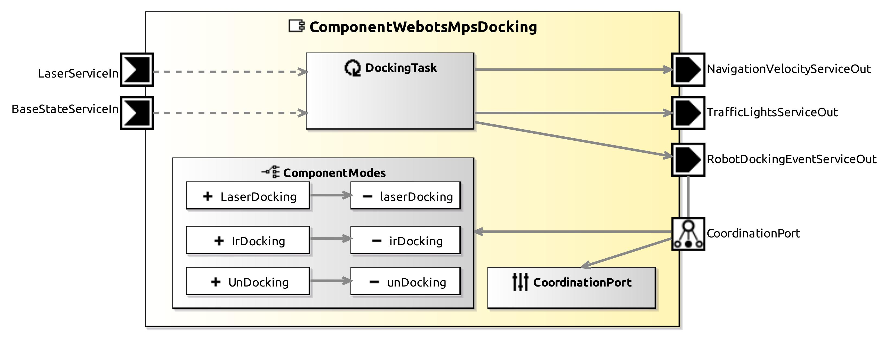

<!--- This file is generated from the ComponentWebotsMpsDocking.componentDocumentation model --->
<!--- do not modify this file manually as it will by automatically overwritten by the code generator, modify the model instead and re-generate this file --->

# ComponentWebotsMpsDocking Component

*Component Short Description:* 

ComponentWebotsMpsDocking moves (docks) the mobile robot very precisely and closely to an production station.

After that the transfer of an stacking container between the mobile robot and the production station is done by [ComponentWebotsConveyorBeltOpcua](../ComponentWebotsConveyorBeltOpcua).

There is a demo to see this component in action: start SystemWebotsNavMpsDockingOPCUA, go to the window with 'ComponentTCLSequencer' and enter a number.

First, the robot is moved to an area in front of the production station by the system. Only than docking is possible.

Commands are given by setting the ComponentMode:
- **laserDocking** or **irDocking** docks the mobile robot to the production station
- **unDocking**: the robot moves backwards from the production station to some distance

Docking:
- if the distance to the production station is bigger than parameter *maxDistanceToDockingPoint*, send event LASER_DOCKING_ERROR and stop with an error
- send event LASER_DOCKING_NOT_DONE
- rotate the robot to match the orientation of the production station
- move the robot very close in front of the production station
- send event LASER_DOCKING_DONE

Meaning of the signal lights (on the mobile robot):
- **red**: an error occured
- **yellow**: warning, robot is moving (light is flashing)
- **green**: not used

## Component-Datasheet Properties

<table style="border-collapse:collapse;">
<caption><i>Table:</i> Component-Datasheet Properties</caption>
<tr style="background-color:#ccc;">
<th style="border:1px solid black; padding: 5px;"><i>Property Name</i></th>
<th style="border:1px solid black; padding: 5px;"><i>Property Value</i></th>
<th style="border:1px solid black; padding: 5px;"><i>Property Description</i></th>
</tr>
<tr>
<td style="border:1px solid black; padding: 5px;">MarketName</td>
<td style="border:1px solid black; padding: 5px;">ComponentWebotsMpsDocking</td>
<td style="border:1px solid black; padding: 5px;"></td>
</tr>
<tr>
<td style="border:1px solid black; padding: 5px;">Supplier</td>
<td style="border:1px solid black; padding: 5px;">Servicerobotics Ulm</td>
<td style="border:1px solid black; padding: 5px;"></td>
</tr>
<tr>
<td style="border:1px solid black; padding: 5px;">Homepage</td>
<td style="border:1px solid black; padding: 5px;">https://wiki.servicerobotik-ulm.de/directory:collection</td>
<td style="border:1px solid black; padding: 5px;"></td>
</tr>
<tr>
<td style="border:1px solid black; padding: 5px;">Purpose</td>
<td style="border:1px solid black; padding: 5px;">moves (docks) the mobile robot very precisely and closely to an production station</td>
<td style="border:1px solid black; padding: 5px;"></td>
</tr>
</table>

## Component Ports

### LaserServiceIn

*Documentation:*

Reads periodically laser scans: CommBasicObjects.CommMobileLaserScan

### BaseStateServiceIn

*Documentation:*

Reads periodically the position etc. of an mobile robot: CommBasicObjects.CommBaseState

### NavigationVelocityServiceOut

*Documentation:*

Writes periodically the translational and rotational velocity of an mobile robot: CommBasicObjects.CommNavigationVelocity

### TrafficLightsServiceOut

*Documentation:*

Writes periodically to turn off/on red/yellow/green lights on the mobile robot: CommBasicObjects.CommTrafficLights

### RobotDockingEventServiceOut

*Documentation:*

## Component Parameters: ComponentWebotsMpsDocking

### Internal Parameter: Webots

*Documentation:*

<table style="border-collapse:collapse;">
<caption><i>Table:</i> Internal Parameter <b>Webots</b></caption>
<tr style="background-color:#ccc;">
<th style="border:1px solid black; padding: 5px;"><i>Attribute Name</i></th>
<th style="border:1px solid black; padding: 5px;"><i>Attribute Type</i></th>
<th style="border:1px solid black; padding: 5px;"><i>Attribute Value</i></th>
<th style="border:1px solid black; padding: 5px;"><i>Attribute Description</i></th>
</tr>
<tr>
<td style="border:1px solid black; padding: 5px;"><b>robotName</b></td>
<td style="border:1px solid black; padding: 5px;">String</td>
<td style="border:1px solid black; padding: 5px;">"MpsDocking"</td>
<td style="border:1px solid black; padding: 5px;">
add an extra robot with this name and controller "<extern>" and supervisor TRUE

</td>
</tr>
<tr>
<td style="border:1px solid black; padding: 5px;"><b>stationName</b></td>
<td style="border:1px solid black; padding: 5px;">String</td>
<td style="border:1px solid black; padding: 5px;">["MPS0", "MPS1", "MPS2", "MPS3"]</td>
<td style="border:1px solid black; padding: 5px;">
the DEF names of the docking stations in webots

</td>
</tr>
<tr>
<td style="border:1px solid black; padding: 5px;"><b>maxDistanceToDockingPoint</b></td>
<td style="border:1px solid black; padding: 5px;">Double</td>
<td style="border:1px solid black; padding: 5px;">2.0</td>
<td style="border:1px solid black; padding: 5px;">
dock to stations only if distance to the docking point is less than this value (in meters)

</td>
</tr>
</table>

