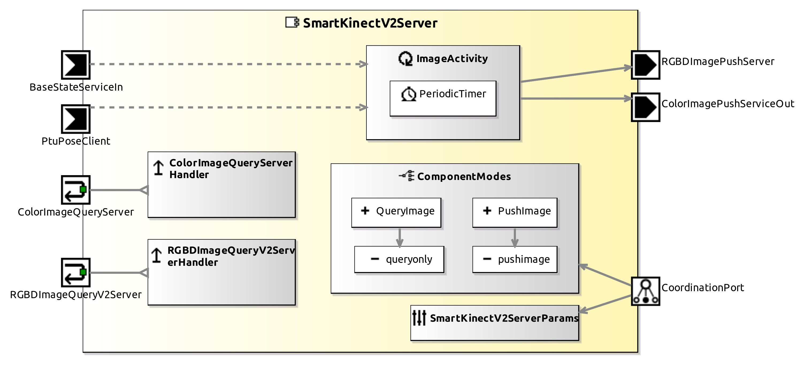

<!--- This file is generated from the SmartKinectV2Server.componentDocumentation model --->
<!--- do not modify this file manually as it will by automatically overwritten by the code generator, modify the model instead and re-generate this file --->

# SmartKinectV2Server Component

NOTE: THIS COMPONENT PROJECT ONLY CONTAINS A COMPONENT HULL. IMPLEMENTATION OF THIS COMPONENT IS WORK IN PROGRESS. YOU CAN USE THIS COMPONENT HULL TO FILL IN YOUR OWN IMPLEMENTATION.

The SmartKinectV2Server captures RGB, depth and range images from the Microsoft Kinect. Undistorted images can be requested by push or query communication.

GPL-License: includes code from The Mobile Robot Programming Toolkit (MRPT). 

| Metaelement | Documentation |
|-------------|---------------|
| License | GPL |
| Hardware Requirements | Microsoft Kinect |
| Purpose | Hardware-Driver |

## Coordination Port CoordinationPort

See States for descriptions of possible states and their meaning.

### States

| MainState Name | MainState Description |
|----------------|-----------------------|
| Neutral |  	In this state the Kinect camera is disabled. The component will not deliver any valid image. When changed to neutral, the component stops the push service and returns invalid stamped images if queried. |
| QueryImage | Kinect camera is enabled, an image is captured any time a query is received. The push services are stopped in this state. |
| PushImage | Kinect camera is enabled, images are captured continuously. The push services are active in this state. Image queries will be answered with the most recent captured image. |

### DynamicWiring

Slave part of wiring pattern. It is responsible for changing the port connections within the component.

### Parameter

## Service Ports

### BaseStateServiceIn

Typically connected to the robot base (e.g. SmartPioneerBaseServer) to receive the base state which is included in the image. Whether this port is connected or not can be configured via the ini file. Used to stamp every image with the base state where the image was recorded, if camera is mounted on a mobile platform. If this port is not connected, the pose where recorded will contain the values configured in the ini file.

### PtuPoseClient

Typically connected to the pan-tilt-unit (e.g. SmartPTUServer) to receive the ptu state which is included in the image. Whether this port is connected or not can be configured via the ini file. Used to stamp every image with the ptu state where the image was recorded, if camera is mounted on a ptu. If this port is not connected, the pose where recorded will contain the values configured in the ini file. 

### RGBDImageQueryV2Server

Query to request the kinect image. Image will be stamped invalid if it was not possible to get the base state or the ptu state but the baseClient or the ptuClient port are connected.

### ColorImagePushServiceOut

Push latest kinect image. The rate with which the server pushes depends on the parameterization of the kinect camera, especially the resolution. Image will be stamped invalid if it was not possible to get the base state or the ptu state but the baseClient or the ptuClient port are connected.

### ColorImageQueryServer

Query to request the color image from the kinect camera only. Image will be stamped invalid if it was not possible to get the base state or the ptu state but the baseClient or the ptuClient port are connected.

## Component Parameters SmartKinectV2ServerParams

### InternalParameter settings

| Attribute Name | Attribute Type | Description |
|----------------|----------------|-------------|
| debug_info | Boolean |  |
| valid_image_time | Double |  |
| high_resolution | Boolean |  |
| undistort_image | Boolean |  |

### InternalParameter sensor_pose

| Attribute Name | Attribute Type | Description |
|----------------|----------------|-------------|
| x | Double |  |
| y | Double |  |
| z | Double |  |
| azimuth | Double |  |
| elevation | Double |  |
| roll | Double |  |

### InternalParameter base

| Attribute Name | Attribute Type | Description |
|----------------|----------------|-------------|
| on_ptu | Boolean |  |
| on_base | Boolean |  |
| x | Int32 |  |
| y | Int32 |  |
| z | Int32 |  |
| base_a | Double |  |
| steer_a | Double |  |

### InternalParameter hardware_properties

| Attribute Name | Attribute Type | Description |
|----------------|----------------|-------------|
| min_distance | Double |  |
| max_distance | Double |  |

