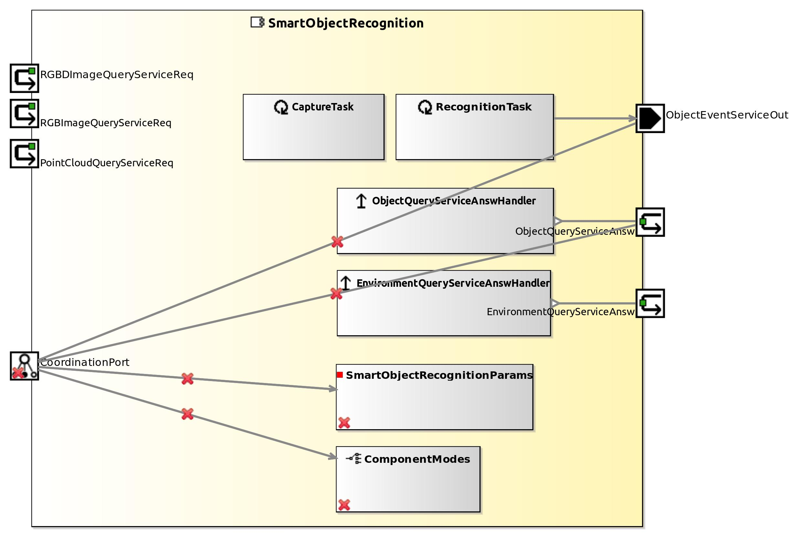

<!--- This file is generated from the SmartObjectRecognition.componentDocumentation model --->
<!--- do not modify this file manually as it will by automatically overwritten by the code generator, modify the model instead and re-generate this file --->

# SmartObjectRecognition Component

NOTE: THIS COMPONENT PROJECT ONLY CONTAINS A COMPONENT HULL. IMPLEMENTATION OF THIS COMPONENT IS WORK IN PROGRESS. YOU CAN USE THIS COMPONENT HULL TO FILL IN YOUR OWN IMPLEMENTATION.

TODO: ADD description!

| Metaelement | Documentation |
|-------------|---------------|
| License |  |
| Hardware Requirements |  |
| Purpose |  |

## Service Ports

## Component Parameters SmartObjectRecognitionParams

### ParameterSetInstance ObjectRecognitionParameter

#### ParameterInstance BELIEF_THRESHOLD

| Attribute Name | Attribute Type | Description |
|----------------|----------------|-------------|
| threshold | Double |  |

#### ParameterInstance CLOUD

| Attribute Name | Attribute Type | Description |
|----------------|----------------|-------------|
| id | UInt32 |  |

#### ParameterInstance CLUSTERING

| Attribute Name | Attribute Type | Description |
|----------------|----------------|-------------|
| doClustering | Boolean |  |

#### ParameterInstance ESTIMATEFILLING

| Attribute Name | Attribute Type | Description |
|----------------|----------------|-------------|
| estimateObjectProperties | Boolean |  |

#### ParameterInstance SETOBJECTID

| Attribute Name | Attribute Type | Description |
|----------------|----------------|-------------|
| id | UInt32 |  |

#### TriggerInstance ADDALGORITHM

active = false

#### TriggerInstance DELALGORITHMS

active = false

#### TriggerInstance ADDOBJECT

active = false

#### TriggerInstance DELOBJECTS

active = false

#### TriggerInstance ADDSENSOR

active = false

#### TriggerInstance DELSENSORS

active = false

#### TriggerInstance BEHAVIOR

active = false

#### TriggerInstance CAPTURE

active = false

#### TriggerInstance RECOGNIZE

active = false

### InternalParameter Data

| Attribute Name | Attribute Type | Description |
|----------------|----------------|-------------|
| object_db_path | String |  |
| moped_model_path | String |  |

### InternalParameter General

| Attribute Name | Attribute Type | Description |
|----------------|----------------|-------------|
| verbose | Boolean |  |
| use_kinect | Boolean |  |
| use_image | Boolean |  |
| use_manipulator | Boolean |  |
| table_thickness | Double |  |
| workspace_max_xy | Double |  |
| workspace_min_z | Double |  |
| workspace_max_z | Double |  |

