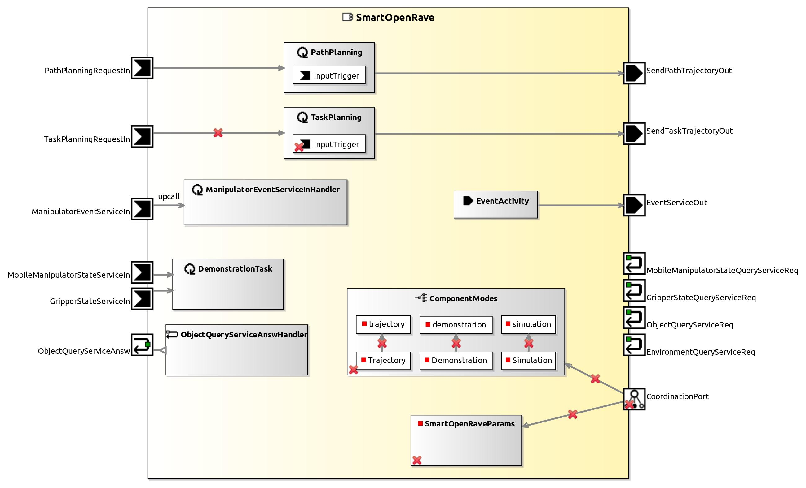

<!--- This file is generated from the SmartOpenRave.componentDocumentation model --->
<!--- do not modify this file manually as it will by automatically overwritten by the code generator, modify the model instead and re-generate this file --->

# SmartOpenRave Component

NOTE: THIS COMPONENT PROJECT ONLY CONTAINS A COMPONENT HULL. IMPLEMENTATION OF THIS COMPONENT IS WORK IN PROGRESS. YOU CAN USE THIS COMPONENT HULL TO FILL IN YOUR OWN IMPLEMENTATION.
This component is based on the OpenRAVE framework. It allows to plan a trajectory to a given point with the specified manipulator. The path planning performs collision free manipulation by taking, for example, obstacles in the scene into account. The scene can be loaded from a XML file or via an object recognition. Furthermore it is possible to plan higher level tasks like grasping an object and putting it on a table. All coordinates are on the robot coordinate system.

| Metaelement | Documentation |
|-------------|---------------|
| License | 	LGPL |
| Hardware Requirements | - |
| Purpose | Manipulation |

## Coordination Port CoordinationPort

See States for descriptions of possible states and their meaning.

### States

| MainState Name | MainState Description |
|----------------|-----------------------|
| Neutral | The component does not perform any planning or IK calculation. It accepts parameters. |
| Trajectory | The component can plan paths or plan higher level tasks like grasping an object and place it somewhere. |
| Demonstration | The component just synchronizes the modeled manipulator with the real manipulator. This state is mainly for testing purpose. |
| Simulation | The component does not send any trajectory to the real manipulator. It computes all IK solutions and plans path as in ''trajectory'' state. |

### DynamicWiring

Slave part of wiring pattern. It is responsible for changing the port connections within the component.

### Parameter

Accepts various parameters to handle the environment and objects in OpenRAVE. PARAMETER_SUCCESS and PARAMETER_FAIL are fired from the handler. Not all parameters fire the mentioned events. See parameter description for further information.

## Service Ports

### MobileManipulatorStateServiceIn

Connect this client service to the real manipulator component (e.g. SmartKatanaServer) to receive the current joint configuration and tool center point of the manipulator.

### ManipulatorEventServiceIn

Connect this client service to the real manipulator component to receive events. The events are important for the path planning. For example it is necessary to receive the "GOAL_REACHED" event to know if the real manipulator is ready to receive a next trajectory.

### EnvironmentQueryServiceReq

Connect this query client service to an object recognition to load an environment from it. The environment contains serveral objects which will be loaded into OpenRAVE. These objects will be considered in the path planning process. If no object recognition is available it is possible to load an environment from a file which can be specified in the ini-configuration.

### ObjectQueryServiceReq

Connect this query client service to an object recognition to load objects from it. The object has to be loaded from this port to get information about the type and extents of the object.

### PathPlanningRequestIn

Only the first tool center point or joint angle configuration in the communication object is used. For this tool center point or joint angle configuration a path planning is performed. The handler fires events when it begins to plan a trajectory ('PLANNING_PATH') or when a trajectory has been found ('PATH_FOUND') or when no trajectory can be calculated ('NO_PATH_FOUND' if the planning is unsuccessful or 'NO_IKSOLUTION_FOUND' if the inverse kinematic cannot be calculated). The environment has to be loaded before this handler is called over the parameter port. The tool center point in the trajectory must be given in the robot coordinate system.

### ObjectQueryServiceAnsw

This port returns the pose of the object with the id specified in the request. If the object is unknown an invalid answer object is returned.

### EventServiceOut

 The event state UNKNOWN can be used for activation if the current state is unknown. The port will send the following events:

    					- PLANNING_PATH: Fired when component started planning the path.
    					- PATH_FOUND: Fired when the path planing was successful and a trajectory has been found.
    					- NO_PATH_FOUND: Fired when no trajectory can be found to the specified position.
    					- NO_IKSOLUTION_FOUND: Fired when the inverse kinematic caluclation fails.
    					- MANIPULATOR_SYNC_FAIL: Event is fired if the modeled manipulator cannot be synced with the real manipulator.

## Component Parameters SmartOpenRaveParams

### InternalParameter OpenRave

| Attribute Name | Attribute Type | Description |
|----------------|----------------|-------------|
| defaultEnvironmentPath | String |  |
| robotPath | String |  |
| saveTrajectoryToFile | Boolean |  |
| saveObjectsToFile | Boolean |  |
| debugSend | Boolean |  |
| debugOpenRave | Boolean |  |
| debugGrasping | Boolean |  |
| gui_active | Boolean |  |
| robotName | String |  |
| showCompleteTrajectory | Boolean |  |
| storedEnvironmentPath | String |  |
| storedEnvironmentName | String |  |
| python_path | String |  |
| objectDatabasePath | String |  |
| objectDatabaseXMLFilename | String |  |

### InternalParameter PortParameter

| Attribute Name | Attribute Type | Description |
|----------------|----------------|-------------|
| withManipulator | Boolean |  |
| withGripper | Boolean |  |
| gripperComponentName | String |  |
| gripperComponentParameterService | String |  |
| withObjectRecognition | Boolean |  |

### ParameterSetInstance ManipulationPlannerParameter

#### TriggerInstance CONSTRAINED_PATH

active = false

#### TriggerInstance ENV_CLEAR

active = false

#### TriggerInstance ENV_LOAD_FILE

active = false

#### TriggerInstance ENV_LOAD_OBJECTRECOGNITION

active = false

#### TriggerInstance ENV_SAVE_FILE

active = false

#### TriggerInstance GRASPING_CENTERED

active = false

#### TriggerInstance GRASPING_NONE

active = false

#### TriggerInstance GRASPING_SIMPLE

active = false

#### TriggerInstance NORMAL_PATH

active = false

#### TriggerInstance OBJ_ADD

active = false

#### TriggerInstance OBJ_COMPUTEGRASPTABLE

active = false

#### TriggerInstance OBJ_DELETE

active = false

#### TriggerInstance OBJ_MOVE

active = false

#### TriggerInstance SIMULATION_PLAN_ALL

active = false

#### TriggerInstance SIMULATION_TEST_IK_ONLY

active = false

