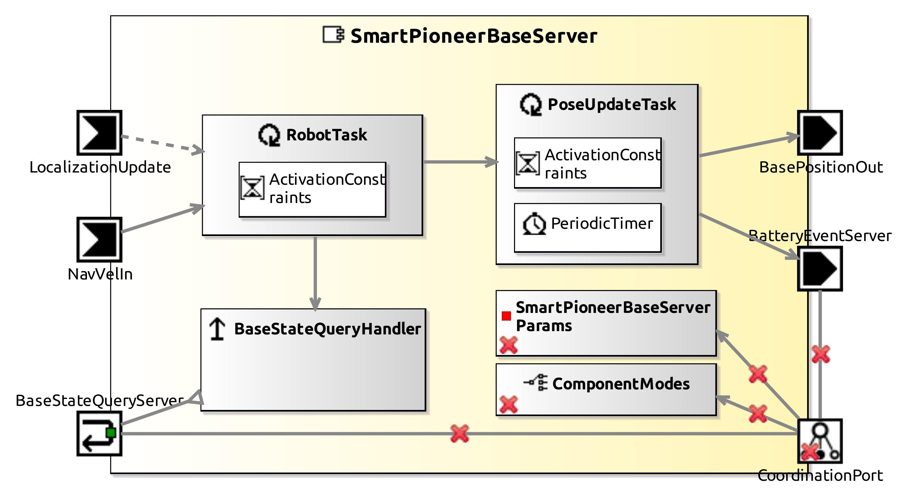

<!--- This file is generated from the SmartPioneerBaseServer.componentDocumentation model --->
<!--- do not modify this file manually as it will by automatically overwritten by the code generator, modify the model instead and re-generate this file --->

# SmartPioneerBaseServer Component

*Component Short Description:* The SmartPioneerBaseServer makes P2OS-based robot platforms available.

## Component Documentation

 The SmartPioneerBaseServer makes P2OS-based robot platforms available.
 It handles all the communication with the hardware.
 It offers several services for controlling the robot,
 such as sending navigation commands to the base and providing access to the robot's odometry.
 Position updates can be sent to the component to overcome odometry failures.

 GPL-License: includes Code from the Player Project.

## Component-Datasheet Properties

<table style="border-collapse:collapse;">
<caption><i>Table:</i> Component-Datasheet Properties</caption>
<tr style="background-color:#ccc;">
<th style="border:1px solid black; padding: 5px;"><i>Property Name</i></th>
<th style="border:1px solid black; padding: 5px;"><i>Property Value</i></th>
<th style="border:1px solid black; padding: 5px;"><i>Property Description</i></th>
</tr>
<tr>
<td style="border:1px solid black; padding: 5px;">SpdxLicense</td>
<td style="border:1px solid black; padding: 5px;">LGPL-2.0-or-later</td>
<td style="border:1px solid black; padding: 5px;">https://spdx.org/licenses/LGPL-2.0-or-later.html</td>
</tr>
<tr>
<td style="border:1px solid black; padding: 5px;">TechnologyReadinessLevel</td>
<td style="border:1px solid black; padding: 5px;">TRL5</td>
<td style="border:1px solid black; padding: 5px;"></td>
</tr>
<tr>
<td style="border:1px solid black; padding: 5px;">Homepage</td>
<td style="border:1px solid black; padding: 5px;">http://servicerobotik-ulm.de/components</td>
<td style="border:1px solid black; padding: 5px;"></td>
</tr>
<tr>
<td style="border:1px solid black; padding: 5px;">Supplier</td>
<td style="border:1px solid black; padding: 5px;">Servicerobotics Ulm</td>
<td style="border:1px solid black; padding: 5px;"></td>
</tr>
<tr>
<td style="border:1px solid black; padding: 5px;">Purpose</td>
<td style="border:1px solid black; padding: 5px;">Mobile-Base</td>
<td style="border:1px solid black; padding: 5px;"></td>
</tr>
</table>

## Component Ports

### NavVelIn

*Documentation:*

### LocalizationUpdate

*Documentation:*

### BasePositionOut

*Documentation:*

### BatteryEventServer

*Documentation:*

### BaseStateQueryServer

*Documentation:*

## Component Parameters: SmartPioneerBaseServerParams

### Internal Parameter: Robot

*Documentation:*

<table style="border-collapse:collapse;">
<caption><i>Table:</i> Internal Parameter <b>Robot</b></caption>
<tr style="background-color:#ccc;">
<th style="border:1px solid black; padding: 5px;"><i>Attribute Name</i></th>
<th style="border:1px solid black; padding: 5px;"><i>Attribute Type</i></th>
<th style="border:1px solid black; padding: 5px;"><i>Attribute Value</i></th>
<th style="border:1px solid black; padding: 5px;"><i>Attribute Description</i></th>
</tr>
<tr>
<td style="border:1px solid black; padding: 5px;"><b>enable_motors</b></td>
<td style="border:1px solid black; padding: 5px;">Boolean</td>
<td style="border:1px solid black; padding: 5px;">true</td>
<td style="border:1px solid black; padding: 5px;">
Enable (true) or disable (false) motors at startup. Defines the state of the base' 'motors'-button on startup.

</td>
</tr>
<tr>
<td style="border:1px solid black; padding: 5px;"><b>enable_sonar</b></td>
<td style="border:1px solid black; padding: 5px;">Boolean</td>
<td style="border:1px solid black; padding: 5px;">false</td>
<td style="border:1px solid black; padding: 5px;">
Enable (true) or disable (false) sonar at startup.

</td>
</tr>
<tr>
<td style="border:1px solid black; padding: 5px;"><b>maxVel</b></td>
<td style="border:1px solid black; padding: 5px;">Int32</td>
<td style="border:1px solid black; padding: 5px;">1000</td>
<td style="border:1px solid black; padding: 5px;">
Set maximum translation velocity of robot [mm/s].

</td>
</tr>
<tr>
<td style="border:1px solid black; padding: 5px;"><b>maxVelAcc</b></td>
<td style="border:1px solid black; padding: 5px;">Int32</td>
<td style="border:1px solid black; padding: 5px;">300</td>
<td style="border:1px solid black; padding: 5px;">
Set maximum translation acceleration of robot [mm/s^2].

</td>
</tr>
<tr>
<td style="border:1px solid black; padding: 5px;"><b>maxVelDecel</b></td>
<td style="border:1px solid black; padding: 5px;">Int32</td>
<td style="border:1px solid black; padding: 5px;">300</td>
<td style="border:1px solid black; padding: 5px;">
Set maximum translation deceleration of robot [mm/s^2]. Negative value.

</td>
</tr>
<tr>
<td style="border:1px solid black; padding: 5px;"><b>maxRotVel</b></td>
<td style="border:1px solid black; padding: 5px;">Int32</td>
<td style="border:1px solid black; padding: 5px;">300</td>
<td style="border:1px solid black; padding: 5px;">
Set maximum rotation velocity of robot [deg/s].

</td>
</tr>
<tr>
<td style="border:1px solid black; padding: 5px;"><b>maxRotVelAcc</b></td>
<td style="border:1px solid black; padding: 5px;">Int32</td>
<td style="border:1px solid black; padding: 5px;">100</td>
<td style="border:1px solid black; padding: 5px;">
Set maximum rotation acceleration of robot [deg/s^2].

</td>
</tr>
<tr>
<td style="border:1px solid black; padding: 5px;"><b>maxRotVelDecel</b></td>
<td style="border:1px solid black; padding: 5px;">Int32</td>
<td style="border:1px solid black; padding: 5px;">100</td>
<td style="border:1px solid black; padding: 5px;">
Set maximum rotation deceleration of robot [deg/s^2]. Negative value.

</td>
</tr>
<tr>
<td style="border:1px solid black; padding: 5px;"><b>serialport</b></td>
<td style="border:1px solid black; padding: 5px;">String</td>
<td style="border:1px solid black; padding: 5px;">"/dev/ttyS0"</td>
<td style="border:1px solid black; padding: 5px;">
Device name to access Pioneer Base, e.g. /dev/ttyS0

</td>
</tr>
<tr>
<td style="border:1px solid black; padding: 5px;"><b>robotType</b></td>
<td style="border:1px solid black; padding: 5px;">String</td>
<td style="border:1px solid black; padding: 5px;">"p3dx"</td>
<td style="border:1px solid black; padding: 5px;">
Type of pioneer platform. Currently supported: p3dx, p3dxsh, p3atsh.

</td>
</tr>
</table>

### ParameterSetInstance: BaseParams

#### Trigger Instance: BASE_RESET

*Property:* active = **false**

*Documentation:*

Reset the connection to the base at runtime. The serial connection is closed and reopened. All estimated positions are set to zero.

#### Trigger Instance: BASE_SONAR

*Property:* active = **false**

*Documentation:*

