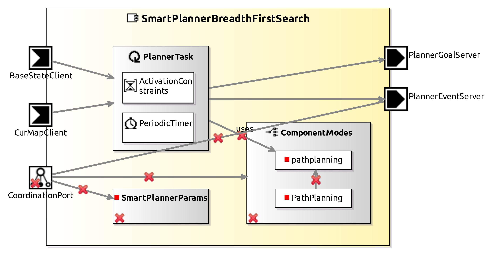

<!--- This file is generated from the SmartPlannerBreadthFirstSearch.componentDocumentation model --->
<!--- do not modify this file manually as it will by automatically overwritten by the code generator, modify the model instead and re-generate this file --->

# SmartPlannerBreadthFirstSearch Component

*Component Short Description:* The SmartPlannerBreadthFirstSearch provides path planning services based on grid maps.

## Component Documentation

 The SmartPlannerBreadthFirstSearch provides path planning services based on grid maps.
 It uses a grid map from a map building component (e.g. SmartMapperGridMap) and sends an intermediate waypoint
 as well as the goalpoint to the motion execution (e.g. SmartCdlServer).

 A wave propagation algorithm starting from goal cells backward to the current position of the robot is used to calculate a path.
 The path planning is further enhanced by a path shortening heuristic: the path is followed starting at the current robot position
 until a straight line from the robot position to the cell in question on the path interferes with an obstacle.
 The prior cell is then sent as an intermediate waypoint. The geometric path planning is applied continuously every one second.

 Several goal circles and/or goal lines can be specified as goals in the planner.
 The planner will generate a path to the goal with the shortest distance.

 The SmartPlannerBreadthFirstSearch for example can be used with SmartCdlServer which cannot handle local minimas.
 Goals are then specified in the SmartPlannerBreadthFirstSearch.
 A CDL_GOAL_REACHED event is fired by the CDL component as soon as the final goal is reached.

 See also:
 Christian Schlegel. Navigation and Execution for Mobile Robots in Dynamic Environments: An Integrated Approach. p. 27-29. Dissertation,
 Fakultät für Informatik, Universität Ulm, 2004.

## Component-Datasheet Properties

<table style="border-collapse:collapse;">
<caption><i>Table:</i> Component-Datasheet Properties</caption>
<tr style="background-color:#ccc;">
<th style="border:1px solid black; padding: 5px;"><i>Property Name</i></th>
<th style="border:1px solid black; padding: 5px;"><i>Property Value</i></th>
<th style="border:1px solid black; padding: 5px;"><i>Property Description</i></th>
</tr>
<tr>
<td style="border:1px solid black; padding: 5px;">SpdxLicense</td>
<td style="border:1px solid black; padding: 5px;">LGPL-2.0-or-later</td>
<td style="border:1px solid black; padding: 5px;">https://spdx.org/licenses/LGPL-2.0-or-later.html</td>
</tr>
<tr>
<td style="border:1px solid black; padding: 5px;">TechnologyReadinessLevel</td>
<td style="border:1px solid black; padding: 5px;">TRL5</td>
<td style="border:1px solid black; padding: 5px;"></td>
</tr>
<tr>
<td style="border:1px solid black; padding: 5px;">Homepage</td>
<td style="border:1px solid black; padding: 5px;">http://servicerobotik-ulm.de/components</td>
<td style="border:1px solid black; padding: 5px;"></td>
</tr>
<tr>
<td style="border:1px solid black; padding: 5px;">Supplier</td>
<td style="border:1px solid black; padding: 5px;">Servicerobotics Ulm</td>
<td style="border:1px solid black; padding: 5px;"></td>
</tr>
<tr>
<td style="border:1px solid black; padding: 5px;">Purpose</td>
<td style="border:1px solid black; padding: 5px;">Planner</td>
<td style="border:1px solid black; padding: 5px;"></td>
</tr>
</table>

## Component Ports

### CurMapClient

*Documentation:*

### BaseStateClient

*Documentation:*

### PlannerGoalServer

*Documentation:*

### PlannerEventServer

*Documentation:*

## Component Parameters: SmartPlannerParams

### Internal Parameter: Settings

*Documentation:*

<table style="border-collapse:collapse;">
<caption><i>Table:</i> Internal Parameter <b>Settings</b></caption>
<tr style="background-color:#ccc;">
<th style="border:1px solid black; padding: 5px;"><i>Attribute Name</i></th>
<th style="border:1px solid black; padding: 5px;"><i>Attribute Type</i></th>
<th style="border:1px solid black; padding: 5px;"><i>Attribute Value</i></th>
<th style="border:1px solid black; padding: 5px;"><i>Attribute Description</i></th>
</tr>
<tr>
<td style="border:1px solid black; padding: 5px;"><b>no_path_event_timeout</b></td>
<td style="border:1px solid black; padding: 5px;">Double</td>
<td style="border:1px solid black; padding: 5px;">5.0</td>
<td style="border:1px solid black; padding: 5px;"></td>
</tr>
</table>

### ParameterSetInstance: PlannerParams

#### Parameter Instance: ID

*Documentation:*

Set the goal id. Used to synchronize components, for example with SmartMapperGridMap and SmartCdlServer.

<table style="border-collapse:collapse;">
<caption><i>Table:</i> Parameter-Instance <b>ID</b></caption>
<tr style="background-color:#ccc;">
<th style="border:1px solid black; padding: 5px;"><i>Attribute Name</i></th>
<th style="border:1px solid black; padding: 5px;"><i>Attribute Type</i></th>
<th style="border:1px solid black; padding: 5px;"><i>Attribute Value</i></th>
<th style="border:1px solid black; padding: 5px;"><i>Attribute Description</i></th>
</tr>
<tr>
<td style="border:1px solid black; padding: 5px;"><b>id</b></td>
<td style="border:1px solid black; padding: 5px;">UInt32</td>
<td style="border:1px solid black; padding: 5px;">0</td>
<td style="border:1px solid black; padding: 5px;"></td>
</tr>
</table>

#### Trigger Instance: DELETEGOAL

*Property:* active = **false**

*Documentation:*

Delete all specified planner goals.

#### Trigger Instance: SETDESTINATIONCIRCLE

*Property:* active = **false**

*Documentation:*

Specify a goal point by setting the coordinates [mm] ?x, ?y and radius ?r for the goal circle.

#### Trigger Instance: SETDESTINATIONLINE

*Property:* active = **false**

*Documentation:*

Specify a goal as a line: the planner will plan the shortest path from the current position to a line between the point ?x1,?y1 and ?x2, ?y2.

