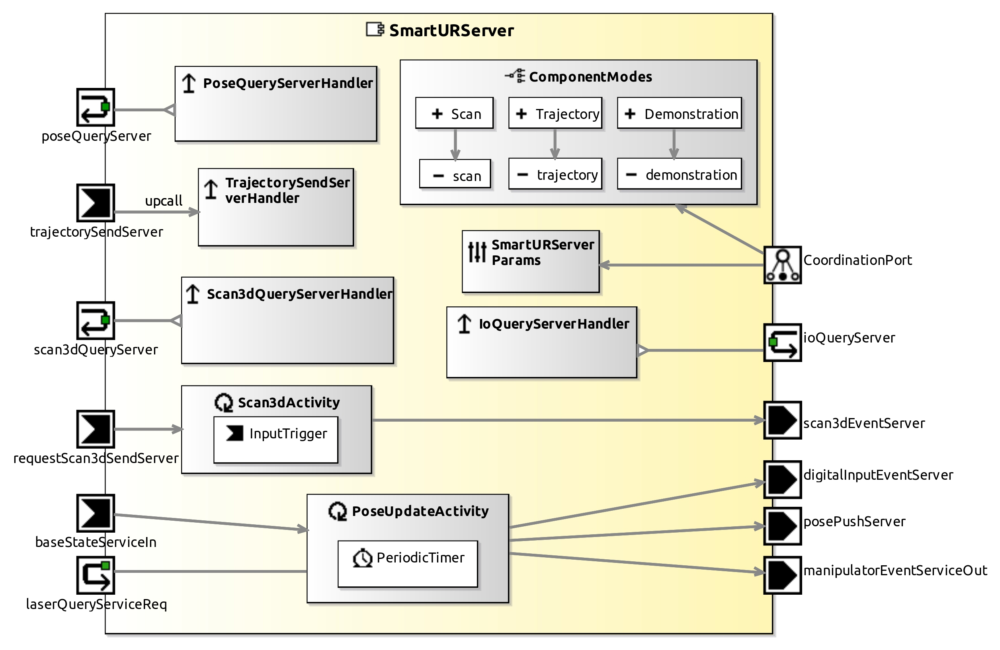

<!--- This file is generated from the SmartURServer.componentDocumentation model --->
<!--- do not modify this file manually as it will by automatically overwritten by the code generator, modify the model instead and re-generate this file --->

# SmartURServer Component

NOTE: THIS COMPONENT PROJECT ONLY CONTAINS A COMPONENT HULL. IMPLEMENTATION OF THIS COMPONENT IS WORK IN PROGRESS. YOU CAN USE THIS COMPONENT HULL TO FILL IN YOUR OWN IMPLEMENTATION.

TODO: ADD description!

| Metaelement | Documentation |
|-------------|---------------|
| License |  |
| Hardware Requirements |  |
| Purpose |  |

## Service Ports

## Component Parameters SmartURServerParams

### InternalParameter laser

| Attribute Name | Attribute Type | Description |
|----------------|----------------|-------------|
| laser_is_mounted | Boolean |  |
| x | Int32 |  |
| y | Int32 |  |
| z | Int32 |  |
| azimuth | Double |  |
| elevation | Double |  |
| roll | Double |  |

### InternalParameter base

| Attribute Name | Attribute Type | Description |
|----------------|----------------|-------------|
| on_base | Boolean |  |
| x | Int32 |  |
| y | Int32 |  |
| z | Int32 |  |
| base_a | Double |  |
| steer_a | Double |  |
| turret_a | Double |  |

### InternalParameter manipulator

| Attribute Name | Attribute Type | Description |
|----------------|----------------|-------------|
| verbose | Boolean |  |
| goal_angle_approach | Double |  |
| goal_position_approach | Double |  |
| x | Int32 |  |
| y | Int32 |  |
| z | Int32 |  |
| azimuth | Double |  |
| elevation | Double |  |
| roll | Double |  |
| debugSendProgrammDirect | Boolean |  |

### InternalParameter network

| Attribute Name | Attribute Type | Description |
|----------------|----------------|-------------|
| ip_adress | String |  |

